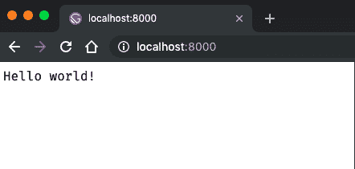
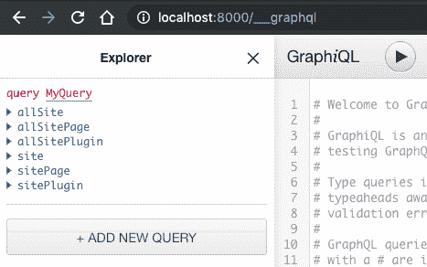

# 用 React 和 GatsbyJs 构建网站

> 原文：<https://dev.to/eperedo/building-websites-with-react-and-gatsbyjs-mdj>

创建一个 gatsby 项目是很容易的，因为您可以使用他们精彩的 CLI。

### 盖茨比 CLI

为了安装 CLI，您需要在计算机上安装 nodejs 和 npm/yarn。如果您是 npm 人员，您需要在您的终端中键入以下内容

```
npm install -g gatsby-cli 
```

如果你喜欢纱线，输入这个:

```
yarn add global gatsby-cli 
```

安装完成后，您可以使用下面的命令
检查 gatsby cli 是否工作正常

```
gatsby --version
Gatsby CLI version: 2.7.7 
```

### 创建新的盖茨比项目

现在你可以使用 **new** 命令创建一个新的 gatsby 项目，这个命令有两个参数，第一个是你的项目的名字，第二个是作为初始文件基础的模板。

```
gatsby new learning-gatsby https://github.com/gatsbyjs/gatsby-starter-hello-world 
```

使用上面的命令，您可以告诉 gatsby:“嘿，请创建一个新项目，我很乐意将其命名为“learning-gatsby”，并请使用 hello-world 模板”。根据文档，如果您刚刚开始使用 gatsbyjs，这是一个很好的模板。

这一步可能需要较长的时间，因为它将克隆项目并自动安装项目的所有依赖项。

一旦整个过程完成，你可以进入项目文件夹，并启动开发服务器，看看网站看起来如何。

### 启动开发服务器

hello-world 模板已经附带了一个脚本来启动开发服务器，该脚本的名称是 **develop** 。
这意味着你可以在终端输入
来启动一个 gatsby 开发服务器

```
npm run develop 
```

如果你用的是纱线

```
yarn develop 
```

这需要做很多工作，但是一旦你在终端上看到这样的消息

```
You can now view gatsby-starter-hello-world in the browser.
http://localhost:8000/ 
```

你可以打开浏览器，进入 [http://localhost:8000/](http://localhost:8000/) 就会看到 hello world。

[](https://res.cloudinary.com/practicaldev/image/fetch/s--Hr-WmEVO--/c_limit%2Cf_auto%2Cfl_progressive%2Cq_auto%2Cw_880/https://thepracticaldev.s3.amazonaws.com/i/vny7ezsnd0y9lfuvkzrh.png)

您还可以在[http://localhost:8000/_ _ _ graph QL](http://localhost:8000/___graphql)中看到 graphiql UI。

[](https://res.cloudinary.com/practicaldev/image/fetch/s--B9uTLZjj--/c_limit%2Cf_auto%2Cfl_progressive%2Cq_auto%2Cw_880/https://thepracticaldev.s3.amazonaws.com/i/bir8bixcopc04ekwq9la.png)

哦，是的，盖茨比如此酷的原因之一是 graphql，但这是下一篇文章的信息。