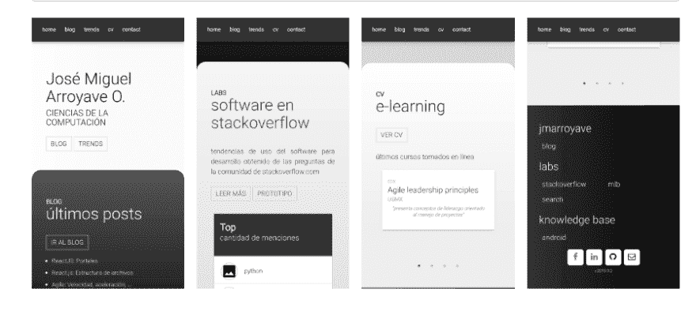
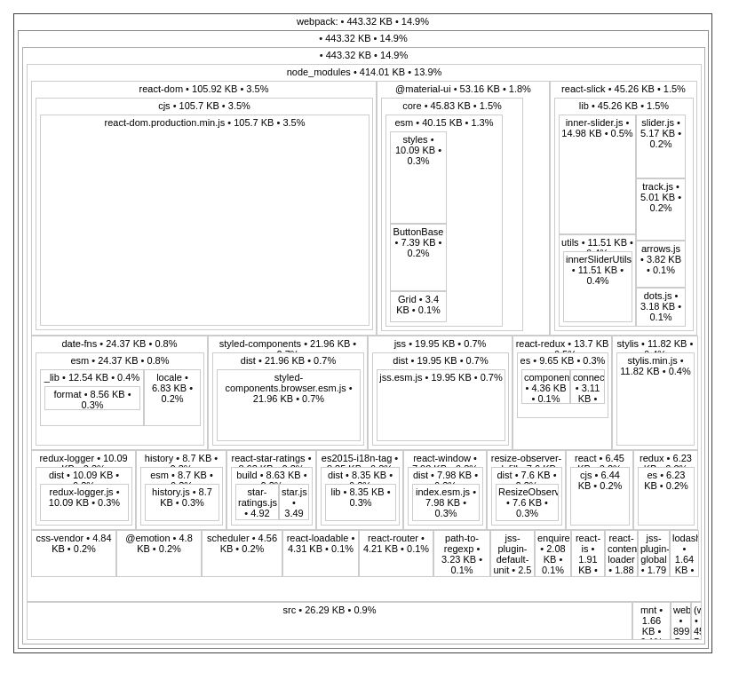

# 束的大小:一个洞察

> 原文：<https://dev.to/jmarroyave/bundle-s-size-an-insight-4h6l>

我不知道关于如何优化捆绑包大小的文章是否足够多，在我见过的几乎所有文章中，我都找到了其他可以添加到我的管道中的东西，这就是为什么我想从我得出的结论开始。

bundle 是基于从源代码(imports)中推导出的依赖关系分析而分组的一组资产，它解决了在项目中集成依赖关系的问题。拥有一系列不同类型和功能的资产，一些明确地包含在代码中，另一些隐含地帮助开发过程(webpack、react、dev 模式),很明显，复杂性与捆绑包的大小成比例。

最终产品不仅仅是内容，还包括交互体验，这从用户决定点击链接并等待响应开始。虽然这个包简化了依赖关系的复杂性，但是有必要实现一些假设来改善这种体验，比如所有代码必须同时存在(拆分)，或者必须顺序加载(并行)，最后源代码必须漂亮且可理解(缩小)。

总的来说，我发现了 4 个主要方面，它们将减少包的大小所需的行动进行了分组

*   删除:冗余或未充分利用的代码
*   摘录:有利于并行化的资产
*   划分:只对需要的代码进行分组
*   优化:每个资产，根据其类型

## 问题

我做了一个简单的 SPA 来显示一些项目，然后把它放在 github 上，我需要给页面添加一些动态组件，所以我用 ReactJS 用[门户](https://jmarroyave-blog.herokuapp.com/en/2019/09/11/reactjs-portals/)来实现它。我的观点是为什么如此简单的东西会如此巨大:

```
app.js 586.6KB
  2.js 377.3KB
  3.js  45.7KB
--------------
     1,009.6KB

polyfill.js  93.1KB 
```

[](https://res.cloudinary.com/practicaldev/image/fetch/s---_R9OhD---/c_limit%2Cf_auto%2Cfl_progressive%2Cq_auto%2Cw_880/https://jmarroyave-blog.herokuapp.com/wp-content/uploads/2019/09/jm-git.png)

这是 page 的图片，不算 HTML，CSS 和图片，它需要差不多 1MB 的代码。我的假设是“这个包打包了它不使用的代码”，所以我开始做了一些调查，减少了涉及到的每个部分(尽管在这篇文章中，我将把重点放在 javascript 代码上)

审查捆绑包后的最终结果是:

```
 app.js 481.9KB
    --------------
           481.9KB

    polyfill.js  92.9KB 
```

这代表了原始大小的 48%,尽管假设是正确的，但它只是描述了问题的一部分。

## 分析和工具

首先，我需要查看包的组成

#### webpack

它生成了一个包含依赖图和资产列表的文件，相当大并且是 json 格式的，有很多信息，但是不太容易管理

```
webpack --profile --json > stats.json 
```

#### [网络包-捆绑包-分析器](https://www.npmjs.com/package/webpack-bundle-analyzer)

它分析 webpack 生成的依赖图，有利于可视化组合，但不够详细

```
 # package
    npm install webpack-bundle-analyzer -g

    # analyze, generate report
    webpack-bundle-analyzer stats.json 
```

[](https://res.cloudinary.com/practicaldev/image/fetch/s--xtcbXyUN--/c_limit%2Cf_auto%2Cfl_progressive%2Cq_auto%2Cw_880/https://jmarroyave-blog.herokuapp.com/wp-content/uploads/2019/09/01.png)

#### [来源-地图-资源管理器](https://www.npmjs.com/package/source-map-explorer)

与上一部非常相似，没有那么丰富多彩，但细节层次更好

```
source-map-explorer script.js 
```

[](https://res.cloudinary.com/practicaldev/image/fetch/s--jAVewCsP--/c_limit%2Cf_auto%2Cfl_progressive%2Cq_auto%2Cw_880/https://jmarroyave-blog.herokuapp.com/wp-content/uploads/2019/09/source-map-explorer.png)

提供了包中包含的最完整的资产列表，它更像是 stats.json 的可视化工具

[](https://res.cloudinary.com/practicaldev/image/fetch/s--xZl3USHd--/c_limit%2Cf_auto%2Cfl_progressive%2Cq_auto%2Cw_880/https://jmarroyave-blog.herokuapp.com/wp-content/uploads/2019/09/bundle-stats.png)

## 解

现在，有了包的组成信息

[](https://res.cloudinary.com/practicaldev/image/fetch/s--6gozkhsw--/c_limit%2Cf_auto%2Cfl_progressive%2Cq_auto%2Cw_880/https://jmarroyave-blog.herokuapp.com/wp-content/uploads/2019/09/01-1.png)

#### 1。react-dom.development.js

在 webpack.config.js 中将模式更改为生产

模式:“生产”

```
all - 2.82MB 
app - 2.58MB 
polyfill - 248.1KB 
```

#### 2。moment.js - >日期-fns

尽管相当完整，但还是相当大。我换成了 [date-fns](https://date-fns.org/) 。

```
all - 2.32MB 
app - 2.08MB 
polyfill - 248.1KB 
```

#### 3。清理未使用的代码

在快速查看了一些组件中的死代码后，我不得不移除一些剩余的未使用的导入

```
all - 2.27MB 
app - 2.02MB 
polyfill - 248.1KB 
```

#### 4。头盔- > document.title

我用头盔只是为了页面标题，所以我把它换成了文档

```
all - 2.22MB 
app - 1.98MB 
polyfill - 248.1KB 
```

#### 5。axios - >获取

我只对服务器请求使用 axios，这很容易被 fetch
所取代

```
all - 2.03MB 
app - 1.79MB 
polyfill - 248.1KB 
```

#### 6。lint 修复

```
all - 2.03MB 
app - 1.79MB 
polyfill - 248.1KB 
```

#### 7。删除 JavaScript-时间-以前

我正在开发一个框架，这个框架是我一段时间以来构建的，在某个时间点，我使用了这个可以被 date-fns 替代的功能

```
all - 1.62MB 
app - 1.38MB 
polyfill - 248.1KB 
```

#### 8。材料-用户界面

这将是一个高成本的重构，我只是将包升级到最新版本，希望库背后的开发人员也在做他们的事情

#### 9。反应- >预先行动

改变 preact 的反应？这听起来不错，尽管迁移过程有点小问题

```
all - 1.51MB 
app - 1.27MB 
polyfill - 248.1KB 
```

#### 10。移除热加载程序和开发依赖项

#### 11。提取资产:css、字体、图像

webpack 微型 css 提取插件

```
all - 1.43MB 
app - 1.19MB 
polyfill - 248.1KB 
```

#### 12。动力载荷

```
const { FixedSizeList } from 'react-window'; 

const { FixedSizeList } = Loadable({
   loader: () => import('react-window'),
       loading: Loading,
}); 

const FixedSizeList = Loadable({
   loader: () => import('react-window/FixedSizeList'),
       loading: Loading,
}); 
```

#### 13。把…作为目标

```
devtool: false,
target: "web", 
externals: {
 React: 'react'
} 
```

#### 14。最小化

戏弄者

[](https://res.cloudinary.com/practicaldev/image/fetch/s--7uD7uNEW--/c_limit%2Cf_auto%2Cfl_progressive%2Cq_auto%2Cw_880/https://jmarroyave-blog.herokuapp.com/wp-content/uploads/2019/09/13.png)

总而言之，我将前面的 14 点分类如下

#### 删除

发展支持

*   react-dom.development.js
*   拆卸热装载机

重构

*   moment.js
*   头盔
*   阿克斯
*   JavaScript-时间-以前
*   材料-用户界面
*   反应

代码审查

*   未使用的代码
*   林挺

#### 提取

css，图像，字体

#### 除

动力载荷

*   反应窗口
*   优化块

#### 优化

瞄准和最小化

今天的清单到此为止，我知道它可以更广泛。我想知道你还建议考虑哪些其他问题。

## 参考文献

*   [https://lemon code . net/lemon code-blog/2018/5/7/web pack-poni endo-a-dieta-tus-bundles-ii](https://lemoncode.net/lemoncode-blog/2018/5/7/webpack-poniendo-a-dieta-tus-bundles-ii)
*   [https://dev . to/sheddy _ nathan/possible-ways-to-reduce-your-web pack-bundle-size-js-secrets-550](https://dev.to/sheddy_nathan/possible-ways-to-reduce-your-webpack-bundle-size-js-secrets-550)
*   [https://medium . com/@ poshakajay/heres-how-I-reduced-my-bundle-size-90-2e 14 c8 a11 c 11](https://medium.com/@poshakajay/heres-how-i-reduced-my-bundle-size-by-90-2e14c8a11c11)
*   [https://material-ui.com/guides/minimizing-bundle-size/](https://material-ui.com/guides/minimizing-bundle-size/)
*   [https://goen ning . net/2018/11/26/how-we-reduced-initial-jscss-size/](https://goenning.net/2018/11/26/how-we-reduced-initial-jscss-size/)
*   [https://www . intercom . com/blog/reducing-intercom-messenger-bundle-size/](https://www.intercom.com/blog/reducing-intercom-messenger-bundle-size/)