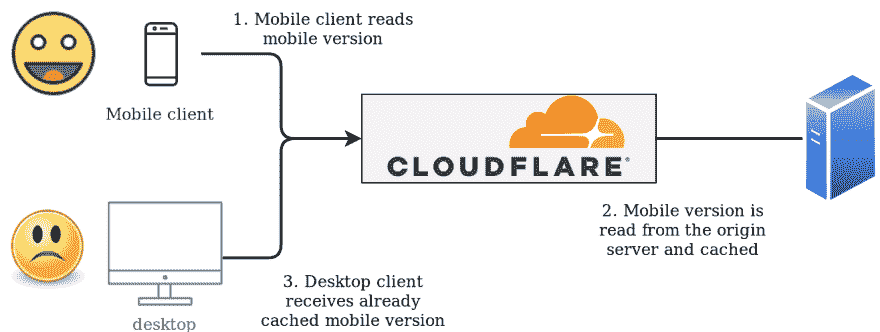

# 使用 Cloudflare workers 进行缓存

> 原文：<https://dev.to/danihodovic/caching-tricks-with-cloudflare-workers-57eb>

*TL；dr: Cloudflare 允许你通过任意的头来改变它们的缓存响应，比如 Cookies 或者 User-Agent。这需要你有一个企业账户(~$5000)。你可以支付 5000 美元，或者用 5 美元和一些 Javascript 代码解决问题。*

## [T1】简介](#intro)

Cloudflare 在其全球 CDN 上提供缓存。对于很少更新 Cloudflare 的站点，它会为您处理大部分流量，而无需到达您的原始服务器。一旦用户访问特定页面，Cloudflare 会将页面响应保存在缓存中，并提供给下一个访问者。这减少了服务器上的负载，同时也提高了页面性能，因为它通过 [Cloudflare 的 pop](https://www.cloudflare.com/en-au/network/)之一更接近用户。

虽然这在理论上很棒，但是对于任何需要对每个访问者进行页面定制的站点来说，实现起来都很有挑战性。例如:我们可能希望根据 cookie(每个访问者的唯一缓存)或用户代理(每个设备类型的唯一缓存-移动/平板/桌面)来提供不同的缓存响应。

幸运的是，Cloudflare 允许您通过 HTTP 头改变缓存:

*   `Accept-Encoding` -通过有效载荷的编码来缓存每个资源。
*   `Cookie` -允许每个 cookie 的缓存是唯一的。如果缓存对于每个用户或会话都是唯一的，这将非常有用。
*   `User-Agent` -每个用户代理的缓存确保每个设备的页面缓存不同。例如，移动客户端可以接收页面的一个版本，而桌面客户端可以接收另一个版本。

**军规？只有 Accept-Encoding 是免费提供的，其他两个头需要您升级到企业计划。**据传这要花费[大约 5000 美元](https://winningwp.com/cloudflare-vs-maxcdn/)。即使您要升级到企业计划，您仍然不能通过其他 HTTP 头进行缓存。

## 为什么我需要缓存变异？

最好通过一个实际的例子来解释为什么通过不同的头进行缓存是有用的。

[](https://res.cloudinary.com/practicaldev/image/fetch/s--CqU-oAGU--/c_limit%2Cf_auto%2Cfl_progressive%2Cq_auto%2Cw_880/https://thepracticaldev.s3.amazonaws.com/i/4xr9kryzh2lw3xda270x.png)

在 findwork.dev，我们根据用户代理提供不同版本的页面。对于移动版本，我们省略了不适合小屏幕尺寸的页面的某些部分，只包括桌面客户端的部分。我们通过检查 User-Agent 头并使用 [django-user-agent](https://github.com/selwin/django-user_agents) 以不同的方式呈现页面来做到这一点。

下面是一个虚构的例子，它根据用户是在移动设备上还是在桌面设备上呈现不同大小的按钮。

```

<a class="btn btn-sm">Company info</a>

<a class="btn btn-lg">Company info</a>
 
```

最近，我们启用了 Cloudflare 页面规则来缓存所有内容(包括 html)。不幸的是，我们马上注意到一些问题:如果一个用户在移动设备上访问一个页面，Cloudflare 会缓存该页面的移动版本。当另一个用户访问桌面上的同一页面时，Cloudflare 将提供移动优化版本，因为该页面在缓存中。这显然导致了非常难看的页面。

## Cloudflare 工人前来救援

我们简要讨论了将我们的 CDN 层迁移到 AWS 和 Cloudfront(这允许任意的缓存变化头)。然而，仅仅为了规避缓存而将我们的整个基础设施迁移到 AWS 是不切实际的。

Cloudflare 最近推出了 [Cloudflare workers](https://blog.cloudflare.com/cloudflare-workers-is-now-on-open-beta/) 。Cloudflare workers 是运行在 Cloudflare 基础架构上的 Javascript 片段。工作人员可以与 Cloudflare 基础架构的各个部分进行交互，包括缓存 API。这意味着我们可以编写任意代码来定制 Cloudflare 应该如何缓存和交付我们的内容。

[Cloudflare 文档状态](https://workers.cloudflare.com/docs/reference/runtime/apis/cache/):

> 与浏览器缓存 API 不同，Cloudflare Workers 不支持 match()上的
> ignore research 或 ignoreVary 选项。您可以通过在 put()时删除查询字符串或 HTTP 头来实现这个
> 行为。

所以默认情况下，HTTP Vary 头在缓存键中被忽略。一种变通方法是添加查询参数，以区分设备的响应。

*   对 findwork.dev 移动版本的请求可以缓存在`https://findwork.dev?version=mobile`下
*   桌面版本可以缓存在`https://findwork.dev?version=desktop`下。

下面是我们想出的解决我们问题的代码片段:

```
async function run(event) {
  const { request } = event;

  const cache = caches.default;

  // Read the user agent of the request
  const ua = request.headers.get('user-agent');
  let uaValue;

  if (ua.match(/mobile/i)) {
    uaValue = 'mobile';
  } else {
    uaValue = 'desktop';
  }

  // Construct a new response object which distinguishes the cache key by device
  // type.
  const url = new URL(request.url);
  url.searchParams.set('ua', uaValue);
  const newRequest = new Request(url, request);

  let response = await cache.match(newRequest);
  if (!response) {
    // Use the original request object when fetching the response from the
    // server to avoid passing on the query parameters to our backend.
    response = await fetch(request);

    // Store the cached response with our extended query parameters.
    event.waitUntil(cache.put(newRequest, response.clone()));
  }

  return response;
}

window.addEventListener('fetch', (event) => {
  event.respondWith(run(event));
}); 
```

值得注意的是，这不仅允许您通过 HTTP 头改变缓存。如果您愿意，您可以发挥创造力，根据正文的内容来改变缓存。

如果您使用 workers，请不要在 Cloudflare UI 中启用缓存。它可能会扰乱工人并导致不一致。要么使用工作线程进行缓存，要么使用 UI /页面规则。