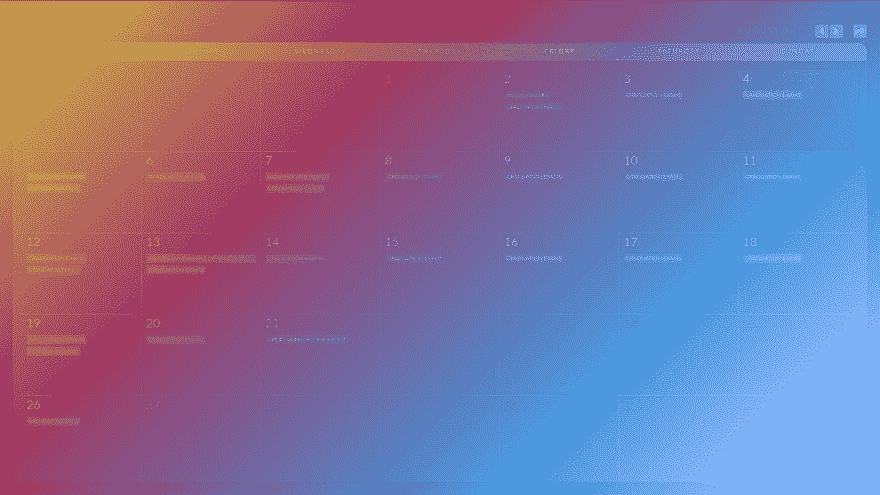

# 这是一个小型的日历库，用于创建灵活的日历

> 原文：<https://dev.to/deviprsd/calendario-a-small-calendar-library-for-creating-flexible-calendars-2bc6>

又一个日历应用，天哪，我们还需要更多吗？也许，我会让你来决定。让我们先检查一下事实。

这是一个很棒的库，有各种组件，功能齐全。但它渲染日历，你必须“主题化”。如果你想在几秒钟内建立并运行一个日历，这可能是个不错的选择，但是如果你想精心设计一个具有强大 CSS 功能的日历，那就需要阅读和修改大量的文档。

同样的道理也适用于 [Mobiscroll](https://mobiscroll.com/) 和【http://ui.toast.com/tui-calendar T2】

如果您将日历视为浏览器中的本机 api，只是另一个提供内部化信息和解析事件的对象，那么剩下的工作就由开发人员来构建 UI 了。开发人员现在可以灵活地做他们想做的任何事情，即使不能在几秒钟内完成，也能设计出漂亮的日历。

我们先去图书馆看看吧[https://github.com/CalendarioFX/Calendario](https://github.com/CalendarioFX/Calendario)。它处于 alpha 阶段，但是已经完成了 90%。

*   用打字稿写的
*   每个 Calendario 对象都是不可变的
*   通过`Intl` api 支持国际化
*   支持 DST 的时区
*   CJS 和 ESM 模块
*   非常轻的重量，75kb(可能包括所有的许可证，README.md...)

让我告诉你在`svelte`中建立一个有多容易。下载[苗条模板](https://github.com/sveltejs/template)在几秒钟内开始

```
npx degit sveltejs/template svelte-app
cd svelte-app
npm install
npm install calendariofx-calendario
npm run dev 
```

在 App.svelte 中，让我们导入 Calendario 并给它一些事件

```
<script context="module">
    import calendario from 'calendariofx-calendario'
</script>

<script>
    let cal = calendario({
        '01-01-1970' : [{content: 'New Year\'s', repeat: 'YEARLY', allDay: true, endDate: '12-31-2100'}],
        '12-25-1970' : [{content: 'Christmas Day', repeat: 'YEARLY', allDay: true, endDate: '12-31-2100'}], 
        '08-02-2019' : [
            {content: 'Yeah Monthly', repeat: 'MONTHLY', allDay: true, endDate: '09-02-2019'},
            {content : 'Graduation Exams', repeat: 'INTERVAL', allDay: true, endDate: '08-20-2019'}
        ],
        '01-07-2019' : [{content: 'Monthly And Yearly', repeat: 'MONTHLY', allDay: true, endDate: '02-07-2020'}],
        '08-01-2019' : [{content : 'MONDAY (WEEKLY)', repeat: 'MON', allDay: true, endDate: '08-30-2019'}]
    })
    $: rows = cal.rows
    $: body = cal.body
</script> 
```

然后，添加月份名称、年份、按钮来导航到不同的日期

```
<h3 class="custom-month-year">
    <span id="custom-month" class="custom-month">{ cal.monthName }</span>
    <span id="custom-year" class="custom-year">{ cal.year }</span>
    <nav>
        <span id="custom-prev" class="custom-prev" on:click={() => cal = cal.previousMonth() } title="Go to previous month"></span>
        <span id="custom-next" class="custom-next" on:click={() => cal = cal.nextMonth() } title="Go to next month"></span>
        <span id="custom-current" class="custom-current" on:click={() => cal = cal.now() } title="Go to current date"></span>
    </nav>
</h3> 
```

然后我们生成日历和事件

```
<div id="calendar" class="fc-calendar-container">
    <div class="fc-calendar" 
        class:fc-four-rows={rows === 4} 
        class:fc-five-rows={rows === 5} 
        class:fc-six-rows={rows === 6}>

        <div class="fc-head">
            {#each cal.head as weekday}
                <div>{weekday}</div>
            {/each}
        </div>

        <div class="fc-body">
            {#each Array.from(Array(rows).keys()) as ri}
                <div class="fc-row">
                    {#each body[ri] as dt}
                        <div 
                            class="{dt.dateClass} {dt.weekday}" 
                            class:fc-past={dt.past}
                            class:fc-future={dt.future}
                            class:fc-today={dt.today}
                            class:fc-content={dt.events.length > 0}>
                            <span class="fc-date" class:fc-emptydate={dt.events.length === 0}>{dt.date.day}</span>
                            <span class="fc-weekday">{dt.weekday}</span>

                            <div class="fc-calendar-events">
                                {#each dt.events as event}
                                    <div class="fc-calendar-event">
                                        {#if event.url}
                                            <a class="{event.category}" href="{event.url}">{event.content}</a>
                                        {:else}
                                            <span class="{event.category}">{event.content}</span>
                                        {/if}
                                    </div>
                                {/each}
                            </div>
                        </div>
                    {/each}
                </div>
            {/each}
        </div>

    </div>
</div> 
```

然后我添加了一些 css，这是我的结果。就这么简单！
[T3】](https://res.cloudinary.com/practicaldev/image/fetch/s--MBU5t-TV--/c_limit%2Cf_auto%2Cfl_progressive%2Cq_auto%2Cw_880/https://thepracticaldev.s3.amazonaws.com/i/q7sg2xe2hphoh9vbu9zu.png)

你可以在 https://github.com/CalendarioFX/example-calendario-svelte 查看完整的例子

**附言** *我是 Calendario 的开发者。我张贴这篇文章是为了得到一些建设性的批评和反馈，看看它是否能帮助其他开发者，让他们的生活更轻松。我也在分析 Calendario 这个概念的潜力，所以不要保留抨击，评价，喜欢，不喜欢只是不要忽视它🎉。享受日历的乐趣*