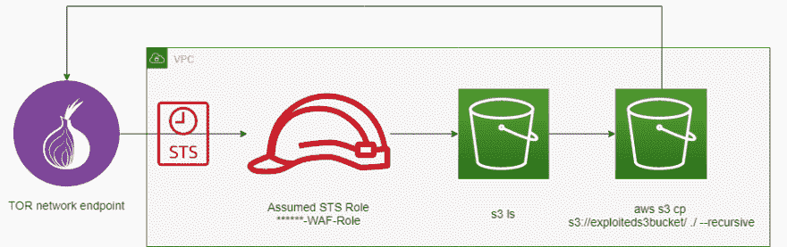

# CapitalOne AWS 违规和 AWS 安全讨论

> 原文：<https://dev.to/dietertroy/capitalone-aws-breach-aws-security-discussion-mo9>

CapitalOne 最近是一次泄密事件的受害者，该事件可能影响了美国的 1 亿个人。这篇文章不会涉及被告的不道德意图或私人信息被泄露的影响，而是技术方面和保护您的 AWS 环境。如果你想进一步了解它，[这份文件](https://regmedia.co.uk/2019/07/29/capital_one_paige_thompson.pdf)很好地解释了它。

下图是我对 CapitalOne S3 数据被泄露的理解。关于被告的背景信息还表明[她从 2015 年到 2016 年在亚马逊网络服务](https://imgur.com/NezWVKw)的 S3 分部工作。知道她曾在亚马逊网络服务公司工作过一段时间，可能影响了她妥协 CapitalOne 的能力。

似乎还有一些问题没有得到解答，例如:

*   被告利用什么凭证来担任 STS 角色以获得访问权？
*   为什么没有维护 AWS GuardDuty 的[信任列表](https://docs.aws.amazon.com/guardduty/latest/ug/guardduty_upload_lists.html)？
*   为什么假设的 STS 角色被允许访问 S3 存储桶？应该使用一个允许 ARN 的严格的木桶政策。

您对利用和保护 AWS 环境的技术方面有什么看法？