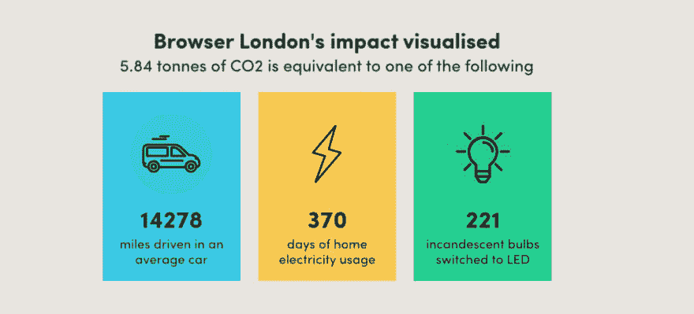

# 碳中和编码:我们刚刚与偏移地球合作

> 原文：<https://dev.to/browserlondon/carbon-neutral-coding-we-ve-just-partnered-with-offset-earth-5h2p>

作为 Browser London 成为负责任雇主承诺的一部分，我们很高兴开始与[抵消地球](https://offset.earth/)合作，以平衡我们员工的碳足迹。

该公司由三名布里斯托尔人(我们很自豪地说，其中一人是浏览器小组的校友)创建，自 6 月份测试版推出以来，我们一直密切关注该公司。为了使抵消碳排放的行为变得容易和[透明](https://offset.earth/pages/about)，该团队只与[黄金标准](https://www.goldstandard.org/)审计项目合作，并公开发布所有[碳信用](https://docs.google.com/spreadsheets/d/1dACvzjE5nBE1cKZBAhYzsUa7rIiLJqCWXVgY4bNS8_Q/edit#gid=766227634)和[植树](https://docs.google.com/spreadsheets/d/1dACvzjE5nBE1cKZBAhYzsUa7rIiLJqCWXVgY4bNS8_Q/edit#gid=0)用捐款购买的项目。

我们的合作伙伴关系意味着我们每位员工每年抵消 14 吨二氧化碳，根据地球抵消公司的计算，这足以使我们的团队[净碳为正](https://www.fastcompany.com/40583176/climate-positive-carbon-neutral-carbon-negative-what-do-they-mean)。您可以在我们的[公司简介页面](https://offset.earth/browserlondon)上看到我们公司迄今为止所做贡献的生动说明。

就个人而言，我认为值得补充的是，这一合作伙伴关系的想法来自我们团队的一名初级成员。所以，如果你在读这篇文章时想‘我的公司永远不会这么做’，我建议你提出来，看看会有什么反应；可能比你想象的要积极。

毕竟，许多公司都在寻找方法来擦亮他们的环保证书，而在开发行业，并不总是清楚最好的方法是什么。我认为像这样的补偿计划是一个好的、简单的和直接的开始方式。

值得一提的是，碳抵消作为平衡环境政策的一部分是最有效的。我们与 Offset Earth 的合作旨在补充我们现有的项目，以减少我们团队的碳排放，例如我们的远程工作和回收计划。

* * *

帖子[碳中性编码:浏览器伙伴与抵消地球](https://www.browserlondon.com/blog/2019/09/03/carbon-neutral-coding-browser-partner-offset-earth/)首先出现在[浏览器伦敦](https://www.browserlondon.com)上。