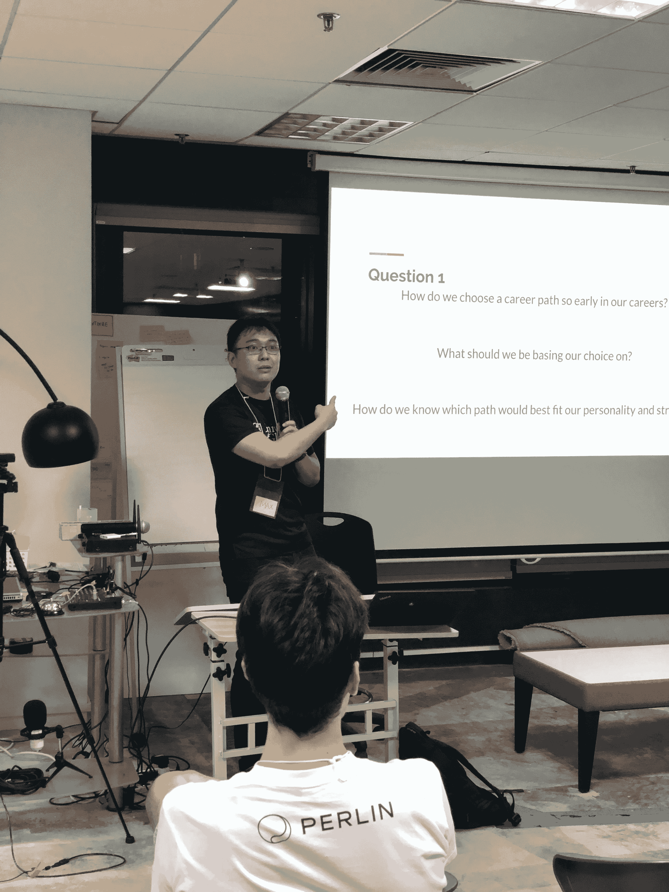
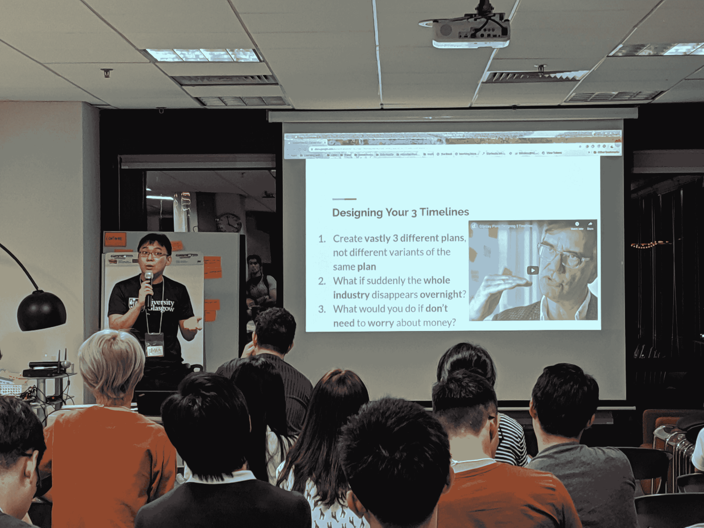

# 职业道路

> 原文：<https://dev.to/steelwolf180/career-path-311h>

# 简介

每当一个人谈到事业，都伴随着对未知未来的疑惑。

随着人工智能或外包的不断轰炸，你的工作会出现在新闻中，你会在工作或生活方式上有更多的选择。

对于任何有抱负的开发人员或软件开发领域的老手来说，选择职业已经变得越来越困难。

# 自我意识的需要

加里五世一直宣扬要有自我意识，这样你才能采取行动，完成任务。

当我开始成为一名开发人员时，我也是如此。

我隐约意识到，在大学期间，我想成为创业公司的销售员或软件工程师。

这样我就能最终走上成为一名科技企业家的道路。

# 安装自我意识

中国习语有句名言“你可以把马带到水边，但你不能强迫它喝水”。

作为导师，我们不能提供一个千篇一律的职业道路模板。

因为我们的答案伴随着我们的偏见和经历。

这是我在制作[滑梯](https://docs.google.com/presentation/d/13GJ3ap1Z8vevwuN03K65687eF8GcwoLii0JAZzX4yRU/edit?usp=sharing)时需要考虑的事情。

当谈到指导计划中初级开发人员的职业道路时。

幸运的是，我使用了一个练习，这个练习让我开始了自己的开发之旅。

这被称为由比尔·伯内特&戴夫·埃文斯创建的[奥德赛计划](https://www.businessinsider.com/no-such-thing-as-one-perfect-life-2017-1?IR=T)。

他在斯坦福经营“生活设计”实验室，提供名为“设计你的生活”的课程。

# 奥德赛计划

一个痛苦的计划是一个 10 年的时间表，是一个 T2 自我发现或 T4 实验的旅程。

帮助你朝着你想要的生活方式和工作方向努力。

这来源于 3 个**非常**不同的时间线，为你提供你想要的工作和生活方式的概述。

## 3 条截然不同的时间线

这意味着为你从事的不同行业或工作创建 3 个时间线。

这不是 3 个不同的时间线与同一类型的工作。

我向观众举例说明，不要为同一类型的工作创建 3 个时间线。

因为我是在对一群初级开发人员和高级开发人员进行指导。

事情是这样的，第一个时间线是成为前端开发者，第二个是后端开发者，第三个是全栈开发者。

观众们笑了出来，这也解释了为什么你不应该在创建 3 个时间线的时候这么做。

## 创建 10 年时间线

10 年时间表是你首选的 5 年时间表的延伸版本。

它可能包括 2 - 5 年的短期不同的工作，以获得知识，经验和网络。

Linkedin 的联合创始人雷德·霍夫曼称之为[任务之旅](https://www.linkedin.com/pulse/20141023153633-1213-tours-of-duty-how-to-organize-modern-employment/)，以达到你自己想要的生活方式或你未来想做的工作。

尽管雷德·霍夫曼在 PayPal 的时候就有创业的雄心。

他决定呆一段时间来学习和吸收教训，知识和建立他的网络来开始自己的。

最终，他开始执行多项任务，这让他为自己创建了一家名为“Linkedin”的初创公司。

# 结论

我希望通过学习建立自己的奥德赛计划。

作为一名开发人员，我会帮助你自我意识到你想要从事的工作类型或生活方式。

我将附上我在指导计划中的职业道路幻灯片。

以及奥德赛计划工作表和在参考资料部分为您创建自己的奥德赛的视频播放列表。

如果你有兴趣了解更多。

# 参考文献

*   [自我意识](https://youtu.be/j6tKf1IR5j8)
*   [JuniorDev SG 职业道路幻灯片](https://docs.google.com/presentation/d/13GJ3ap1Z8vevwuN03K65687eF8GcwoLii0JAZzX4yRU/edit?usp=sharing)
*   [奥德赛计划](https://www.businessinsider.com/no-such-thing-as-one-perfect-life-2017-1?IR=T)
*   [奥德赛计划工作表](http://designingyour.life/wp-content/uploads/2016/08/DYL-Odyssey-Planning-Worksheet-v21.pdf)
*   [奥德赛计划播放列表](https://www.youtube.com/playlist?list=PLjwFGCpXfsbeqOfcEdEWWzsgTvPDB-ACN)
*   [巡回值日如何组织现代就业](https://www.linkedin.com/pulse/20141023153633-1213-tours-of-duty-how-to-organize-modern-employment/)
*   [un draw 的插图](https://undraw.co/illustrations)