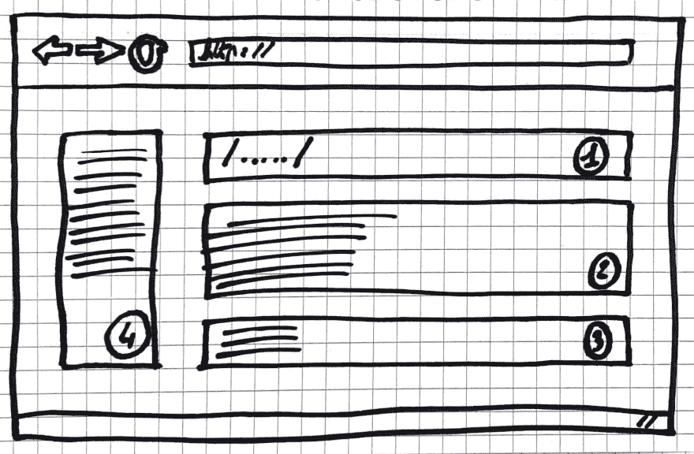
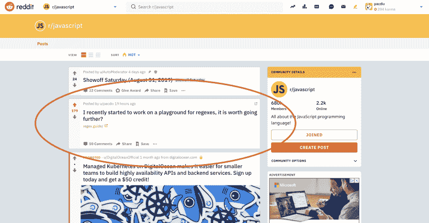

# 案例研究:如何验证你的开源项目想法

> 原文：<https://dev.to/pacdiv/case-study-how-to-validate-your-open-source-project-idea-3488>

“假装直到你成功”，这句话我们已经读过多少遍了？

让我们建立一个引人注目的销售页面，添加一个从专业平台上的自由设计师那里购买的五美元的标志，花几十美元做广告，为我们的销售页面带来一些流量，我们就可以开始了！

让我们等几个星期，将这个流量与我们的“购买”或“预购”按钮的总点击量进行比较。

如果有足够多的人点击这个按钮，我们知道我们的想法是有效的。这个策略已经被证明了好几年了，所以我准备应用它！

不过有一件事困扰着我。我的想法是一个开源项目。所以人们会期望看到一些源代码。我应该假装有源代码吗？

对我来说，这听起来像是给电影和幕后添加特效。我找不到这个方程的任何解。

我不得不想出别的办法。于是，我开始编码。

* * *

## 围绕思想的脉络

在我的[介绍文章](https://growthnotes.dev/why-my-next-project-might-succeed/?utm_source=dev_to&utm_medium=post&utm_campaign=default&utm_content=idea_validation)中，我说我已经从失败中吸取了教训，我不会在没有征求反馈的情况下构建任何项目。但是，对于这个开源项目，我必须从某个地方开始。

当时，我的目标是验证这个想法，而不必花几个月的时间编写最终产品。为了做到这一点，我给自己设定了一个很短的期限:10 天来证明我的想法。

这个想法非常简单:为需要试验正则表达式的开发人员提供一个平台。在我找到的在线免费工具中，大多数看起来都像下面这个模式:

我注意到，如果你只是从正则表达式开始，想出一些东西会很困难。

如您所见，如果您在区域 n 1 中键入正则表达式，并在区域 n 2 中输入任何文本，如“正则表达式就像数学一样:令人沮丧，直到您设法使用它们”，您将在区域 n 3 中看到结果。区域 n 4 分享了一些提示，帮助您在区域 n 1 中构建正则表达式。

我的观点是，如果有人需要发现和实验一些东西，使用的工具应该尽可能容易理解。越早认识到好处，他们就会越早信服。

考虑到这一点，我应用了我们通常知道的*“what”*，我们想要从正则表达式中提取什么的事实。*【如何】*仍然是主要问题。

这让我建立了一个表单，开发者可以定义他们需要什么，系统会建议 T2 如何编写他们的正则表达式。我认为它可以帮助试图进入正则表达式的开发人员。

然后，我试图验证这个想法。

* * *

## 向周围的人寻求早期反馈

在我开始编码的十几天后，我的概念证明已经可以测试了，所以我把它放到了网上。

错误的第一印象是无法修复的。因此，在项目的这个阶段，我更喜欢询问我个人认识的人，比如我的工作团队成员，我在以前的经历或课程中遇到的开发人员。

此外，我建议在聚会、聚会周围的小型社区讨论组或任何其他活动中就地询问。

我所定义的理想群体是那些大到足以获得反馈，小到足以引起注意的群体。如果你注意到在一个群中很少有消息得到回应，你知道这不是你想要的。

比你要招揽的人数更重要的是，你必须瞄准那些会使用你的项目的人，那些可能需要你的项目的人。

对于我的项目，我问了三个对正则表达式感到不舒服的开发人员。从他们那里得到反馈让我能够验证这个项目，仍然处于概念验证阶段，是否能在那个时候帮助他们。

此外，我在一个由大约 60 名 javascript 开发人员组成的讨论组中询问反馈，其中一些人对正则表达式了如指掌。

他们的反馈帮助我理解了我的概念证明没有涵盖足够多的正则表达式案例。然而，反馈强调了这个项目可以帮助向其他开发人员解释正则表达式。

我收到的反馈证实了它可以帮助开发人员学习和/或尝试正则表达式。那是多么好的消息啊！

此后，在花几个月的时间在这个新项目上编码之前，我想要更多的反馈。

所以，我开始瞄准我网络之外的人。为了避免得到同样的反馈，我通过添加一些更常见的正则表达式并获得 UI 来改进这个项目。

* * *

## 从远离你的人际网络的地方获得反馈

分享我们的作品，有一些大玩家在那里。

为了最大限度地获得有价值的反馈，我的首要任务是找到开发人员在哪些平台上。在这个过程的早期，我一直在寻找小组讨论。

开发者在 twitter 上非常活跃，但我在那里找不到团体。一些脸书群组和 LinkedIn 群组符合我的规模和活动要求，但我必须发送加入请求。

至于博客平台，写一篇文章对我来说似乎太难得到反馈。

它仍然是 Reddit，我所需要的完美候选人。因为我的项目是用 javascript 编写的，所以我很想从 javascript 开发人员那里得到反馈。所以，我加入了 subreddit r/javascript。

需要注意的是，Reddit 是一个讨论的地方。这很方便，因为我需要从 redditors 那里获得想法。如果我需要推广这个项目，在 Reddit 上分享就不合适了。

* * *

## 不展示项目，询问一下

因此，我发表了一个帖子，带着以下问题:“我最近开始在一个 regexes 的操场上工作，这值得进一步吗？”

除了寻求反馈，我还邀请了 redditors 参与我的思考。不是请求许可，而是想知道他们是否认为值得。

对于每个人来说，我的时间是宝贵的。如果这个项目不能帮助任何人，我看不出有任何理由继续下去。

然而，我不会建议每次都问是否值得，这取决于你的需求。

然而，我建议在 Reddit 上提问，因为这是一个提问和获得回答的完美平台。选择一两个你的目标用户所在的子街道，询问你的项目。

此外，请注意，社区成员会花时间尝试您的项目，阅读您的自述文件并给您反馈。你至少应该感谢他们。尽快给他们所有人一个回应，从最酷的到最刻薄的。

此外，准备好接受批评。他们允许你强调在你的项目中什么对他们是重要的，为什么。由于它处于项目生命周期的早期，这是一个将这些批评转化为有价值的特性的机会。

让我们回到我的研究案例。结果超出了我的预料。这篇文章已经在 r/javascript 的首页上放了大约 24 小时了！这让我得到了大约 30 条反馈！

*(有~60 条评论，一半是我的，因为我试图回答大家)*

一些社区成员分享说，他们不会离开他们使用的工具，如 regexr 或 regex101。其他人分享说他们会把它推荐给其他开发者。他们中的几个人推动我在这个项目上更进一步！

更重要的是，在那些理解这个项目是为不使用正则表达式的开发人员设计的人中，他们都认可了这个想法。

* * *

## 找到一个符合你期望的过程

现在，我的项目的信息更清楚了:Regex 指南是一个帮助开发人员发现正则表达式的平台。

不仅如此，我现在知道它需要更多的正则表达式，一个更好的 UI，并且它将帮助开发者学习正则表达式。

这期间我学到的是，有很多方法可以验证想法。

早些时候，我可以不用代码就可以分享给我的网络。我只是太害怕去做，结果证明这是一个更有说服力的项目，有一个用户界面可以尝试，有一段代码可以阅读。

此外，在这个过程的后期，我可以询问其他子主题和一些不和谐的群组，以获得更多的反馈。

最重要的是设定一个符合你预期的流程。

作为外卖，这里总结一下我的过程:
——定义一个目标，项目能解决哪些主要问题(以及如何解决)；
–为自己设定一个短的期限来建立概念验证；
–建立您的概念证明，该证明必须给出最终产品/服务的清晰概念；
–分享给网络；
——收集反馈，并从中提取最常见的内容。

这个过程是可重复的，而清晰的想法和需求没有得到验证。

* * *

## 那么接下来呢？

显然，我这个项目的下一个目标是改进它，并推广它。

我会努力达到一些里程碑，如 1000 个 GitHub 明星或网站的一定量的日访问量。

请随意[订阅我的时事通讯](https://growthnotes.dev/?utm_source=dev_to&utm_medium=post&utm_campaign=default&utm_content=idea_validation)以便在我发表相关文章时得到通知！

感谢阅读！

注意:需要更多来验证你的想法吗？你会在我的博客上找到[，在这篇文章的结尾](https://growthnotes.dev/case-study-how-to-validate-an-open-source-project-idea/?utm_source=dev_to&utm_medium=post&utm_campaign=default&utm_content=idea_validation)，一些资源可以帮助你。这些资源包括我的项目环境中的过程清单，以及要发送的消息的模式和示例。随便看看吧！