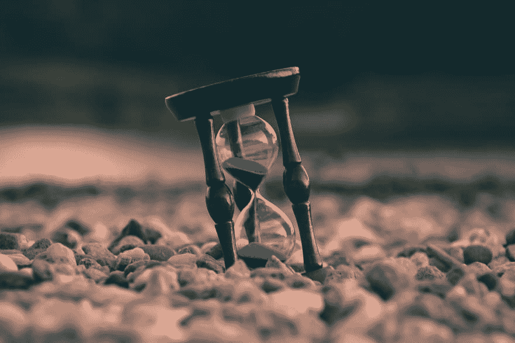

# 挑战:什么都不做

> 原文：<https://dev.to/tchaflich/challenge-do-nothing-5056>

Guillaume de Germain 通过 Unsplash 拍摄的封面照片。

## 你有没有觉得自己太忙了，但同时又做得不够多*？*

 *如果你完全没有那种感觉，你不会从这件事里得到很多。休息几分钟或者做点什么\_(ツ)_/

但是对我和我的许多同事来说，我们总是被推动着去做更多的事情。有时是老板，有时是我们自己的内心独白让我们在没有做有成效的事情时感到紧张。

所以你今天的挑战是静坐一分钟，什么也不做，并在这个过程之前、之中和之后检查你的想法。

这是一个一分钟计时器。

就一分钟。应该很容易吧？你可以抽出一分钟。

在这个挑战中，你可以睁着或闭着眼睛，坐立不安，等等，但是在这一分钟里，你不可以做或努力思考任何“有成效”的事情。也没有网飞或 youtube 或任何其他分心，你狡猾的工程师。尽量不要看计时器。(这不是冥想，所以不要担心你的想法或者呼吸什么的；这是一个关于行动焦点而不是思想焦点的练习。)

### 就绪...设置...走吧。

 
*图片由 Aron 通过 Unsplash 提供。*

#### 好了，大家都回去吧？

如果你和我一样，那无所事事的一分钟就是永恒。我已经变得如此习惯于每天每时每刻都把自己推到 100%的能力，以至于我除了苦力没有时间做任何事情。花时间做任何没有“生产力”的事情被认为是浪费时间和金钱。自我保健甚至不在优先考虑的清单上。

但是问问你自己，如果这能引起你的共鸣:

*   明年我能保持这样的速度吗？在接下来的五年里？在我余下的工作时间里？直到我死去？
*   我的目标是什么？我在朝着什么方向努力？以极快的速度工作真的让我更接近我真正想要的吗？
*   我真的真的在做什么事情吗，或者我只是在保持忙碌？
*   你会真的达到你希望的“某一天”，做你现在正在做的事情吗？

你不需要沉迷于忙碌和#hustle。你可以花一分钟思考。就一分钟，对吧？*