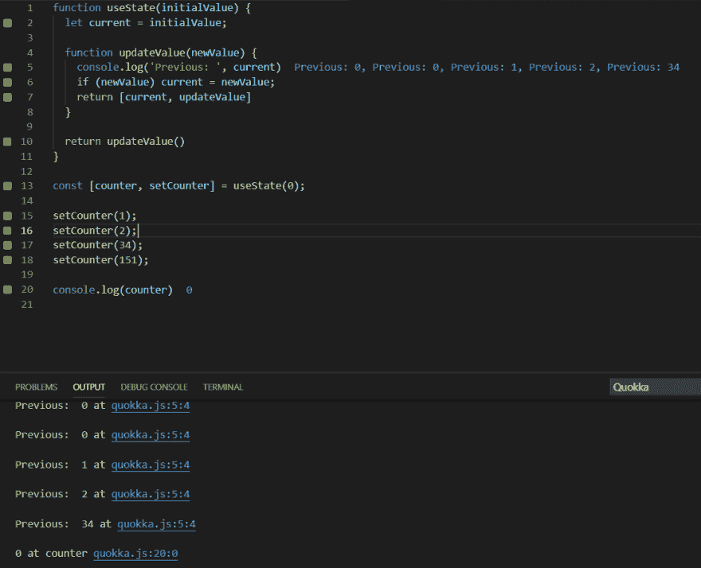

# 挑战:在不复制 React 的情况下编写一个 useState 钩子

> 原文：<https://dev.to/emmanuelvr/challenge-write-a-usestate-hook-without-copying-react-s-45eo>

你好，
昨天我想出了构建自己的 useState 函数的想法。我认为这很简单，因为我们总是可以使用词法范围。所以我试了一下。但没有成功。

如你所见，我创建了一个高阶函数来保存变量 *current* 的值，在返回的函数中，我返回了我们需要的实际值。

问题是，在我多次调用 setCounter 函数后，它确实持久化了当前状态并成功更新了它，但没有返回它。

我尝试直接从 useState 函数返回[current，updateValue],但在这种情况下，updateValue 不会保留其词法范围。所以我最后的代码是我认为最接近的。

看到这个错误我能想到的是，我传递的不是一个引用，而是实际值。我记得处理引用的方法是对象和数组，我尝试了对象的方法，但我不确定它是否实现得不好，数组引用我甚至不知道它是如何工作的。我希望从 updateValue 函数返回[current，updateValue]会有神奇的效果，但事实并非如此。

正如我所说的，我正在尝试解决这个问题，而不是查看 React 的 useState 代码。我想自己创造它，也许需要一些帮助。

你们觉得我错过了什么？你试过自己做一个使用状态吗？

最诚挚的问候！