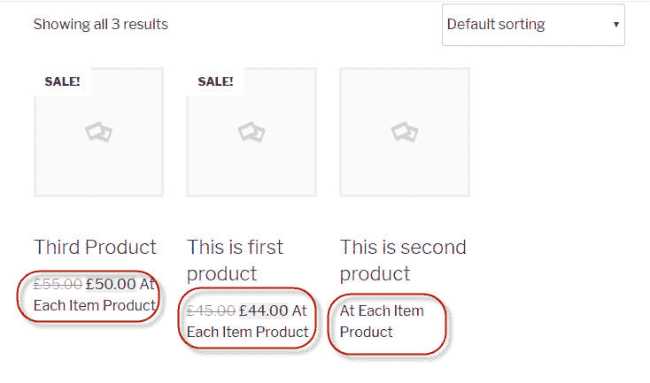
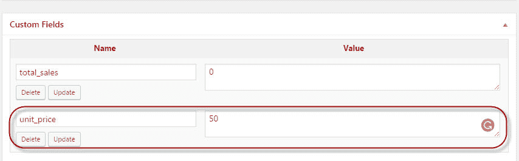

# 更改 WooCommerce 动态定价显示

> 原文：<https://dev.to/alvinarichard/change-woocommerce-dynamic-pricing-display-29ne>

[WooCommerce 定价](https://www.cloudways.com/blog/change-woocommerce-price-display/)展示是产品页面必不可少的一部分。有两种方法可以改变 WooCommerce 价格显示。

woocommerce_get_price_html:价格显示在产品和商店页面上。
·woo commerce _ cart _ item _ price:产品价格显示在购物车表中。

**更改所有 WooCommerce 产品的价格显示**
 `function cw_change_product_price_display( $price ) {
$price .= ' At Each Item Product';
return $price;
}
add_filter( 'woocommerce_get_price_html', 'cw_change_product_price_display' );
add_filter( 'woocommerce_cart_item_price', 'cw_change_product_price_display' );` 

**根据产品字段改变价格显示**

如果您想要更改某些产品的价格显示，那么为列表中的每个产品添加一个字段，并在代码中检索该字段。

