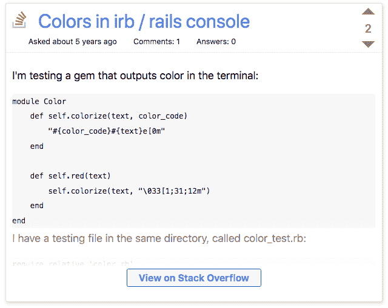
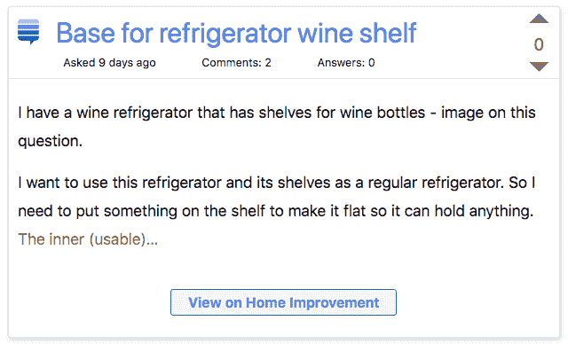
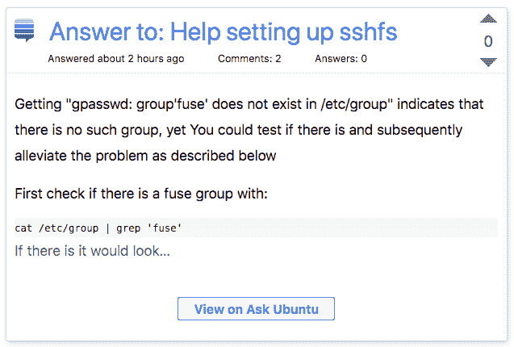

# Changelog:堆栈溢出液体标签

> 原文：<https://dev.to/devteam/changelog-stack-overflow-liquid-tag-12o2>

我们很高兴推出堆栈溢出和堆栈交换液体标签。这些嵌入，在帖子中以原生 HTML 组装(相对于 iframe、JavaScript 等。)是为了更好地讲述我们编写的代码而设计的。

堆栈溢出问题和答案是我们编码生活的一大部分，也是已知宇宙中最丰富的软件知识来源。我们希望这种集成将有助于提升进一步讨论的答案，并为堆栈溢出流注入更多的社区。

出于任何原因使用这些嵌入内容，可以是关于答案的元对话，向你在 DEV 上的关注者提出一个问题，组织一个精彩答案的综述，或者只是将*附加阅读*包含在任何 DEV 帖子中。

要进行嵌入，从堆栈溢出 URL 中提取 ID，并将其添加到您的帖子中，如下所示:

```
 
```

Enter fullscreen mode Exit fullscreen mode

这将创建一个这样的嵌入:

<header> [Why does the Rust compiler not optimize code assuming that two mutable references cannot alias?](https://stackoverflow.com/questions/57259126/why-does-the-rust-compiler-not-optimize-code-assuming-that-two-mutable-reference) Jul 29 '19 Comments: 4 Answers: 1[387](https://stackoverflow.com/questions/57259126/why-does-the-rust-compiler-not-optimize-code-assuming-that-two-mutable-reference) </header>

据我所知，引用/指针别名会妨碍编译器生成优化代码的能力，因为它们必须确保在两个引用/指针确实别名的情况下，生成的二进制文件行为正确。例如，在下面的 C 代码中，

```
void adds(int *a, int *b) {
    *a += *b;
```

…[Open Full Question](https://stackoverflow.com/questions/57259126/why-does-the-rust-compiler-not-optimize-code-assuming-that-two-mutable-reference)

还有一个问题:

<header> [Why is the result of ('b'+'a'+ + 'a' + 'a').toLowerCase() 'banana'?](https://stackoverflow.com/questions/57456188/why-is-the-result-of-ba-a-a-tolowercase-banana) Aug 12 '19 Comments: 7 Answers: 8[650](https://stackoverflow.com/questions/57456188/why-is-the-result-of-ba-a-a-tolowercase-banana) </header>

我在练习 JavaScript 时，我的一个朋友看到了这段 JavaScript 代码:

```
document.write(('b' + 'a' + + 'a' + 'a').toLowerCase());
```

以上代码回答`"banana"`！有人能解释一下为什么吗？

[Open Full Question](https://stackoverflow.com/questions/57456188/why-is-the-result-of-ba-a-a-tolowercase-banana)

这里有一个答案:

<header> [answer re: Count the identical pairs in two lists](https://stackoverflow.com/questions/57144684/count-the-identical-pairs-in-two-lists/57144755#57144755) Jul 22 '19[31](https://stackoverflow.com/questions/57144684/count-the-identical-pairs-in-two-lists/57144755#57144755) </header>

在一行程序中:

```
sum(x == y for x, y in zip(a, b)) 
```

[Open Full Answer](https://stackoverflow.com/questions/57144684/count-the-identical-pairs-in-two-lists/57144755#57144755)

而且这里有个 DIY 栈交换社区问题:

```
 
```

Enter fullscreen mode Exit fullscreen mode

<header> [How to store my pliers and wire cutters on my desk?](https://diy.stackexchange.com/questions/170013/how-to-store-my-pliers-and-wire-cutters-on-my-desk) Jul 28 '19 Comments: 5 Answers: 12[11](https://diy.stackexchange.com/questions/170013/how-to-store-my-pliers-and-wire-cutters-on-my-desk) </header>

我在桌子上放了一套工具，它们体积庞大，似乎从来都不好存放。这些包括我的钢丝钳、钳子、尺子和剪刀。

目前，我发现存放它们的最好方法是把一半的腿放在这个笔筒里…

[Open Full Question](https://diy.stackexchange.com/questions/170013/how-to-store-my-pliers-and-wire-cutters-on-my-desk)

感谢 to [@antogarand](https://dev.to/antogarand) 第一个提出这个功能，感谢 Stack Overflow 的朋友们在这个问题上提供指导，鼓励我们发布这个功能！

# [ 建议:堆栈溢出液体标签 #1419](https://github.com/thepracticaldev/dev.to/issues/1419) 

[](https://github.com/AntonyGarand) **[AntonyGarand](https://github.com/AntonyGarand)** posted on [<time datetime="2018-12-30T01:39:06Z">Dec 30, 2018</time>](https://github.com/thepracticaldev/dev.to/issues/1419)

**您的功能请求是否与某个问题相关？请描述一下。**我刚刚注意到，当我试图在我的帖子上嵌入这些问题或答案时，我们没有为堆栈溢出问题或答案添加液体标签。
考虑到以开发者为中心的网站，这可能是一个不错的补充。

**描述你想要的解决方案**使用`{{ SO stackoverflow-url }}`或类似的语法在帖子中嵌入 stackoverflow 问题或答案。

**附加上下文**在使用此功能时，需要考虑 stackexchange 网站上所有不同的子域名。这里有一个网站列出了大多数不同的域名/社区:[https://stackexchange.com/sites](https://stackexchange.com/sites)

快速浏览一下，似乎以下域是有效的:

*   [https://stackoverflow.com](https://stackoverflow.com)
*   [https://stackexchange.com](https://stackexchange.com)
*   [https://superuser.com](https://superuser.com)
*   [https://mathoverflow.net](https://mathoverflow.net)
*   https://*.stackexchange.com
*   [https://es.stackoverflow.com](https://es.stackoverflow.com)

最后两个是子域:任何 stackexchange 子域，显然很少有特定于语言的 stackoverflow 子域。

域的多样性意味着我们不能只使用`{{ so [post-id] }}`作为语法，因为我们不知道从哪里获取 ID。
也许我们可以使用简化的语法`{{ so [id] [Opt: Q or A] [Opt: Domain] }}`
，其中默认模式是问题和 Stackoverflow.com，但是它们可以被用户指定的值覆盖。

以下是几种有效的 URL 格式示例:

**问题**【https://math.stackexchange.com/q/12186】T2[https://math.stackexchange.com/questions/12186](https://math.stackexchange.com/questions/12186)[https://math . stack exchange . com/Questions/12186/arc-length-of-b % C3 % a9 zier-curves](https://math.stackexchange.com/questions/12186/arc-length-of-b%c3%a9zier-curves)[https://math.stackexchange.com/q/12186/anything](https://math.stackexchange.com/q/12186/anything)

**答案**https://math.stackexchange.com/a/64769T2【https://math.stackexchange.com/a/64769/anything】T4

[View on GitHub](https://github.com/thepracticaldev/dev.to/issues/1419)

感谢 [@andy](https://dev.to/andy) 为这个功能做了大部分工作！以下是拉取请求:

# [ 添加堆叠交换液标签 #3637](https://github.com/thepracticaldev/dev.to/pull/3637) 

[](https://github.com/Zhao-Andy) **[Zhao-Andy](https://github.com/Zhao-Andy)** posted on [<time datetime="2019-08-05T21:42:26Z">Aug 05, 2019</time>](https://github.com/thepracticaldev/dev.to/pull/3637)

## 这是什么类型的公关？(勾选所有适用选项)

*   [x]功能

## 描述

这增加了堆栈交换/堆栈溢出液体标签！以下是一些例子，并附有相应的截图:

```




 
```

[](https://user-images.githubusercontent.com/17884966/62496847-39958600-b7a8-11e9-9e0c-f5c2e25595b6.png)

[](https://user-images.githubusercontent.com/17884966/62496871-474b0b80-b7a8-11e9-80ac-180a4cd4cfe8.png)

[](https://user-images.githubusercontent.com/17884966/62496875-487c3880-b7a8-11e9-8fc1-2734a88ff561.png)

## 相关车票&单据

解决#1419

## 添加到文档中？

*   [x]编辑指南

[View on GitHub](https://github.com/thepracticaldev/dev.to/pull/3637)

编码快乐！