# 🔥带有 Google Apps 脚本的 Google Sheets 中的 Chatfuel 图片库

> 原文：<https://dev.to/nqcm/chatfuel-image-gallery-from-google-sheets-with-google-apps-script-2bhg>

[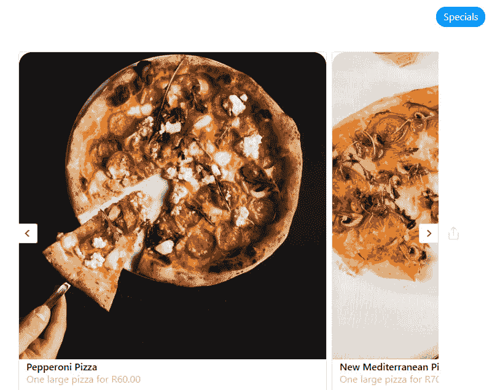](https://res.cloudinary.com/practicaldev/image/fetch/s--Nxtihv6e--/c_limit%2Cf_auto%2Cfl_progressive%2Cq_auto%2Cw_880/https://blog.naveeraashraf.com/img/googleAppScriptWithBot/chatfuel-app-with-google-apps-script.png)

假设你正在为一家餐馆制作一个机器人。机器人可以告诉用户每天的特色菜。每日特色菜会每天变化，你希望餐厅员工更新它们。由不了解技术的人，比如餐厅员工，每天在 Chatfuel 里修改东西，并不是一件值得推荐的事情。如果你为客户制作机器人，事情会变得更加复杂。

所以，我们想要一个地方，工作人员可以每天更新特价商品，机器人在将信息发送给用户之前读取特价商品。通常，这是数据库的工作，但是在这种情况下，Google Sheets 可以作为轻量级的、易于使用的数据库替代物。

唯一的问题是，Chatfuel 不提供从 Google Sheets 中开箱读取数据的功能。例如，使用第三方集成， [Zapier](https://zapier.com/) 或[integra mat](https://www.integromat.com/en/)可以达到目的，但会增加管理费用。

好消息是，如果你知道一些基本的 JavaScript，你可以像使用常规数据库一样使用 Google Sheets，并将其集成到你的 bot 中。输入 [Google Apps 脚本](https://developers.google.com/apps-script/)！

> Google Apps 脚本让你可以用 Google Sheets 做新的很酷的事情。您可以使用 Apps 脚本将自定义菜单、对话框和侧栏添加到 Google Sheets。它还允许你为表单编写自定义函数，以及将表单与其他谷歌服务如日历、驱动和 Gmail 集成。

但是 Google Apps 脚本能做的远不止这些。在本教程中，我们将使用 Google Apps 脚本从 Google Sheet 中读取比萨饼店的每日特价，并通过我们的机器人将数据作为画廊卡发送到 Messenger。

如果你不熟悉 Google Apps Script，它是一种用于 Google 生态系统中轻量级应用程序开发的脚本语言。它基于 JavaScript。所以，如果你熟悉 JavaScript，使用 Google Apps 脚本相当简单。

让我们开始吧。

## 脚手架

转到 Google Sheets 并创建一个新的空白表格。

[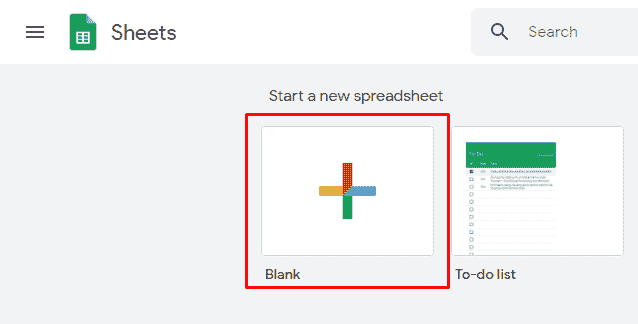](https://res.cloudinary.com/practicaldev/image/fetch/s--OqimLzty--/c_limit%2Cf_auto%2Cfl_progressive%2Cq_auto%2Cw_880/https://blog.naveeraashraf.com/img/googleAppScriptWithBot/create-sheet.png)

按照本教程，使名称，描述和图像 URL 列。这是我的带有一些虚假数据的工作表的屏幕截图。确保您的图像托管在网络上的某个地方，并且它们具有正确的权限。

[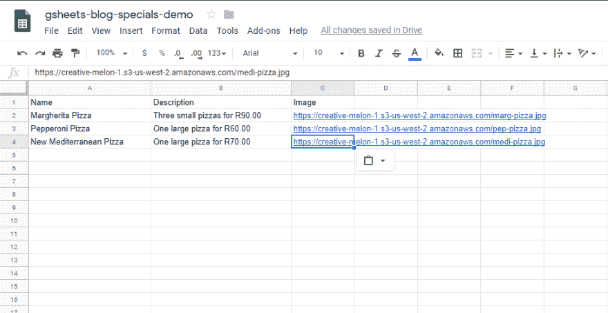](https://res.cloudinary.com/practicaldev/image/fetch/s--wcT98PhK--/c_limit%2Cf_auto%2Cfl_progressive%2Cq_auto%2Cw_880/https://blog.naveeraashraf.com/img/googleAppScriptWithBot/populate-sheet.png)

一旦你的工作表设置好了，让我们开始写脚本吧。

## 介绍 Google Apps 脚本

有不同类型的 Google Apps 脚本，在本教程中，我将创建一个[容器绑定脚本](https://developers.google.com/apps-script/guides/bound)。你可以在这里阅读更多关于不同种类的剧本。但基本上，这意味着绑定到 Google 工作表的脚本不能从它们所绑定的文件中分离出来，并且它们获得了对父文件的一些特权。

要创建一个绑定脚本，在 Google Sheet 中，从菜单中选择 tools，然后选择 Script Editor。

[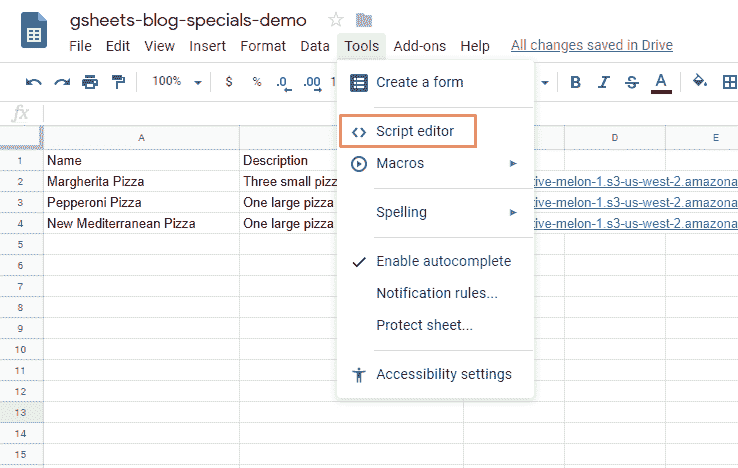](https://res.cloudinary.com/practicaldev/image/fetch/s--iyNVCUnu--/c_limit%2Cf_auto%2Cfl_progressive%2Cq_auto%2Cw_880/https://blog.naveeraashraf.com/img/googleAppScriptWithBot/select-script-editor.png)

这将打开 Google 企业应用套件脚本项目页面。

> 项目代表 Google Apps 脚本中的文件和资源的集合，有时简称为“脚本”。脚本项目有一个或多个脚本文件，这些文件可以是代码文件(扩展名为. gs)或 html 文件(扩展名为. HTML)。您还可以在 HTML 文件中包含 JavaScript 和 CSS。

你可以在这里阅读更多关于 Google Apps 脚本项目的信息。

给你的项目取一个合适的名字。

[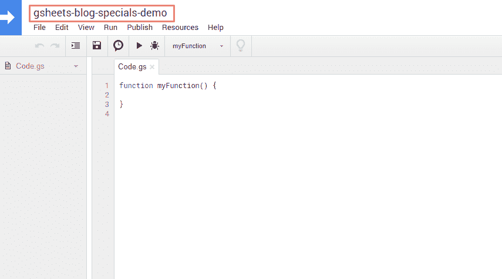](https://res.cloudinary.com/practicaldev/image/fetch/s--Ove14o7f--/c_limit%2Cf_auto%2Cfl_progressive%2Cq_auto%2Cw_880/https://blog.naveeraashraf.com/img/googleAppScriptWithBot/code-editor-screenshot.png)

如您所见，这里有一个代码编辑器，我们将在其中编写代码。目前这里只有一个空函数。

```
function myFunction() {  
} 
```

Google Apps 脚本有一个使用`Logger`类的基本日志机制。所以我们可以用`Logger.log`代替 JavaScript 的`console.log`。让我们记录一个简单的“你好，世界！”。

```
function myFunction() {
    Logger.log('Hello World!');
} 
```

单击保存，然后运行您的脚本。

[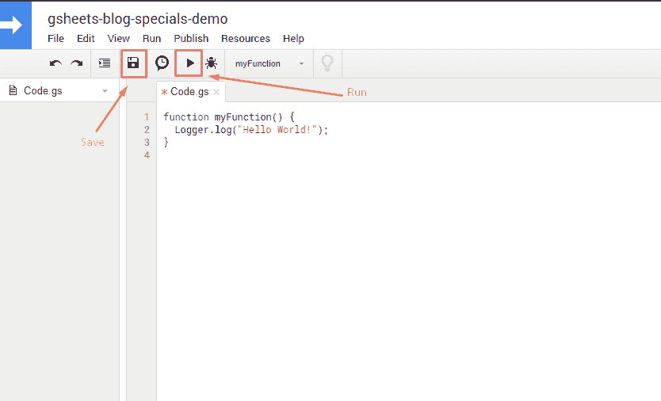](https://res.cloudinary.com/practicaldev/image/fetch/s--yYDebbSN--/c_limit%2Cf_auto%2Cfl_progressive%2Cq_auto%2Cw_880/https://blog.naveeraashraf.com/img/googleAppScriptWithBot/save-run.png)

现在点击查看>日志或者简单地按 Ctrl + Enter，你应该会看到 Hello World！显示在日志上。

[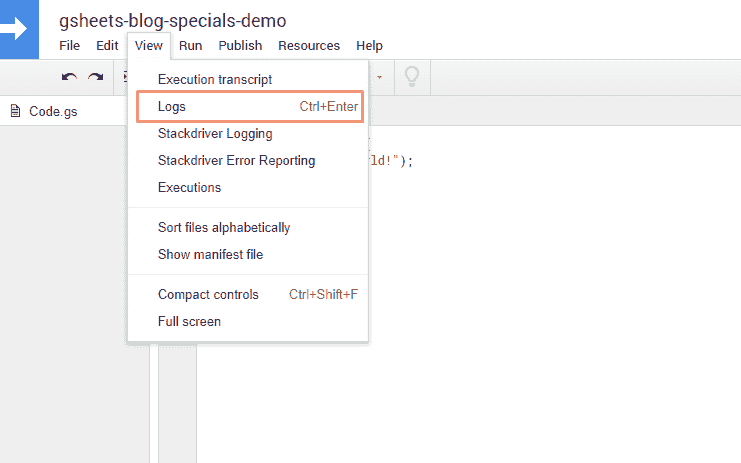](https://res.cloudinary.com/practicaldev/image/fetch/s--xiTsbSuf--/c_limit%2Cf_auto%2Cfl_progressive%2Cq_auto%2Cw_880/https://blog.naveeraashraf.com/img/googleAppScriptWithBot/view-logs.png)

[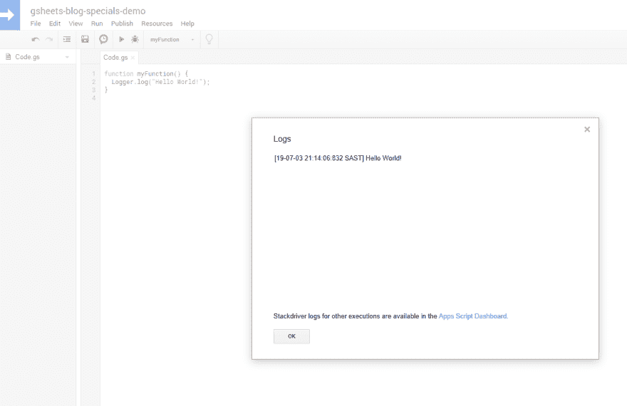](https://res.cloudinary.com/practicaldev/image/fetch/s--EDo1Ljyu--/c_limit%2Cf_auto%2Cfl_progressive%2Cq_auto%2Cw_880/https://blog.naveeraashraf.com/img/googleAppScriptWithBot/hello-world-log.png)

## 将脚本部署为 Web 应用程序

目前这只是一个脚本。我们需要将这个脚本转换成一个 web 应用程序，这样我们的机器人就可以与之通信。

只要满足以下要求，任何脚本都可以发布为 web 应用程序:

*   它包含一个 doGet(e)或 doPost(e)函数。
*   并且该函数返回 HTML 服务 HtmlOutput 对象或内容服务 TextOutput 对象。

有了这些信息，让我们改变我们的功能。

```
function doGet() {
  Logger.log("Hello World!");
  return ContentService.createTextOutput('Hello, world!');
} 
```

让我们再次保存这个脚本，然后将其部署为 web 应用程序。点击发布并选择“部署为 web 应用程序”。

[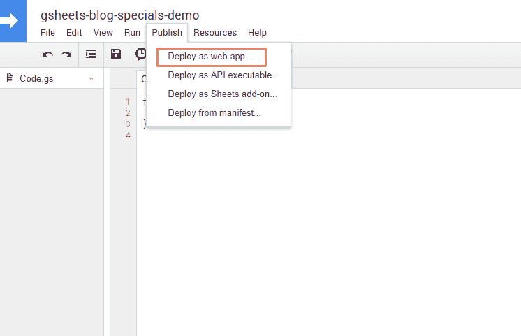](https://res.cloudinary.com/practicaldev/image/fetch/s--8oz8dSnp--/c_limit%2Cf_auto%2Cfl_progressive%2Cq_auto%2Cw_880/https://blog.naveeraashraf.com/img/googleAppScriptWithBot/deploy-as-web-app.png)

将“谁有权访问此应用程序”更改为“任何人，甚至匿名”，然后单击“部署”。

[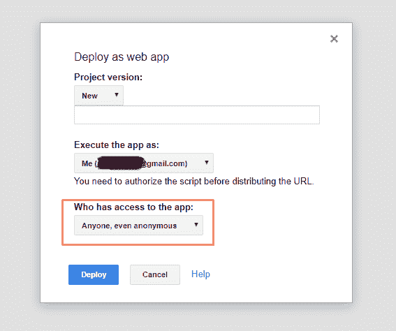](https://res.cloudinary.com/practicaldev/image/fetch/s--7XOun2Bq--/c_limit%2Cf_auto%2Cfl_progressive%2Cq_auto%2Cw_880/https://blog.naveeraashraf.com/img/googleAppScriptWithBot/deploy1.png)

请注意下一个屏幕中的 web 应用程序 URL。

## 与聊天工具整合

现在转到您的聊天燃料机器人，在您想要显示特色菜的地方添加一个 JSON API 卡。将请求的类型更改为 GET，并在 URL 中粘贴您从 Google Apps 脚本项目页面复制的 URL。测试请求。在响应部分，在响应正文下，您应该看到我们的 Hello，world！文字。

[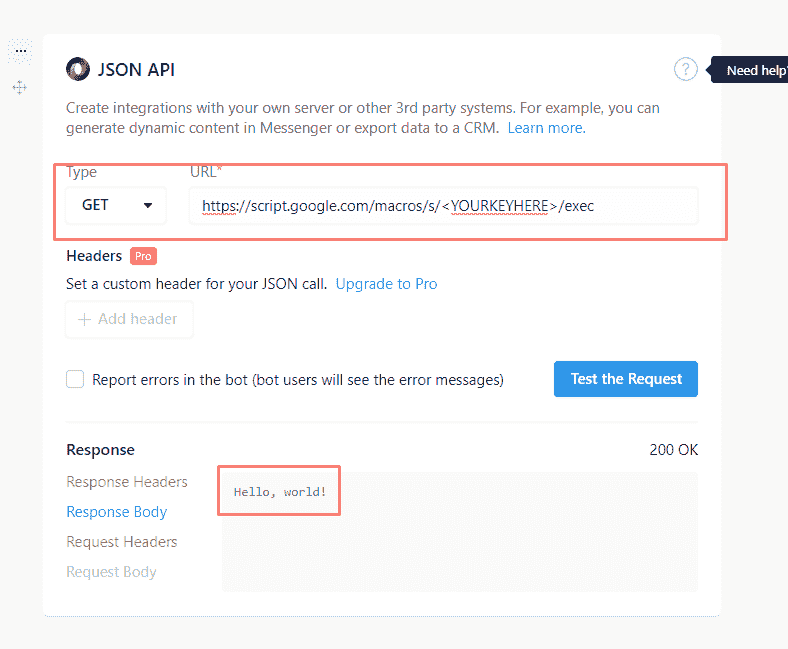](https://res.cloudinary.com/practicaldev/image/fetch/s---C0MDDrT--/c_limit%2Cf_auto%2Cfl_progressive%2Cq_auto%2Cw_880/https://blog.naveeraashraf.com/img/googleAppScriptWithBot/test-json-connection.png)

现在，我们的 bot 已经连接到运行在 Google Apps 脚本项目上的 web 应用程序，让我们看看如何从 Google Sheets 中读取数据。

## 以编程方式从 Google Sheets 中读取数据

要从电子表格中检索数据，您必须访问存储数据的电子表格，获取电子表格中保存数据的区域，然后获取单元格的值。

> Apps Script 通过读取电子表格中的结构化数据并为其创建 JavaScript 对象来方便对数据的访问。

因为我们使用的是绑定脚本，所以上述过程相当简单。我们将只调用为我们创建的 JavaScript 对象的一些方法。你可以在这里阅读所有可用的方法。将代码更改为以下内容。

```
function doGet() {
  var sheet = SpreadsheetApp.getActiveSheet();
  var data = sheet.getDataRange().getValues();
  for (var i = 0; i < data.length; i++) {
    Logger.log('Item name: ' + data[i][0]);
    Logger.log('Item description: ' + data[i][1]);
  }
  return ContentService.createTextOutput('Hello, world!');
} 
```

点击保存。谷歌会要求你允许访问数据，它可能会告诉你这个网络应用程序是不安全的。仍然继续，然后运行您的函数。检查日志，您应该会得到类似这样的结果。

[](https://res.cloudinary.com/practicaldev/image/fetch/s--Y-HAbeMB--/c_limit%2Cf_auto%2Cfl_progressive%2Cq_auto%2Cw_880/https://blog.naveeraashraf.com/img/googleAppScriptWithBot/logs1.png)

如您所见，它也在读取标题行和数据。但是，通过用 1 而不是 0 初始化循环变量，可以很容易地解决这个问题。

这是一个极其简单的脚本，我们只是触及了提供给我们的所有可能性的表面。随意摆弄代码，构建更复杂的功能。但是对于本教程来说，这个脚本就足够了。

## 从数据中制作图库

现在我们知道了如何以编程方式从工作表中读取和解析数据，让我们看看如何将这些数据作为图库发送回去。

Chatfuel 文档提供了我们需要的所有信息。转到 [JSON API 部分](https://docs.chatfuel.com/en/articles/735122-json-api)并向下滚动到“发送图库”。页面看起来像这样。

[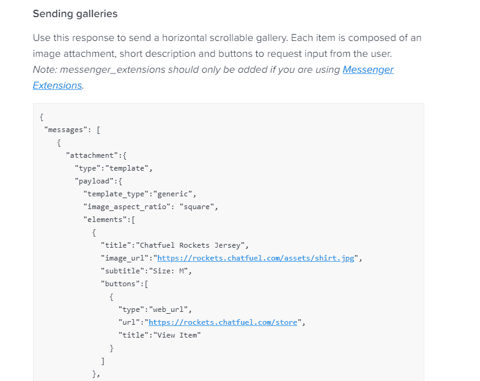](https://res.cloudinary.com/practicaldev/image/fetch/s--E_9k_G_e--/c_limit%2Cf_auto%2Cfl_progressive%2Cq_auto%2Cw_880/https://blog.naveeraashraf.com/img/googleAppScriptWithBot/chatfuel-docs.png)

正如我们所看到的，我们需要以对象列表的形式发送实际数据。

因此，让我们首先从数据中创建一个对象或元素的列表。

将代码更改为以下内容。

```
function doGet() {
  var sheet = SpreadsheetApp.getActiveSheet();
  var data = sheet.getDataRange().getValues();
  elements = create_elements(data)
  Logger.log(elements);
  return ContentService.createTextOutput('Hello, world!');
}

function create_elements(data) {
  var elements = [];
  for (var i = 1; i < data.length; i++) {
    var object = {
      title : data[i][0],
      image_url : data[i][2],
      subtitle : data[i][1],
      buttons : [
        {
          "type":"web_url",
          "url":"https://blog.naveeraashraf.com/",
          "title":"View Item"
        }
      ] 
    }
    elements.push(object)
  }
  return elements  
} 
```

我们循环遍历我们的行，并将数据添加到一个 JavaScript 对象中，然后该对象被推送到一个列表中。我们还移动了代码，在一个单独的函数中创建我们的对象，以保持代码的整洁。您可以检查您的日志，看看您的代码是否工作正常。

到目前为止，我们只记录了对象，并没有将它们发送到我们的机器人。让我们改变这一点。首先，我们将使用我们的对象来创建响应，这将建立一个画廊。将以下函数添加到您的代码中。如果愿意，您可以复制来自[聊天燃料文档](https://docs.chatfuel.com/en/articles/735122-json-api)的响应，并进行必要的更改。

```
function buildImageGallery(elements) {
  var output = JSON.stringify({
    messages: [
      {
        attachment: {
          type: "template",
          payload: {
            template_type:"generic",
            image_aspect_ratio: "square",
            elements: elements
          }
        }
      }
    ]
  });

  return ContentService.createTextOutput(output).setMimeType(ContentService.MimeType.JSON);
} 
```

我们只是将文档中的元素列表替换为我们在上一步中创建的列表。

我们还将在代码中添加一些功能，以便在工作表中没有数据时使用。这样，我们的代码就不会在餐厅员工忘记添加新特色菜而删除旧特色菜的情况下中断。

您的最终代码现在应该是这样的。

```
function doGet() {
  var sheet = SpreadsheetApp.getActiveSheet();
  var data = sheet.getDataRange().getValues();
  elements = create_elements(data)
  if (elements.length != 0) {
     return buildImageGallery(elements);
  } else {
    return notFound()  
  }
}

function create_elements(data) {
  var elements = [];
  for (var i = 1; i < data.length; i++) {
    var object = {
      title : data[i][0],
      image_url : data[i][2],
      subtitle : data[i][1],
      buttons : [
        {
          "type":"web_url",
          "url":"https://blog.naveeraashraf.com/",
          "title":"View Item"
        }
      ] 
    }
    elements.push(object)
  }
  return elements  
}

function buildImageGallery(elements) {
  var output = JSON.stringify({
    messages: [
      {
        attachment: {
          type: "template",
          payload: {
            template_type:"generic",
            image_aspect_ratio: "square",
            elements: elements
          }
        }
      }
    ]
  });

  return ContentService.createTextOutput(output).setMimeType(ContentService.MimeType.JSON);
}

function notFound() {
  var output = JSON.stringify({
    messages: [
      {
        text: "There are no items in this category"
      }
    ]
  });
  return ContentService.createTextOutput(output).setMimeType(ContentService.MimeType.JSON);
} 
```

在 Messenger 中测试您的 bot，您应该可以从显示为图库的工作表中获得数据。

[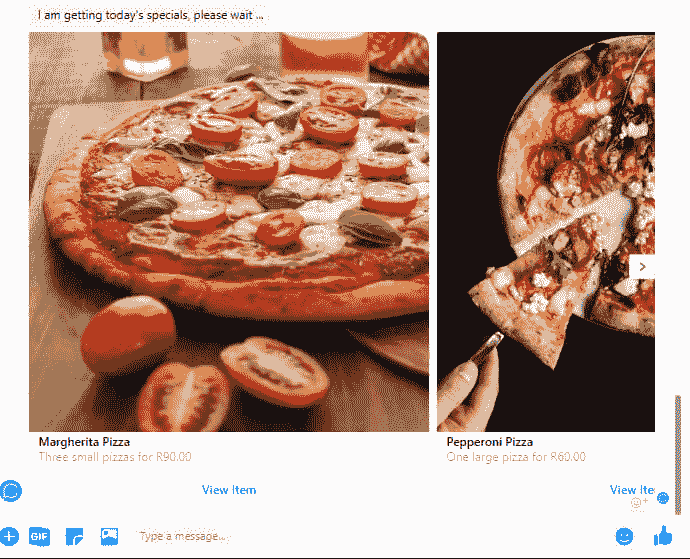](https://res.cloudinary.com/practicaldev/image/fetch/s--JsNfILzO--/c_limit%2Cf_auto%2Cfl_progressive%2Cq_auto%2Cw_880/https://blog.naveeraashraf.com/img/googleAppScriptWithBot/pizza-bot-demo-1.png)

就是这样！我希望你喜欢这个教程。如果你有，不要忘记分享它。