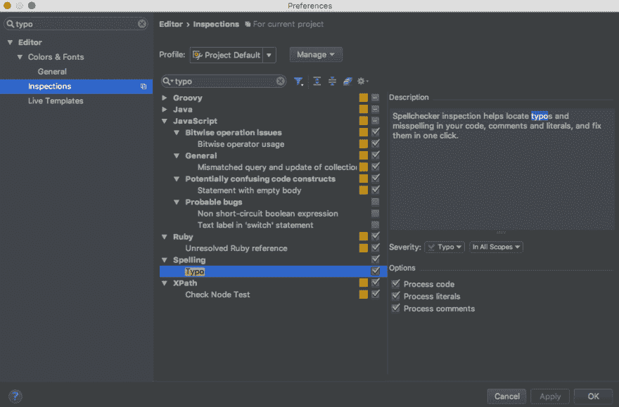
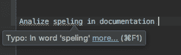
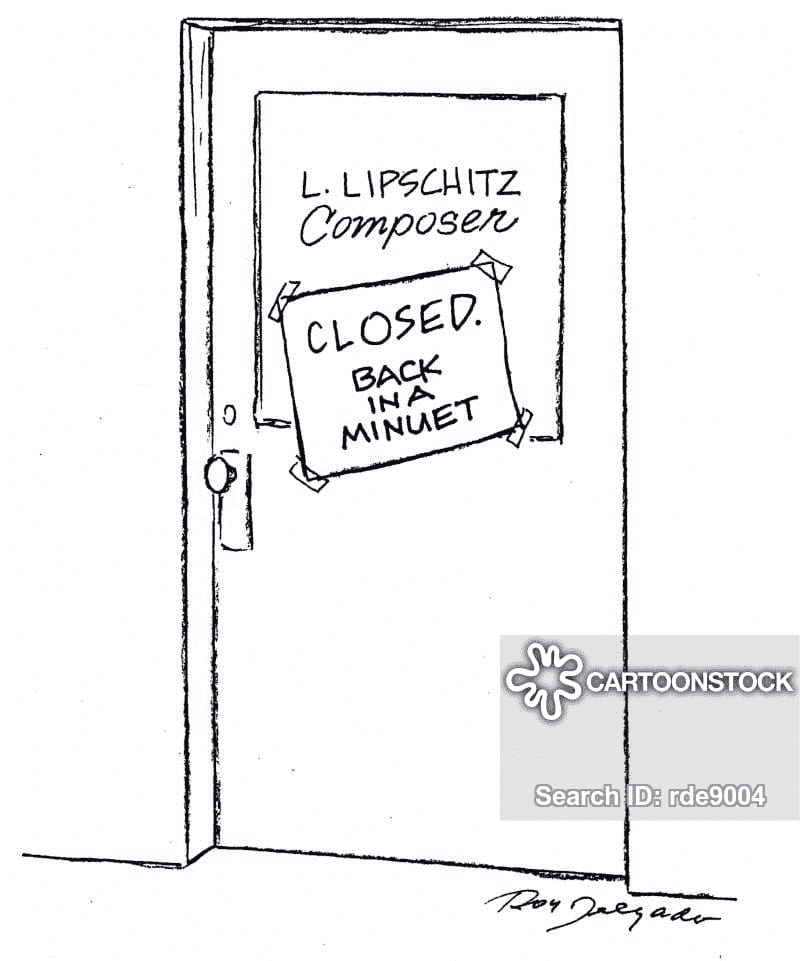

# 请检查一下拼写。(代码评审编年史)

> 原文：<https://dev.to/dvddpl/check-that-spelling-please-code-review-chronicles-3pga>

你是一个讨厌的、挑剔的、学究式的代码评审者吗？
我想我有时候是。

不，我不争论制表符或分号(*我们用 linter 来表示*)。
我不要求只重写的代码*，因为我会写得稍微不同。*

那为什么呢？好吧，我给你讲一点背景:

> 在我团队的 9 个人中，没有一个人的母语是英语。

你能想象我的意思吗？

在这样的工作环境中——来自印度、埃及、意大利、波兰、俄罗斯、中国、保加利亚的开发人员——使用不同的语言和字母—**经常会出现拼写错误。**

也许代码是绝对好的，很好的实现和单元测试都在那里，但是你开始:

```
const analiseData = (data)=> //awesome code here 
```

Enter fullscreen mode Exit fullscreen mode

[](https://i.giphy.com/media/YsOpzCbCfLJfO/giphy.gif)

你是做什么的？你会因为这个拒绝合并请求(或者拉请求——如果你用 github 的话)吗？

或者也许先生已经被发现有评论和修改的要求，你会在所有这些之上加上打字错误吗？

那岂不是太吹毛求疵了？

虽然我不想伤害人们的感情，听起来像一个无聊的英语老师，或者只是因为成为所有 MR 审批票的瓶颈而减缓我们的冲刺，但我真的认为应该从代码中消除错别字。

> 代码必须是人类可读的，并且必须是为你的同事和你未来的自己而写的。

如果您允许一个名为 *`loadCampaings`* 的方法通过代码审查，并使其成为主代码，这可能会发生:

*   其他没有意识到拼写错误的开发人员可能会调用缺失的函数或访问不存在的属性，从而导致错误。
*   或者他们将不得不增加一些认知负荷和领域项目负担，不得不记住那个功能不叫`loadCampaigns`而是真正的`loadCampaings`。
*   如果你记得有这样一个函数并搜索它/ grep 它，你将无法找到它(假设你拼写正确)。

所以，imho，**错别字应该被指出来(在每次代码审查中需要通常的小心和敏感)，因为它们**可能导致错误和难以维护的代码。****

 **### 但是如何避免或改善这个过程呢？

#### 棉绒

一些 linters(我们使用了 [XO](https://github.com/xojs/xo) 并且我们喜欢它)有助于立即发现缺失的功能或属性，因为:

*   你试图访问正确的`isMaintenance`属性——它没有被声明(见 [No-undef](https://eslint.org/docs/rules/no-undef) )
*   ` is 维护将被视为未使用(参见[无未使用变量](https://eslint.org/docs/rules/no-unused-vars))。

#### IDE 拼写检查器

当涉及到电子邮件和文档(或博客帖子)时，我个人在语法上使用，但是当我在 IntelliJ IDEA 中编写代码时，我激活了**错别字检查**,这样拼写错误就会用一条绿色的曲线标记出来(你可以定义你喜欢的“通知”级别，并最终将其设置为“警告”或“错误”,这样它会更加突出，不会出现拼写错误)

[](https://res.cloudinary.com/practicaldev/image/fetch/s--f-CIh3ej--/c_limit%2Cf_auto%2Cfl_progressive%2Cq_auto%2Cw_880/https://thepracticaldev.s3.amazonaws.com/i/8ox074lllfibvx35rohs.png) 
除了您正在编辑的文件中的即时视觉帮助，您还可以通过运行`Analyze / Inspect Code`来运行项目智能分析。

[](https://res.cloudinary.com/practicaldev/image/fetch/s--0k9nPjKc--/c_limit%2Cf_auto%2Cfl_progressive%2Cq_auto%2Cw_880/https://thepracticaldev.s3.amazonaws.com/i/k94hwbotsueg5m3o4woy.png)

对于 Visual Studio，我很快在谷歌上找到了

*   [VisualStudio 拼写检查器](https://marketplace.visualstudio.com/items?itemName=EWoodruff.VisualStudioSpellCheckerVS2017andLater)
*   [代码拼写检查器](https://marketplace.visualstudio.com/items?itemName=streetsidesoftware.code-spell-checker)

我很确定还有很多，对于你可能正在使用的其他 IDE 也是一样。

* * *

这是我最近在我们的代码审查中发现的几个拼写错误——我忍不住用一个有趣的链接向作者指出了它们(在 slack 上私下发送——不是在官方的 MR 评论中！).

``const timestampUnit = "minuets"``

 ``[](https://res.cloudinary.com/practicaldev/image/fetch/s--kdEUqAzx--/c_limit%2Cf_auto%2Cfl_progressive%2Cq_auto%2Cw_880/https://s3.amazonaws.com/lowres.cartoonstock.com/music-lunchbreak-lunch_break-lunch_break-musician-composer-rde9004_low.jpg)

``The purpose of this **Lambada** function is to ..... (inside a README.md)``

 ``[https://www.youtube.com/embed/iyLdoQGBchQ](https://www.youtube.com/embed/iyLdoQGBchQ)

我是不是太刻薄了？你有没有发现一些有趣的事情？

顺便问一下——假设你不是说英语的人，你的团队也不是多元文化的——你是用英语编码还是用你的母语编码？

* * *

席琳·纳多在 Unsplash 上的照片