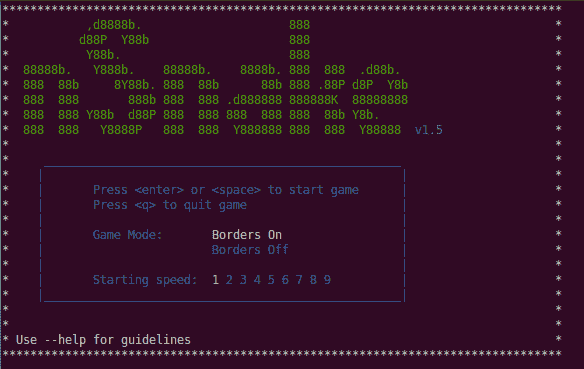
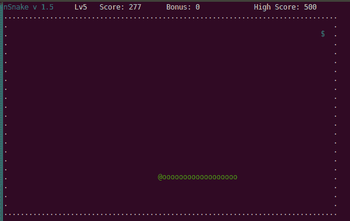
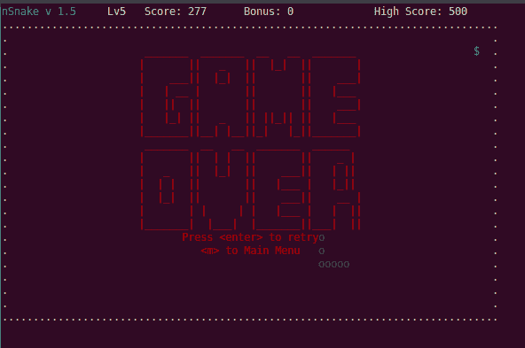

# Linux 终端中的经典贪吃蛇游戏

> 原文：<https://dev.to/anuragrana/classic-snake-game-in-linux-terminal-334d>

[](https://res.cloudinary.com/practicaldev/image/fetch/s--GNIw8XT2--/c_limit%2Cf_auto%2Cfl_progressive%2Cq_auto%2Cw_880/https://cdn-images-1.medium.com/max/1024/1%2Ax535NzzoXrs95BZLUVSfvg.png)

你一定在像诺基亚 1100 这样的功能手机上玩过经典的贪吃蛇游戏。

现在你又可以在 Linux 终端上玩同样的游戏了。

为此，您需要在终端中运行下面的命令来安装 nsnake 包。

```
sudo apt-get install nsnake 
```

安装包后，通过运行 nsnake 命令运行游戏。

[](https://res.cloudinary.com/practicaldev/image/fetch/s--Z7rvQxlN--/c_limit%2Cf_auto%2Cfl_progressive%2Cq_auto%2Cw_880/https://cdn-images-1.medium.com/max/584/1%2A8DGidl_R1sLrr3aNa09N7g.png)

使用上下箭头键将游戏模式切换到边框打开和边框关闭。

使用左右箭头键改变速度。完成设置后，按回车键或空格键开始游戏。

按下 *q* 键可以退出游戏。

[](https://res.cloudinary.com/practicaldev/image/fetch/s--8vv861u3--/c_limit%2Cf_auto%2Cfl_progressive%2Cq_auto%2Cw_880/https://cdn-images-1.medium.com/max/587/1%2ALwcK6XtA-kSnCBSe0JQQUQ.png)

规则和经典游戏中的一样。

如果你和自己(蛇)相撞，你就死了。游戏结束。

[](https://res.cloudinary.com/practicaldev/image/fetch/s--lJhOzDot--/c_limit%2Cf_auto%2Cfl_progressive%2Cq_auto%2Cw_880/https://cdn-images-1.medium.com/max/592/1%2AqfV3vAPw0DqFZyfr9WDSJw.png)

[从 Github](https://github.com/alexdantas/nsnake) 下载这款游戏的最新版本。

[](https://res.cloudinary.com/practicaldev/image/fetch/s--z1TbTkFR--/c_limit%2Cf_auto%2Cfl_progressive%2Cq_auto%2Cw_880/https://cdn-images-1.medium.com/max/1/0%2AZAXJ6c3TUq7rRTif)

**更多来自作者:**

*   [**如何在 Pythonanywhere 上免费托管 Django App**](https://www.pythoncircle.com/post/18/how-to-host-django-app-on-pythonanywhere-for-free/)
*   [**使用 Python Request 和 BeautifulSoup 抓取 2019 年印度大选数据并分析**](https://www.pythoncircle.com/post/683/scraping-data-of-2019-indian-general-election-using-python-request-and-beautifulsoup-and-analyzing-it/)
*   [**基于文本的蛇与梯游戏中的 python**](https://www.pythoncircle.com/post/676/text-based-snake-and-ladder-game-in-python/)
*   [**如何开始 Python 编程—初学者指南**](https://www.pythoncircle.com/post/671/how-to-start-with-python-programming-a-beginners-guide/)
*   [**使用 python 脚本自动化脸书页面帖子**](https://www.pythoncircle.com/post/666/automating-facebook-page-posts-using-python-script/)