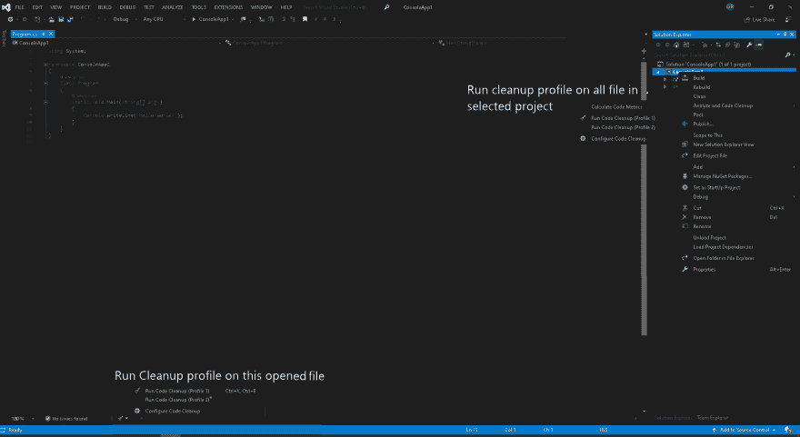

# 清理你的代码？下面是 VS 2019 为你准备的。

> 原文：<https://dev.to/gopkumr/clean-your-code-using-code-cleanup-in-visual-studio-2019-3k9a>

我们所有的开发人员在完成了一整天的代码和咖啡后，都会花时间清理代码！因为。Net 开发人员要做的是删除 visual studio/nuget 自动添加的所有不再需要的 using 子句，删除不再使用的变量，为合格的私有变量添加只读，从单个语句块中添加或删除大括号等。

有一系列工具/扩展可以帮助开发人员自动完成这些任务。这些工具中最受欢迎的是 Re-Sharper、StyleCop、CodeMaid...

微软从 2012 年开始的 visual studio 版本将这些功能整合到了 IDE 中。在 Visual studio 2017 之前，开发人员可以通过右键单击文件并选择其选项或选择重构快速操作灯泡来删除未使用的 using、sort using 子句和其他清理。

## 从 visual studio 执行代码清理

Visual Studio 2019 通过引入一个选项来对项目/解决方案中的单个文件或所有文件运行一组预定义的代码清理操作，将这一点提升到了一个新的水平，该选项可在 Visual Studio 状态栏、分析菜单或文件/项目/解决方案的右键单击上下文菜单中找到。

### 代码清理概要文件

从上面的截图可以看出，visual studio 2019 允许您创建一个代码清理活动(他们称之为修复程序)的列表，并将它们保存为他们所谓的配置文件(不，您不能为配置文件定义名称，目前只有 2 个配置文件的选项)。您可以从预定义的修复程序列表中进行选择(目前有 14 个)。要配置概要文件，你可以从上面截图中的任何菜单选项中选择选项，或者你可以选择 Visual Studio 菜单*分析>代码清理>配置代码清理*
，你会得到一个如下所示的窗口来选择进入概要文件的修复程序

这只是第一次发布的特性，每个开发者都会喜欢它，它有潜力做得更多。Visual studio 开发人员社区已经开始对这个特性提出大量的建议和反馈，以使它变得更好。