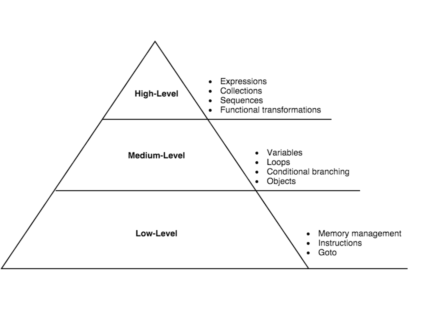

# JavaScript 生态系统中的 ClojureScript

> 原文：<https://dev.to/kendru/clojurescript-in-the-javascript-ecosystem-64k>

这篇文章是安德鲁的书[第二课](https://www.learn-clojurescript.com/section-0/lesson-2-clojurescript-in-the-javascript-ecosystem/)，[T3】学 ClojureScriptT5】](https://gum.co/learn-cljs)

* * *

现在我们已经很好地了解了 ClojureScript 是什么以及如何使用它，我们将继续拉开帷幕，以更清楚地了解这种奇怪的语言如何融入其环境 JavaScript 生态系统。虽然这种语言与 JavaScript 有很大不同，但它与其 JavaScript 宿主保持着共生关系。JavaScript 需要 ClojureScript，ClojureScript 需要 JavaScript。让我们来探索这种有趣的共生现象。

**本章内容:**

*   ClojureScript 试图解决 JavaScript 中的哪些问题？
*   使用编译语言如何帮助应用程序开发
*   为什么 JavaScript 是 ClojureScript 的理想平台？

## 为什么 JavaScript 需要 Clojure

看到 ClojureScript 的优点后，很明显它承诺了一些好处。尽管如此，我们能从 JavaScript 本身获得类似的优势而无需学习一门新语言吗？此外，ClojureScript 在我们的日常开发任务中真的给了我们那么多额外的优势吗？对于琐碎的任务，ClojureScript 可能不是最好的工具，但是对于任何更复杂的任务，JavaScript 实际上*需要*像 Clojure 这样的语言来实现更高效、更愉快的开发。

> **Clojure(脚本)**
> 
> 您可能已经注意到，我多次交替使用术语“Clojure”和“ClojureScript”。Clojure 作为一种语言，有编译成 Java 字节码和 JavaScript 的实现。一些潜在的混淆来自于“Clojure”既指这种语言，也指它的 Java 实现。我将遵循 Clojure 社区的一般模式，在讨论语言本身时互换使用这两个术语，在讨论 ClojureScript 特有的生态系统或语言特性时使用“ClojureScript”。

### 更高层次的语言

ClojureScript 使用比 JavaScript 更高级的结构进行操作。在 JavaScript 中，我们主要处理变量、循环、条件分支结构、对象和数组。在 ClojureScript 中，我们处理表达式、集合、序列和转换。从低级概念到高级概念的旅程是我们获得生产力的方式。

*定义每个抽象层次的特征*

当我们在更高的层次工作时，会发生一些有趣的事情。首先，完成给定的任务需要较少的代码，这有助于初始开发和调试/维护。第二，它使得代码的结构更加类似于问题域，当我们回到问题域的时候，它让我们更容易理解。第三，它解放了我们，让我们更多地考虑领域的问题，而不是技术实现问题。所有这些因素都可以极大地提高生产力，无论是在应用程序的初始开发阶段还是维护阶段。

当我们编写更少的代码来完成给定的任务时，有几个好处。首先，不用说，写一点代码比写很多代码要快。尽管通常花在设计和规划代码上的时间比实际编写代码的时间要多，但我们不希望被将想法转化为代码所需的击键次数所阻碍。第二，更少的代码行意味着更少的 bug。宁愿把时间花在修复 bug 而不是编写新特性的开发人员不是凤毛麟角，就是根本不存在。像 ClojureScript 这样的高级语言的简洁意味着有更少的地方可以隐藏 bug，反过来，我们可以花更多的时间取得进展。

### 少了样板文件

我已经数不清有多少次我想用 JavaScript 完成一个简单的任务——比如说，执行一个对象的深度克隆——但是不得不使用 Google 搜索来记住如何使用普通的 JavaScript 或我可用的库来完成它。通常，我会在某个我已经访问过无数次的 StackOverflow 线程上结束，并将该示例复制并粘贴到另一个项目的另一个“utils”文件中。像 *lodash* 和 *jQuery* 这样的库有助于弥补 JavaScript 缺乏公共工具的不足，但是它们没有解决这样的问题，即人们必须超越语言本身来获得健壮的标准库的功能。

对于浏览器来说，大多数任务都需要引入第三方库，这是一个独特的问题，因为每个额外的库都会增加页面加载的时间。更糟糕的是，大多数网络应用程序至少需要考虑网速较慢的移动客户端。当每一个字节都很重要时，就像在 web 上一样，我们不断地面临这样的问题:是为了有限的效用而包含另一个库，还是从头开始编写我们需要的函数。

最后，JavaScript 开发人员必须不断面对浏览器兼容性问题的现实。可用的选项有:针对您希望支持的浏览器的最小公分母(并错过提高开发人员生产率的语言功能)、引入库(并增加大量页面大小)，或者实现浏览器检测并从头开始编写特定于浏览器的部分(并面对浏览器黑客带来的额外复杂性)。这些选择听起来不是很吸引人，我们不应该在开发人员的生产力、性能和复杂性之间做出权衡。为了解决浏览器兼容性问题而不牺牲任何这些东西，我们需要看看 JavaScript 本身以外的东西。

另一方面，ClojureScript 有一组丰富的数据结构和函数，用于处理集合、字符串、数学、状态管理、JavaScript 互操作性等等。此外，ClojureScript 建立在 Google 的 Closure(带有“s”，而不是“j”)库的基础上，将支持 Gmail 和 Google Docs 等应用程序的相同工具放在您的指尖。有了这么多的工具供我们使用，我们将会看到我们需要编写的实用程序代码的数量是最少的。最后，ClojureScript 编译成广泛支持的 JavaScript 子集，使得浏览器兼容性不再是问题。ClojureScript 将焦点从“管道”上移开，允许我们更多地关注我们正在工作的领域中的有趣问题。

### 默认不可变数据

我们已经将不可变数据视为函数式编程的基本概念之一。虽然 JavaScript 社区的许多人开始认识到不可变数据的价值，但在 JavaScript 中使用不可变数据仍然不是本地的，可能会感觉有些麻烦。像脸书的 *Immutable.js* 这样的库允许我们从 JavaScript 中获得不可变数据的好处，但是同样，这种语言目前没有本地支持。

然而，在 ClojureScript 中，情况正好相反。所有默认的数据结构都是不可变的，我们不得不特意去处理可变的对象。这是 ClojureScript 非常固执己见的一个领域，但是它所提倡的编程风格将会导致更少的错误和——正如我们已经看到的——优化的用户界面。一旦我们习惯了使用 ClojureScript 的数据结构，返回到可变的对象和数组会感觉不寻常——甚至危险。

### 编译器优化

编译语言的一个优点是，它可以在生成的 JavaScript 代码中实现优化。高级语言很少能在速度、资源使用或编译代码大小方面与低级语言相媲美。然而，ClojureScript 通常可以生成运行速度与手写 JavaScript 一样快的 JavaScript。它的不可变数据结构通常消耗更多内存，比原始对象和数组慢，但是这些数据结构提供的 UI 优化可以使 ClojureScript 接口*比相应的 JavaScript 接口*更快。

对 JavaScript 程序员来说非常重要的一个指标是代码大小。当在服务器端环境中工作时，代码大小通常不是一个问题——代码从磁盘中读取并立即读入内存。然而，对于前端 JavaScript 应用程序，代码通常必须通过互联网读取，可能是通过低带宽的移动网络。在这种情况下，每一个字节都很重要，我们习惯于费力地编写代码，并试图使代码尽可能地小，甚至不惜牺牲清晰性。缩小帮助很大，但是我们仍然必须注意包含更多的库。通常，库带来的好处会被页面加载时间增加的千字节数抵消。

ClojureScript 编译器最有趣的特性之一是它生成 Google 闭包模块，然后利用闭包编译器优化 JavaScript。因为 ClojureScript 编译器保证它生成的 JavaScript 是有效的 Google 闭包模块，所以在准备生产资产时，我们可以安全地利用闭包编译器最激进的优化。除了删除空白和重命名变量之外，闭包编译器还会分析整个代码库，并删除任何永远无法调用的代码路径。实际上，这意味着我们可以引入一个大的库，如果我们只使用这个库中的几个函数，那么只有这些函数和它们调用的函数包含在我们的代码库中。在代码大小如此重要的环境中，这显然是一个显著的优势。

### 快速回顾

*   你能想到你自己为几乎每个 JavaScript 项目编写的代码片段吗？一个更完整的标准库能解决这些问题吗？
*   用编译成 Javascript 的语言工作有什么好处？你能想到有什么缺点吗？

## 为什么 Clojure 需要 JavaScript

尽管 Clojure 语言很有用，但它需要 JavaScript。JavaScript 为 Clojure 语言带来的最重要的东西是客户端 web 开发、丰富的库和技术生态系统，以及一个比 Java 虚拟机占用空间小得多的轻量级平台。也就是说，ClojureScript 编译成 JavaScript，所以它可以在 JavaScript 运行的地方运行，包括客户端、服务器、桌面和物联网(IoT)设备。

### 客户端开发

Clojure 最初是一种服务器端语言。使用 Swing 或另一个 Java UI 工具包编写桌面 GUI 当然是可能的，但是 Clojure 的绝大部分是为服务器编写的。Clojure 作为一种服务器端编程语言非常优秀，但是正如我们已经讨论过的，它也为 UI 开发带来了一些显著的优势。随着 ClojureScript 的出现，Clojure 现在是一种通用语言，几乎可以用于任何应用程序——在服务器或客户机上。正如 Rich Hickey 在宣布 ClojureScript 时所说，“Clojure *摇滚*，JavaScript *到达*”

此外，有了像 Electron 这样的技术，我们也可以选择用 JavaScript 编写桌面应用程序；由于 ClojureScript 可以编译成 JavaScript，我们也可以利用同样的技术用 ClojureScript 编写桌面应用程序。虽然 Clojure 本身使开发人员能够编写 Java GUI 应用程序，但许多开发人员更喜欢这些 JavaScript UI 技术所提供的轻量级风格。

> **关闭桌面上的脚本**
> 
> LightTable 编辑器——支持 Clojure 语言的最流行的编辑器之一——的开发人员选择使用 ClojureScript 构建他们的 UI，并部署在 electronic 内部。这使他们能够构建一个非常灵活、可定制的 UI，而没有传统桌面 UI 的复杂性。

最后，有一些技术允许 JavaScript 应用程序作为移动应用程序运行。React Native 在这个领域越来越受欢迎，成为 ClojureScript 的绝佳选择，因为大多数 ClojureScript UIs 都是以 React 为平台构建的。虽然 JavaScript 移动原生应用程序是一个相对较新的领域，但它显示出了很大的前景。下一代移动应用可能主要是 JavaScript 应用，这意味着 ClojureScript 也将成为移动客户端的一等公民。

### JavaScript 生态系统

JavaScript 不仅仅是一种语言——它是一个对最佳实践、库、工具和开发过程有意见的社区。ClojureScript 生活在这个社区中。虽然我们作为 ClojureScript 开发人员受益于大量可用的 JavaScript 库，但 JavaScript 提供的更重要的好处是它的社区。我们可以从社区的集体经验中了解前端开发的好、坏和丑陋之处。JavaScript 和 Clojure 之间的关系是真正的共生关系，两个社区都受益于对方的想法和见解。

虽然我们已经看到 ClojureScript 是一种非常实用和有用的语言，但让我们面对它——函数式编程语言很容易与工作程序员的关注点脱节。理论语言是有用的，大多数有用的编程语言特性都是从研究项目开始的，但是理论的纯洁性不是我们编写 web 应用时最关心的。完成任务的能力是更高的优先级，从一开始，JavaScript 就致力于尽可能直接地完成任务。成为 JavaScript 社区的一员有助于 ClojureScript 专注于实用问题，帮助我们构建更好的 web 应用程序。

### 足迹变小

JVM 是开发高性能跨平台应用程序的优秀平台。当在资源受限的环境或脚本中运行时，它就不那么优秀了。虽然 Sun Microsystems 用“编写一次，在任何地方运行”的口号来推广 Java，但具有讽刺意味的是，成为“通用”运行时的是 JavaScript。从浏览器到服务器到 Raspberry Pi 和嵌入式设备，JavaScript 可以在任何地方运行。另一方面，在类似 Raspberry Pi 的东西上运行 Java 实际上是不可能的。对于编写 Java 过于臃肿的应用程序，ClojureScript 是一个很好的选择。它几乎可以在任何设备上运行的能力是 JavaScript“影响力”的另一个方面，我们可以从 ClojureScript 中加以利用。

脚本是 Java 相当薄弱的另一个领域。无论是作为一种嵌入到大型应用程序中的脚本语言，还是作为一种系统外壳脚本语言，Java 都太大太复杂，JVM 的启动时间对于像简单脚本这样的短命程序来说是不切实际的。JavaScript 是一种很棒的脚本语言。Node.js 允许我们编写系统脚本以及 web 服务器。

### 快速回顾

*   ClojureScript 最常见的平台是什么——web、桌面、移动还是物联网设备？可以在这个平台之外使用吗？
*   ClojureScript 与现有 JavaScript 工具和库的互操作性如何？

## 总结

在本章中，我们探讨了 ClojureScript 与其宿主语言 JavaScript 的关系。我们已经看到了解到:

*   ClojureScript 如何改进 JavaScript 的开发体验
*   JavaScript 的轻量级和无处不在的运行时如何允许我们为几乎任何平台编写 ClojureScript。
*   为什么客户端 web 开发非常适合 ClojureScript。

既然我们已经很好地理解了 ClojureScript 是什么以及它与 JavaScript 平台的关系，那么我们就可以开始学习这门语言了。在下一节中，我们将完成编写 ClojureScript 应用程序的过程，学习常用的工具和实践。