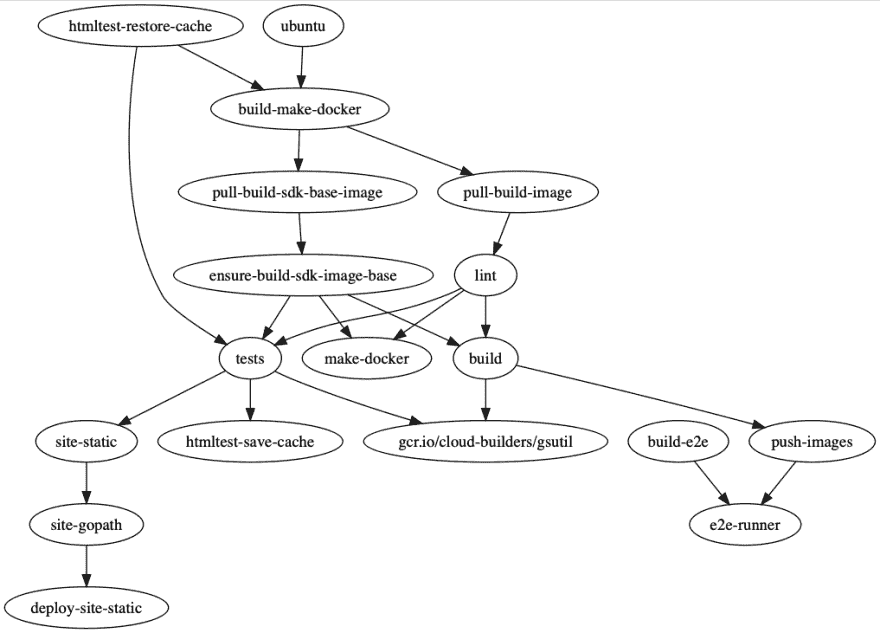

# 云构建依赖关系图

> 原文：<https://dev.to/googlecloud/cloud-build-dependency-graph-mkp>

几个月前，我的同事马克·曼德尔(Mark Mandel)问是否有人有办法可视化[云构建(T3)中的依赖关系。正如你所料，我们中有几个人立即着手解决这个问题。我使用 graph gem 用 Ruby 编写了我的解决方案。](https://cloud.google.com/cloud-build/)

云构建配置文件在 yaml 中。每个构建步骤都列出了要运行的容器和一些配置选项，如要传递的参数和要使用的目录。每个步骤还有一个`waitFor`字段来指定步骤之间的依赖关系。这是构建依赖图时需要解析和理解的所有信息。

因为我在开始使用 [Zenspider 的`graph`宝石](https://github.com/seattlerb/graph)之前就已经用过了。graph gem 使用 DSL 输出 Graphviz 使用的 [`dot`](https://en.wikipedia.org/wiki/DOT_(graph_description_language)) 文件格式。使用 graph gem，用语法`edge "A", "B"`定义边。一个边缘只是一个箭头。在这种情况下，箭头在 A 和 B 之间，如果 A 或 B 中有一个还不存在，gem 会自动添加它。

DSL 使得创建依赖图非常简单。我所要做的就是解析构建配置文件，然后使用`waitFor`字段来绘制相关步骤之间的边界。为了使图表易于阅读，我选择使用 ID 作为节点标签。如果没有 ID 字段，我使用名称。唯一棘手的是，云构建配置文件不必使用`waitFor`来声明它们所有的依赖关系。如果没有为一个步骤给出依赖关系，则假定它依赖于所有前面的步骤。这意味着我必须跟踪前面的步骤来获得正确的边缘。将所有这些放在一起会产生以下代码:

```
require 'graph'
require 'psych'

steps = Psych.load(File.read(ARGV[0]))["steps"]

previous_steps = []

digraph do
  steps.each do |step|
    id = step["id"] || step["name"]

    deps = step["waitFor"] || previous_steps
    deps.each do |dep|
      break if dep == "-"
      edge dep, id
    end

    previous_steps << id

  end

  save "buildgraph", "png"

end 
```

[要旨在此](https://gist.github.com/thagomizer/5bf613022e323a5134d22a4e4e8f026d)

根据与团队共享的构建文件标记运行该代码，会得到这个依赖关系图:

[](https://res.cloudinary.com/practicaldev/image/fetch/s--3qfHcA8C--/c_limit%2Cf_auto%2Cfl_progressive%2Cq_auto%2Cw_880/http://thagomizer.com/img/buildgraph.png)

总共花了大约 30 分钟在黑客之夜编码。大部分时间都在阅读云构建配置文件格式。如果你很好奇，上面显示的依赖图是针对 [Agones](https://agones.dev/site/) 的，这是一个基于 Kubernetes 构建的开源游戏服务器扩展和编排平台。