# 用于 React NextJS 应用程序中图像管理的 Cloudinary

> 原文：<https://dev.to/nabendu82/cloudinary-for-image-management-in-react-nextjs-app-5f7>

在完成韦斯·博斯的 [Advanced React](https://advancedreact.com/) 课程后，我最近开始开发印度餐馆账单应用程序，作为应用我所学知识的一部分。

在我的第一篇文章中，我把菜单从普通菜单改成了[汉堡菜单](https://dev.to/nabendu82/creating-a-hamburger-menu-in-react-nextjs-app-1hpb)。

回到主题，当我们给用户上传图像到网络应用程序，我们通常需要存储图像在某个地方。如今某处是云。

现在，有许多不同的服务，但 cloudinary 是 React NextJS 应用程序中最好且易于使用的服务之一，也是 Wes Bos 在课程中教授的。

据他们称，Cloudinary 允许任何网络应用程序管理云中的所有图像:上传、调整大小、裁剪、检测人脸、脸书& Twitter 支持、快速 CDN 交付。

现在，我已经做了一些后端更改，如添加一个 Prisma 数据库和一个 Yoga 服务器，因为我的上一篇文章和应用程序目前看起来是这样的。

[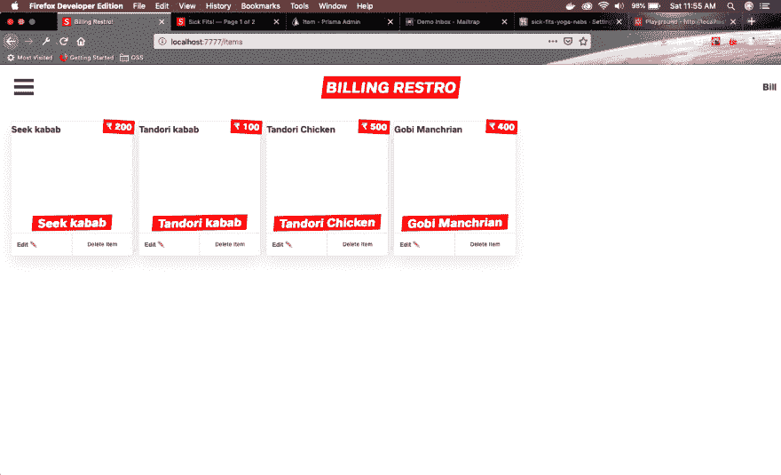](https://res.cloudinary.com/practicaldev/image/fetch/s--S_KAdDE---/c_limit%2Cf_auto%2Cfl_progressive%2Cq_auto%2Cw_880/https://cdn-images-1.medium.com/max/2876/1%2AZdR7Jq9W3XdBunLzaut9dA.png)*App 当前状态*

所以，是时候添加一些图像了。前往[https://cloudinary.com/](https://cloudinary.com/)创建一个账户。您将被带到下面的仪表板。

 *云雾缭绕的仪表盘*

接下来，单击仪表板右上角的设置。

 *打开设置*

然后，我们点击设置中的上传选项卡。

[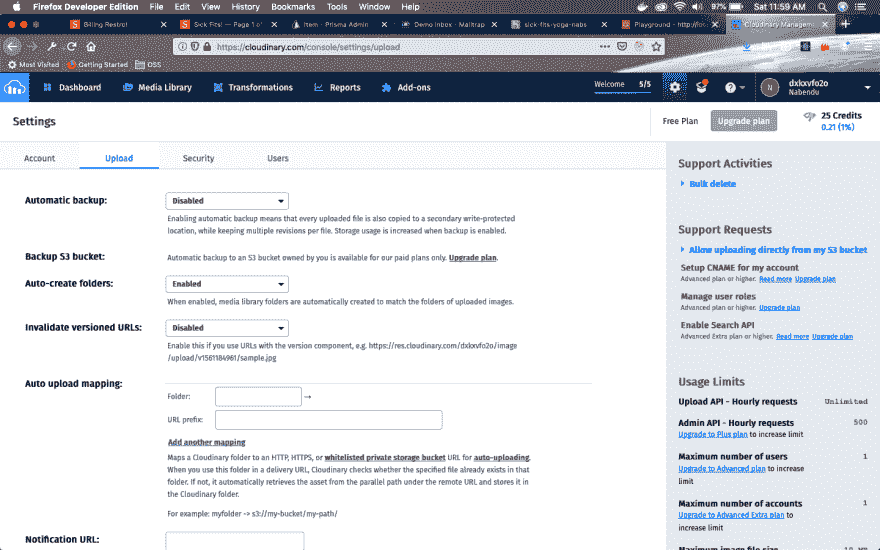 ](https://res.cloudinary.com/practicaldev/image/fetch/s--4DZYkaP2--/c_limit%2Cf_auto%2Cfl_progressive%2Cq_auto%2Cw_880/https://cdn-images-1.medium.com/max/2880/1%2AZscrVzK8c7Gp2lEbKoLA8A.png) * Goto 上传*

然后向下滚动找到链接“**添加上传预置**”，点击即可。

[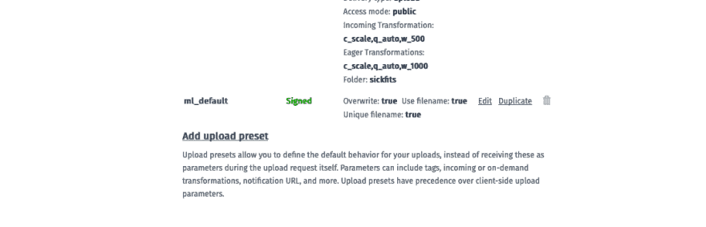 ](https://res.cloudinary.com/practicaldev/image/fetch/s--K-TpYvaD--/c_limit%2Cf_auto%2Cfl_progressive%2Cq_auto%2Cw_880/https://cdn-images-1.medium.com/max/2176/1%2AyEVoVZ7sVoRqpcQiMjPujg.png) *向下滚动【添加上传预置】*

在下一个屏幕中，给一个**上传预设名称**，将**签名模式**设为*未签名*，同时给一个**文件夹**命名。

[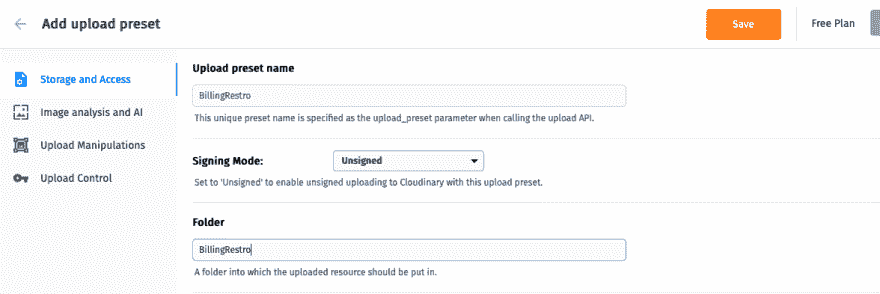 ](https://res.cloudinary.com/practicaldev/image/fetch/s--mGQAvSwb--/c_limit%2Cf_auto%2Cfl_progressive%2Cq_auto%2Cw_880/https://cdn-images-1.medium.com/max/2352/1%2AaddGOxr-5zpj5cyZfbg7DQ.png) *补充一些细节*

点击**上传操作**标签，点击**内的**编辑**传入转换**

在弹出的赋予**宽度**为 *180* ，**高度**留白*，**模式**为*比例*和**格式&形状**为*自动**

点击弹出窗口中的 **OK** 按钮。

[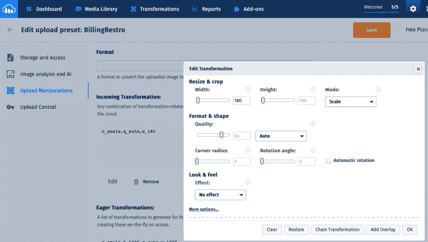 ](https://res.cloudinary.com/practicaldev/image/fetch/s--XkHtStH8--/c_limit%2Cf_auto%2Cfl_progressive%2Cq_auto%2Cw_880/https://cdn-images-1.medium.com/max/2288/1%2A2R8o0nibWbw__kgJ5gG3gQ.png) *传入转换编辑*

现在，点击 **+Add Eager Transformation** ，这将打开一个与上述情况类似的弹出窗口。

在弹出的给定**宽度**为 *1000* ，**高度**为 *1000* ，**模式**为*比例*和**格式&形状**为*自动*

点击弹出窗口中的 **OK** 按钮。

[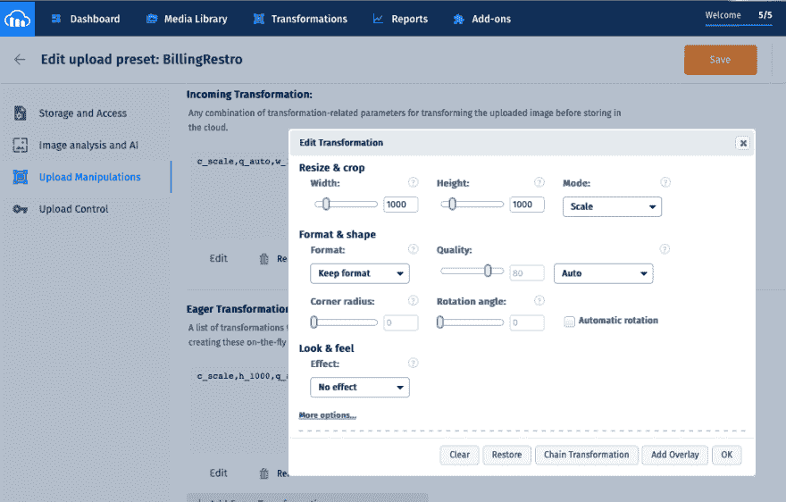 ](https://res.cloudinary.com/practicaldev/image/fetch/s--nFSHfOGH--/c_limit%2Cf_auto%2Cfl_progressive%2Cq_auto%2Cw_880/https://cdn-images-1.medium.com/max/2168/1%2AGhLGaIv36wQRFkrJ8-_cwg.png) *急切转型编辑*

现在，单击页面右上角的大橙色**保存**按钮保存配置。

它将打开这个屏幕，显示我们新添加的**billing resto**配置。

请注意，**传入转换**用于在我的应用程序的主页或项目页面显示的较小图像，而**急切转换**用于用户进入产品详情页面的较大图像。我不会在我的项目中使用渴望转换，只是为了完成而教授。

[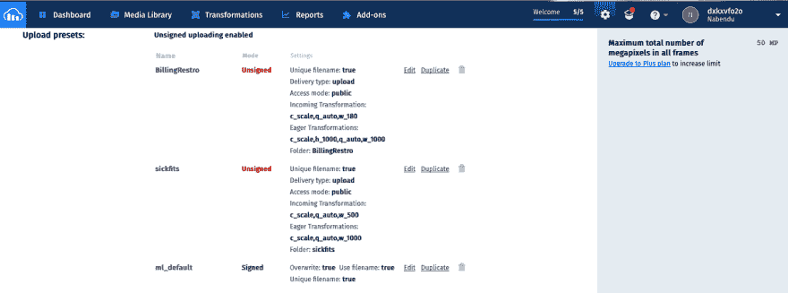 ](https://res.cloudinary.com/practicaldev/image/fetch/s--XBTvAyn7--/c_limit%2Cf_auto%2Cfl_progressive%2Cq_auto%2Cw_880/https://cdn-images-1.medium.com/max/2876/1%2An8OwztiVvx22oOOccFHSSg.png) *保存的菜单*

在开始编码之前，有两件事需要注意，那就是上传预置的 Nmae，在我的例子中是 **BillingRestro** 。还有用户名，你可以在页面中向上滚动，从无效版本化的 URL(突出显示的那个)或右上角找到它。

[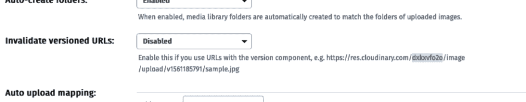 ](https://res.cloudinary.com/practicaldev/image/fetch/s--OH9WWo8J--/c_limit%2Cf_auto%2Cfl_progressive%2Cq_auto%2Cw_880/https://cdn-images-1.medium.com/max/2000/1%2AnxguSeiEEJZmzx1zrH_Ukg.png) *用户名*

我有一个 **CreateItem** 组件，这是一个普通的 React 表单，包含输入**标题**和**价格**。

我添加了突出显示的代码，通过使用*输入 type="file"* 来上传文件。在添加文件时将调用 **onChange** ，后者调用方法 **uploadFile** 。

此外，在提交之前，向用户显示上传图像的小预览。

[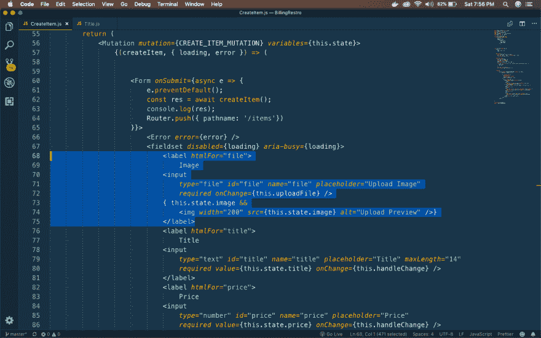 ](https://res.cloudinary.com/practicaldev/image/fetch/s--BdTRriPA--/c_limit%2Cf_auto%2Cfl_progressive%2Cq_auto%2Cw_880/https://cdn-images-1.medium.com/max/2880/1%2ABqqrT8hs-qyORrCe2JbPzA.png) *新文件上传*

现在，在 **uploadFile** 方法中，我们使用我们的用户名和之前截图中的 **upload_preset** 名称对 Cloudinary 进行 API 调用。

我们从 cloudinary 的 **file.secure_url** 中获得响应，并使用 setState 更新状态。

[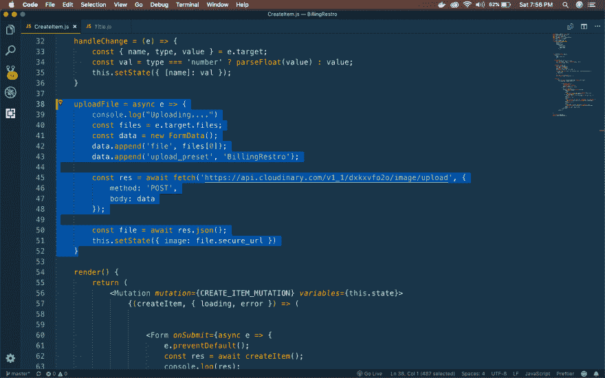 ](https://res.cloudinary.com/practicaldev/image/fetch/s--roqQA68V--/c_limit%2Cf_auto%2Cfl_progressive%2Cq_auto%2Cw_880/https://cdn-images-1.medium.com/max/2880/1%2Ab3XCQtCjd1fW5QPwPgdnCg.png) *上传文件功能*

现在，是测试代码的时候了。在我的 **adddish** 页面中， **CreateItem** 组件得到加载。

[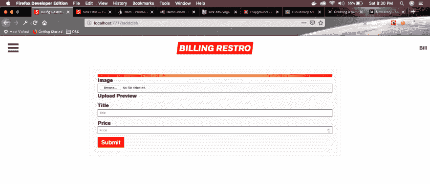](https://res.cloudinary.com/practicaldev/image/fetch/s--OdxOgKaS--/c_limit%2Cf_auto%2Cfl_progressive%2Cq_auto%2Cw_880/https://cdn-images-1.medium.com/max/2880/1%2Aa8hlam-wEKfbNxBQRG3nCg.png)*adddish 页面*

在这里，我上传一张图片，添加一个标题和价格(在 paisa)。

[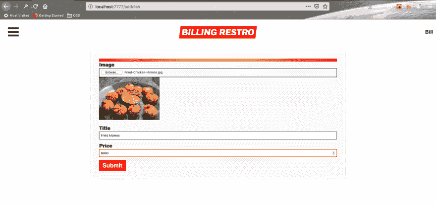 ](https://res.cloudinary.com/practicaldev/image/fetch/s---u1uMT-0--/c_limit%2Cf_auto%2Cfl_progressive%2Cq_auto%2Cw_880/https://cdn-images-1.medium.com/max/2880/1%2AcWfckqE_6lvCsIhwX3OOlA.png) *增加一项*

新项目被添加到主页中。

[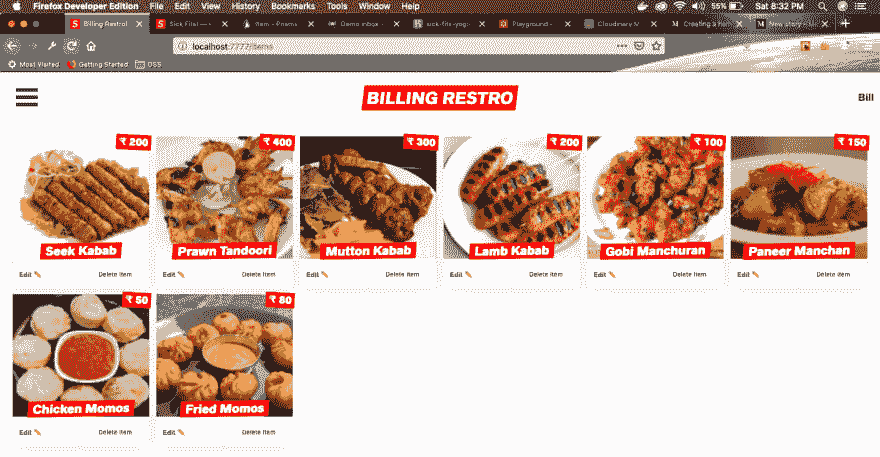 ](https://res.cloudinary.com/practicaldev/image/fetch/s--GoMk7Am_--/c_limit%2Cf_auto%2Cfl_progressive%2Cq_auto%2Cw_880/https://cdn-images-1.medium.com/max/2880/1%2AjIcmPuuy2ZjlBJRHJVML0Q.png) *首页*

你可以在这个 Github [链接](https://github.com/nabendu82/BillingRestro)中得到同样的代码。