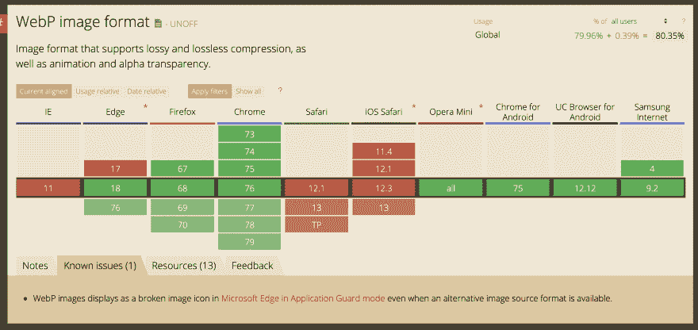
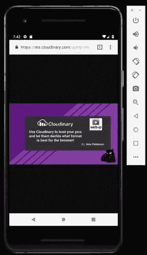
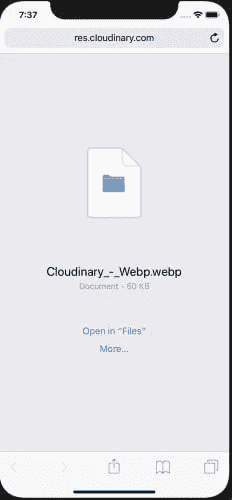
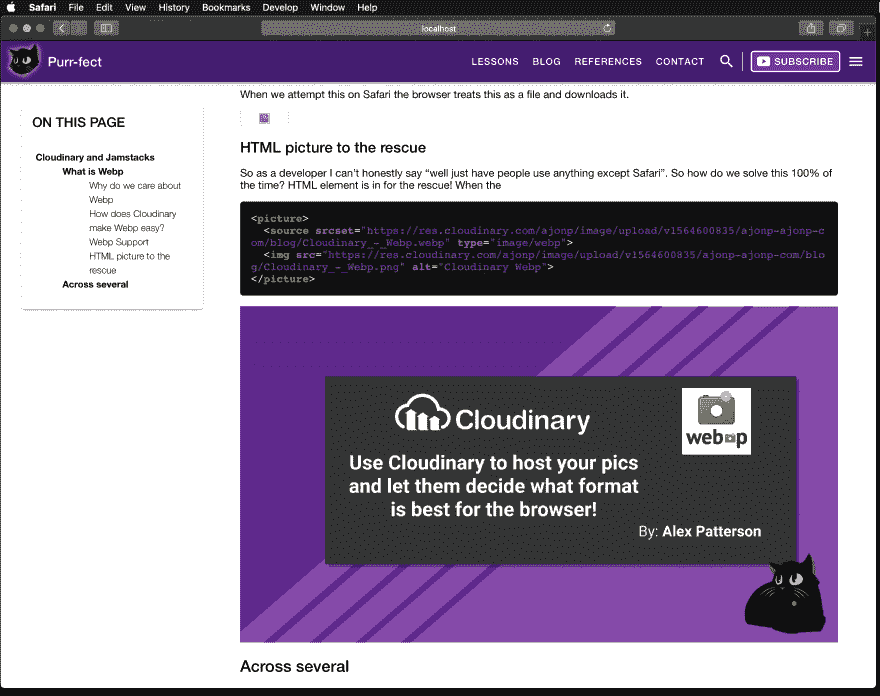
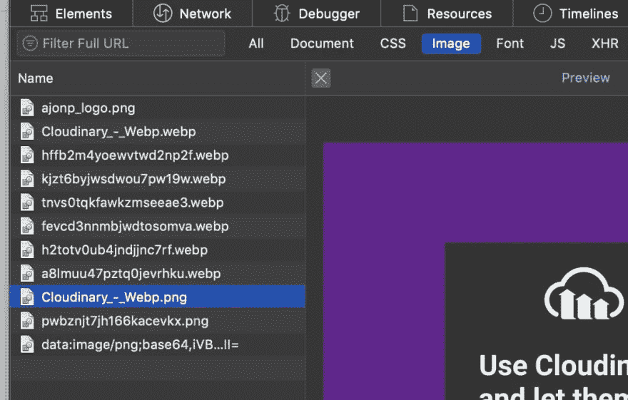

# 使用 Webp 的 Jamstacks 中的 Cloudinary

> 原文：<https://dev.to/codingcatdev/cloudinary-in-jamstacks-using-webp-3ga>

> 原帖:[https://ajonp.com/blog/cloudinary-in-jamstacks-using-webp/](https://ajonp.com/blog/cloudinary-in-jamstacks-using-webp/)

# 云里雾里

在 Cloudinary 上托管最棒的地方在于，它为开发人员提供了非常广泛的 API。然而，对于内容创作者来说，他们通常不太关心在网络上显示图像所需的技术方面。我们被反复告知，存储是廉价的，如果我们只是将这些图像放在一个不受管理的服务器上，或者像 Adobe AEM 或 Wordpress 这样的 CMS 上，这并不重要。然而，随着我们开始将更多的内容转移到“云”上，价格和功能开始变得重要起来，对于内容的生产者和消费者来说都是如此。

## 什么是 Webp

> WebP 是一种现代图像格式，为网络上的图像提供卓越的无损和有损压缩。使用 WebP，网站管理员和 web 开发人员可以创建更小、更丰富的图像，使 web 速度更快。

与 png 相比，WebP 无损图像的大小要小 26%。在同等 SSIM 质量指数下，WebP 有损图像比可比较的 JPEG 图像小 25-34%。Webp 是 Google 在 2010 年创建的一种格式，已经在当今的许多浏览器中实现。

### 我们为什么关心 Webp

在许多基于云的系统中，他们会创建几种不同大小的图像，这开始增加您的存储成本。现在消费者对生产者来说不一定在乎这个成本。消费者会关心他们的手机使用了多少数据，消耗了多少套餐。

### Cloudinary 如何让 Webp 变得简单？

HTTP 呼叫:

原始呼叫 134 KB

网址:[https://RES . cloud inary . com/ajonp/image/upload/v 1564600835/ajonp-ajonp-com/blog/cloud inary _-_ webp . png](https://res.cloudinary.com/ajonp/image/upload/v1564600835/ajonp-ajonp-com/blog/Cloudinary_-_Webp.png)[](https://res.cloudinary.com/practicaldev/image/fetch/s--DaWlV_8i--/c_limit%2Cf_auto%2Cfl_progressive%2Cq_auto%2Cw_880/https://res.cloudinary.com/ajonp/image/upload/v1564601664/ajonp-ajonp-com/blog/hffb2m4yoewvtwd2np2f.webp)

Webp 呼叫 49.7 KB -减少 63%

网址:[https://RES . cloud inary . com/ajonp/image/upload/v 1564600835/ajonp-ajonp-com/blog/cloud inary _-_ webp . webp](https://res.cloudinary.com/ajonp/image/upload/v1564600835/ajonp-ajonp-com/blog/Cloudinary_-_Webp.webp)[](https://res.cloudinary.com/practicaldev/image/fetch/s--btKxPcF8--/c_limit%2Cf_auto%2Cfl_progressive%2Cq_auto%2Cw_880/https://res.cloudinary.com/ajonp/image/upload/v1564601710/ajonp-ajonp-com/blog/kjzt6byjwsdwou7pw19w.webp)

Webp 呼叫@ 800 像素宽度 49.7 KB -减少 92.5%

网址:[https://RES . cloud inary . com/ajonp/image/upload/w _ 800/v 1564600835/ajonp-ajonp-com/blog/cloud inary _-_ webp . webp](https://res.cloudinary.com/ajonp/image/upload/w_800/v1564600835/ajonp-ajonp-com/blog/Cloudinary_-_Webp.webp)[](https://res.cloudinary.com/practicaldev/image/fetch/s--kkW_3_gi--/c_limit%2Cf_auto%2Cfl_progressive%2Cq_auto%2Cw_880/https://res.cloudinary.com/ajonp/image/upload/v1564601806/ajonp-ajonp-com/blog/tnvs0tqkfawkzmseeae3.webp)

除了将 png 更改为 webp 之外，您无需做任何其他事情，就可以自动减少 63%的通话。现在大多数软件可以更进一步，自动考虑你的浏览器应该请求的屏幕尺寸，所以上面的例子是请求图片宽度为 800 像素(' w_800)。

### Webp 支持

正如你在下面看到的，除了 Safari(和 iOS Safari)之外，所有主流浏览器都支持 Webp 格式。

[](https://res.cloudinary.com/practicaldev/image/fetch/s--eFuFf_v_--/c_limit%2Cf_auto%2Cfl_progressive%2Cq_auto%2Cw_880/https://res.cloudinary.com/ajonp/image/upload/v1564962316/ajonp-ajonp-com/blog/fevcd3nnmbjwdtosomva.webp)[https://caniuse.com/#feat=webp](https://caniuse.com/#feat=webp)

正如你在 Android 上使用 Chrome 看到的，使用 Webp 查找图片没有问题。

[](https://res.cloudinary.com/practicaldev/image/fetch/s--_91eTZ9b--/c_limit%2Cf_auto%2Cfl_progressive%2Cq_auto%2Cw_880/https://res.cloudinary.com/ajonp/image/upload/h_500/v1564962205/ajonp-ajonp-com/blog/h2totv0ub4jndjjnc7rf.webp)

当我们在 Safari 上尝试这样做时，浏览器会将其视为文件并下载。

[](https://res.cloudinary.com/practicaldev/image/fetch/s--Z0HEP-Q8--/c_limit%2Cf_auto%2Cfl_progressive%2Cq_auto%2Cw_880/https://res.cloudinary.com/ajonp/image/upload/h_500/v1564961942/ajonp-ajonp-com/blog/a8lmuu47pztq0jevrhku.webp)

### HTML 图片营救

所以作为一名开发者，我不能诚实地说“我们只是让人们使用除了 Safari 之外的任何东西”。那么我们如何 100%解决这个问题呢？HTML `<picture>`元素正在拯救！当

```
<picture>
  <source srcset="https://res.cloudinary.com/ajonp/image/upload/v1564600835/ajonp-ajonp-com/blog/Cloudinary_-_Webp.webp" type="image/webp">
  
</picture> 
```

Enter fullscreen mode Exit fullscreen mode

<source type="image/webp">
[](https://res.cloudinary.com/practicaldev/image/fetch/s--gmhlZr9t--/c_limit%2Cf_auto%2Cfl_progressive%2Cq_auto%2Cw_880/https://res.cloudinary.com/ajonp/image/upload/v1564600835/ajonp-ajonp-com/blog/Cloudinary_-_Webp.png) 

正如你在下面看到的，Safari 将使用``标签而不是引用`<source>`标签，它将正确显示图像。【T2

[](https://res.cloudinary.com/practicaldev/image/fetch/s--D8hniHIy--/c_limit%2Cf_auto%2Cfl_progressive%2Cq_auto%2Cw_880/https://res.cloudinary.com/ajonp/image/upload/v1564964815/ajonp-ajonp-com/blog/ylcgjkzqau17g3cov6by.webp)

在 Chrome 中使用了`<source>`标签，因此它将自动获取 webp 扩展并正确工作。

## 降价销售

### 为什么降价

我把我的课程和博客交叉发布给 [DEV](https://dev.to/) 。因此，我不喜欢使用短代码，而是坚持使用支持的 markdown 语法。我也倾向于经常转向下一个“酷”的技术平台。

例如，我可以轻松地将所有降价加载到:

*   [雨果](https://gohugo.io/)
*   哲基尔
*   [武打〔t1〕](https://vuepress.vuejs.org/)
*   盖茨比

### 雨果中的降价

我完全承认，我花了更长的时间来获取我的[降价文件图像](https://github.com/adam-p/markdown-here/wiki/Markdown-Cheatsheet#images)并替换它们为`<picture>`标签(是的，我很懒)。Hugo 提供了一些神奇的东西，叫做[短代码](https://gohugo.io/content-management/shortcodes/)，可以让你在一个简短的 markdown 例子中执行大量代码。xabeng 创建了一组非常棒的短代码 [my hugo 短代码，用于包含来自 cloudinary](https://dev.to/xabeng/my-hugo-shortcode-for-including-image-from-cloudinary-1l46) 的图像。

### VSCode 扩展-粘贴图像- Cloudinary

[markdown image paste](https://marketplace.visualstudio.com/items?itemName=njLeonZhang.markdown-image-paste) 是一个非常棒的插件，它可以让你轻松地截图并直接加载到 cloudinary。默认情况下，一旦上传完成，它会将新的图像 URL 放入一个 markdown 图像标签中。

我确实打开了一个[问题](https://github.com/njleonzhang/vscode-extension-mardown-image-paste/issues/9)，允许使用`html`代码，而不是通用的降价语法。