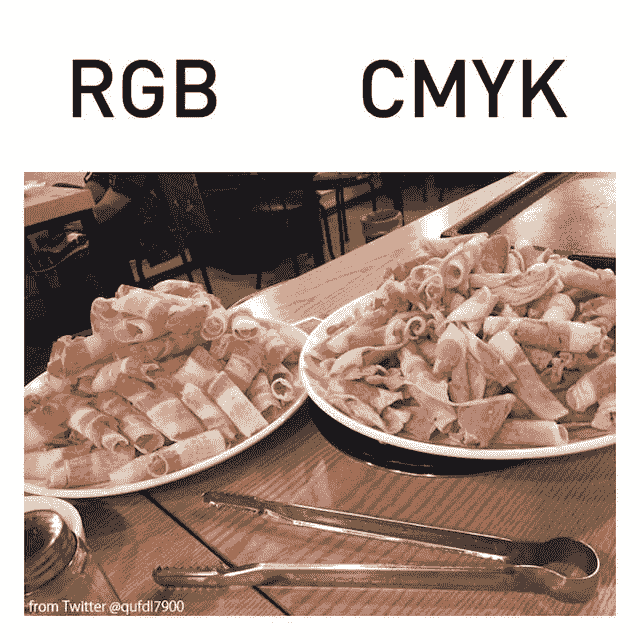
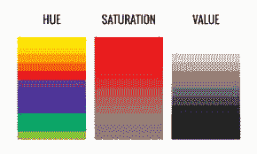
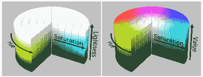

# CMYK 和 RGB？HSV 和 HSL？介绍半音阶纲要！

> 原文：<https://dev.to/r4h33m/cmyk-and-rgb-hsv-and-hsl-introducing-the-chromatic-compendium-1d7>

一本大部头书躺在被遗忘的大教堂北墙边的读经台上。透过窗户的微弱光线显示出悬浮在污浊空气中的灰尘颗粒，交叉在狭窄墙壁上的蜘蛛网在黎明前的黑暗中闪闪发光。

**走向讲台(y/n)？** y

当你穿过布满蛛网的黑暗走向讲台时，灰尘会让你咳嗽。随着你的靠近，这本书的标题变得清晰起来:

半音阶纲要。
第五版，Resel Grun Btel

标题的字母被照亮，似乎在忧郁的房间里发光。你注意到作品上没有灰尘。你停顿了一下。

**打开大部头(y/n)？** n

你犹豫了一下，盯着大部头棱柱形标题。有那么一瞬间，你觉得你听到了什么。竖起耳朵，你可以听到轻微的叮当声，似乎来自纲要。你深呼吸...

**打开大部头(y/n)？** y

你用双手打开了那本书...瞬间，光线充满了房间，让你眼花缭乱。即使你闭着灼热的眼睛，你也要努力睁开它。叮当声越来越大，你开始感到困倦。

你的手失去了对书的控制，你跌落到地上。你穿过肮脏的瓷砖地板；直接进入完全的黑暗。

* * *

我真的希望你读那篇介绍的时候和我写的时候一样开心。我想尝试一些新的东西，同时也向基于文本的冒险游戏致敬，对一些人来说，这些游戏比我们今天拥有的“4K·HDR”更具沉浸感。

现在是时候给你想要的东西了。

## 颜色模式:RGB 和 CMYK。

简单地说，颜色模型是一种表示颜色的数学方法。有两种颜色模型:加色和减色。

有了光，例如电脑显示器，颜色就会相互叠加。这就是为什么 RGB 是加色模式。三原色(红、蓝、绿)用于建设性地产生 1600 多万种不同的组合。这意味着所有的原色都产生白色。

另一方面，用纸时，不同的颜色会相互消失。四种原色(青色、品红色、黄色和黑色)用于产生 1000 万种可能的颜色(因为每种原色有 100 级)。这被称为减色法，因为所有的颜色都会变成黑色。

您可能已经注意到，RGB 可以显示比 CMYK 更多的颜色。这就是为什么数码照片中的一些颜色在打印时会经常显得褪色或暗淡。这个迷因很好地说明了这一点:

但是 RGB 到底为什么是从 0 - 255？嗯，由于计算机是二进制的，它们是以位和字节(8 位)工作的。每个颜色值用一个字节表示，作为发送到显示器的数据。一个字节可以代表 256 个不同的值，所以 0 - 255(包括 0)。因此，每个完整的 RGB 颜色正好占用 3 个字节的内存。

## 了解色相:HSL 和 HSV

HSL - **H** 【欧盟】、 **S** 、 **L** 【平整度】【HSV】**【欧盟】、**【平整度】、 **V【平整度】******

 ****这些是 RGB 的替代表示。这是一个圆柱形模型(就像在色轮中一样)，所有不同的色调(纯色，而不是色调或阴影)无缝融合在一起。饱和度代表圆柱体的直径。而是色调有多强烈；是“多彩”。

这两个模型的不同之处在于它们的最终变量——亮度/价值。明度是一种颜色有多白，而价值是它有多亮。这意味着无论变量是什么，100%的明度都会产生纯白，但是 100%的值只有在与 0%的饱和度结合时才会产生纯白。这是 HSL 和 HSV 之间的主要区别，它直观地显示在下面——HSL 在左边，HSV 在右边。

为什么它们会被开发出来？嗯，虽然 RGB 在计算机上工作得很好，但 HSL/HSV 对于设计师来说更容易操作，对于人类对颜色的感知来说更自然。

## 总结

我希望你喜欢这个关于数字色彩表现模型的快速指南，我想听听你的意见！暂时就这样吧！****