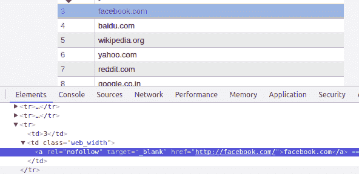

# 收集一百万个网站链接

> 原文：<https://dev.to/anuragrana/collecting-one-million-website-links-3jc5>

我需要收集不同的网站链接来试验 Docker 集群。所以我创建了这个小脚本来收集一百万个网站 URL。

代码也可以在 [Github](https://github.com/anuragrana/Python-Scripts) 上获得。

**运行脚本:**

要么使用 python3 创建一个新的虚拟环境，要么使用系统中现有的虚拟环境。
安装依赖项。

```
pip install requests, BeautifulSoup 
```

激活虚拟环境并运行代码。

```
python one_million_websites.py 
```

**完整代码:**

```
import requests
from bs4 import BeautifulSoup
import sys
import time

headers = {
    "Accept": "text/html,application/xhtml+xml,application/xml;q=0.9,image/webp,image/apng,*/*;q=0.8",
    "Accept-Language": "en-GB,en-US;q=0.9,en;q=0.8",
    "User-Agent": "Mozilla/5.0 (X11; Linux x86_64) AppleWebKit/537.36 (KHTML, like Gecko) Ubuntu Chromium/64.0.3282.167 Chrome/64.0.3282.167 Safari/537.36"
}

site_link_count = 0

for i in range(1, 201):
    url = "http://websitelists.in/website-list-" + str(i) + ".html"
    response = requests.get(url, headers = headers)
    if response.status_code != 200:
        print(url + str(response.status_code))
        continue

    soup = BeautifulSoup(response.text, 'lxml')
    sites = soup.find_all("td",{"class": "web_width"})

    links = ""
    for site in sites:
        site = site.find("a")["href"]
        links += site + "\n"
        site_link_count += 1

    with open("one_million_websites.txt", "a") as f:
        f.write(links)

    print(str(site_link_count) + " links found")

    time.sleep(1) 
```

我们正在从网站[http://www.websitelists.in/](http://www.websitelists.in/)抓取链接。如果你检查网页，你可以看到`td`标签内的`anchor`标签带有`web_width`类。

我们将把页面响应转换成 BeautifulSoup 对象，获取所有这样的元素，并提取它们的`HREF`值。

[](https://res.cloudinary.com/practicaldev/image/fetch/s--74HuXTqY--/c_limit%2Cf_auto%2Cfl_progressive%2Cq_auto%2Cw_880/https://www.pythoncircle.com/media/uploads/python-script-10-collecting-one-million-website-links-20180713-9d289d48854e4e408d007a9e32c53957.png)

虽然在连续的请求之间有超过 1 秒的自然延迟，这相当慢，但对服务器来说是好的。我仍然引入了一秒钟的延迟来避免 429 HTTP 状态。

抓取的链接将被转储到同一目录下的文本文件中。

原载于

 **更多来自 [PythonCircle](https://www.pythoncircle.com) :

*   [在 PythonAnyWhere 服务器上免费托管 Django 应用程序](https://www.pythoncircle.com/post/18/how-to-host-django-app-on-pythonanywhere-for-free/)
*   [使用芹菜、RabbitMQ 和带有旋转代理的 Docker 集群在 60 秒内抓取 10000 条推文](https://www.pythoncircle.com/post/518/scraping-10000-tweets-in-60-seconds-using-celery-rabbitmq-and-docker-cluster-with-rotating-proxy/)
*   [初学 python 程序员常犯的 5 个错误](https://www.pythoncircle.com/post/602/5-common-mistakes-made-by-beginner-python-programmers/)**