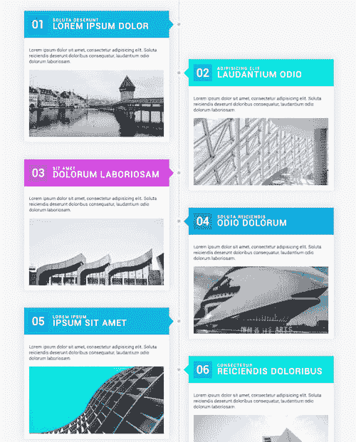
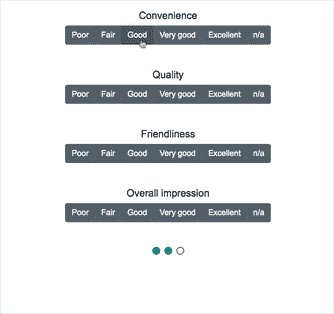
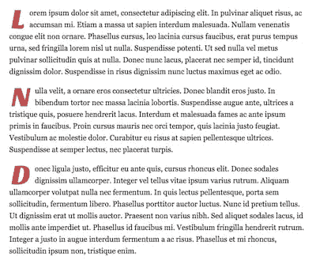
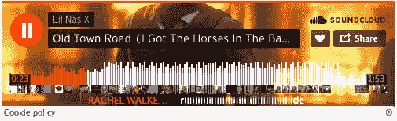

# 丰富多彩的时间线、调查、定向悬停|模块星期一 42

> 原文：<https://dev.to/tyrw/colorful-timeline-survey-directional-hover-module-monday-42-3khe>

## 为您的下一个项目开发开源 web 模块

以下所有内容都是开源的，可以在任何网站、web 应用程序或其他任何地方免费使用。在 Anymod 上还有数百个这样的网站。

单击一个 mod 来查看它及其源代码。

## 定向悬停

基于鼠标在缩略图上移动方向的悬停效果。

[视图对](https://anymod.com/mod/directionally-aware-3d-hover-effect-llkddd?v=20)视图

 [
T4】](https://anymod.com/mod/directionally-aware-3d-hover-effect-llkddd?v=20)

## 五彩缤纷的时间轴

将事件添加到这个响应丰富多彩的时间线中。

[视图对](https://anymod.com/mod/colorful-vertical-timeline-dkdrdb?v=20)视图

 [
T4】](https://anymod.com/mod/colorful-vertical-timeline-dkdrdb?v=20)

## 调查问卷

构建您自己的调查问题并添加到任何页面。

[视图对](https://anymod.com/mod/multi-stage-form-questionnaire-dkdrrb?v=20)视图

 [
T4】](https://anymod.com/mod/multi-stage-form-questionnaire-dkdrrb?v=20)

## 首字母高亮显示

一个简单的内容块，突出显示每个部分的第一个字母。

[视图对](https://anymod.com/mod/first-letter-highlight-alrarm?v=20)视图

 [
T4】](https://anymod.com/mod/first-letter-highlight-alrarm?v=20)

## 音云嵌入

向任何页面添加轨道。

[视图对](https://anymod.com/mod/soundcloud-embed-mokmr)视图

 [
T4】](https://anymod.com/mod/soundcloud-embed-mokmr)

* * *

我每周一从社区[这里](https://dev.to/tyrw)贴出新的 mods 我希望你觉得它们有用！

快乐编码✌️