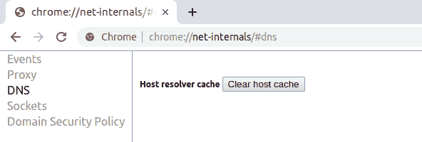

# 没有 Windows，Mac，Ubuntu 和 Chrome？

> 原文：<https://dev.to/shadowlik/como-limpar-o-cache-de-dns-no-windows-mac-ubuntu-e-chrome-2fee>

## O que é DNS？

DNS(域名系统)充当域的 IP 地址转换器(192.168.0.1)，作为一种可以将 CEP (IP)转换为街道(域)的邮局。

## O que é cache de DNS？

由于浏览器保存浏览历史记录、图像和其他文件以提高浏览速度，因此计算机还会存储您访问过的站点的位置(IP 地址)，从而避免了每次进入节省响应时间和加载时间的站点时都必须查找要访问的 IP 这是著名的 DNS 缓存，因此如果域中的 IP 引用在 DNS 服务器上发生更改，您可能仍在尝试访问过期信息。

## 怎么清理？

在介绍清除计算机 DNS 高速缓存的一些方法之前，请记住，网络上可能存在其他高速缓存层，这在使用代理系统的企业中很常见，您可能无权访问这些层，具体取决于连接的位置。在这种情况下，您将不得不等待 DNS 缓存自行更新

### 窗口

*   按 Win + X 打开菜单
*   右键单击“Comand Prompt(命令提示符)”，然后选择“Run as Administrator(以管理员身份运行)”。
*   键入以下命令，然后按 enter 键:

```
ipconfig /flushdns 
```

如果命令成功，您将看到以下消息:
*【windows IP 配置成功溢出 DNS 解析缓存】。*

### **MacOS**

1.  单击应用程序
2.  单击“服务”
3.  双击终端应用程序
4.  输入以下命令:

```
sudo killall -HUP mDNSResponder 
```

### Ubuntu 和 Debian 分布

1.  打开终端(通常快捷键为 Ctrl+Alt+T)
2.  运行以下命令:

```
sudo /etc/init.d/networking restart 
```

输入 root 密码并等待以下响应:“t0[ok]restarting networking(通过 system CTL):networking . service”

### 谷歌浏览器

打开 Google Chrome 浏览器，在导航栏中键入“**chrome://net-internals/# DNS**”，然后按下“**clear host cache**”按钮:

[](https://res.cloudinary.com/practicaldev/image/fetch/s--hmrMAm7t--/c_limit%2Cf_auto%2Cfl_progressive%2Cq_auto%2Cw_880/https://marquesfernandes.com/wp-content/uploads/2019/07/image.png)

post [如何清除 Windows、Mac、Ubuntu 和 Chrome 中的 DNS 缓存？](https://marquesfernandes.com/2019/07/30/como-limpar-o-cache-de-dns-no-windows-mac-ubuntu-e-chrome/)首先出现在[恩里克·马克斯·费尔南德斯](https://marquesfernandes.com)。