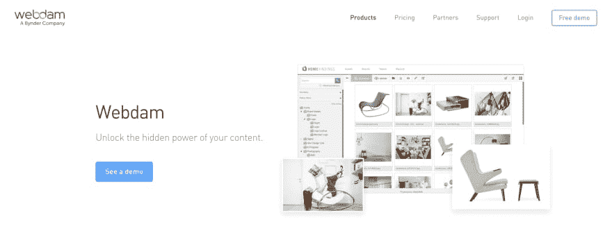
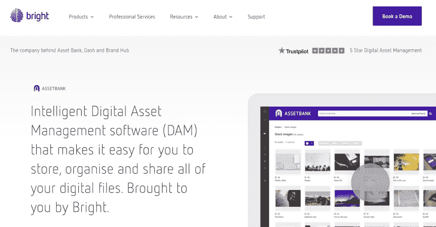
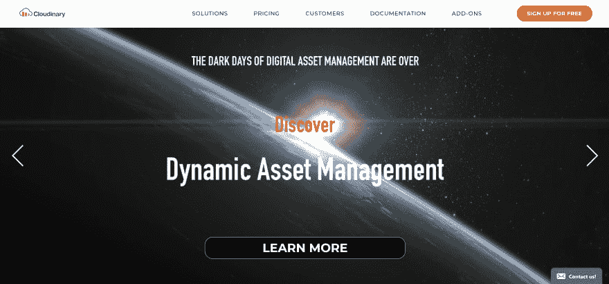
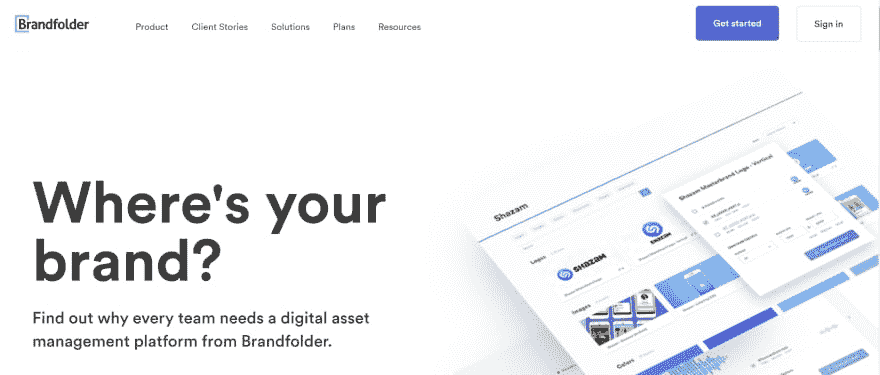

# 对比 2019 年最佳 DAM 软件

> 原文：<https://dev.to/chenshemtov/comparing-the-best-dam-software-of-2019-3f41>

在今天的数字世界中，人们被大量的内容所包围。品牌通过任何可能的渠道争夺关注。我们的电子邮件充斥着促销简讯和千载难逢的优惠。我们的新闻提要充斥着赞助广告、有影响力的评论、善意的朋友和家人以及偶尔精通技术的姑婆主动提供的意见。

视觉媒体帮助品牌以快速有效的方式区分自己。不同于大段大段的文字，品牌可以将他们的信息浓缩成一张图片，说明一切。不幸的是，一张照片是远远不够的。《脸书邮报》或广告的寿命只有几秒钟，浏览一下就可以向前滚动——大约六秒钟。你需要更多的信息来保持可见性并接触潜在客户。

随着品牌积累越来越多的媒体，保持对分发、管理和使用许可的跟踪变得困难。数字资产管理(DAM)解决方案使品牌能够在一个集中的平台上存储、组织和分发他们所有的数字资产。

## 什么是数字资产管理(DAM)？

数字资产管理(DAM)由一组业务实践和技术工具组成。DAM 使组织能够控制其媒体资产的存储、使用和监管。

## 什么是数字资产管理(DAM)软件？

DAM 软件最初是为帮助组织管理富媒体内容而设计的，当时你只需要两张滑动图像来创建一个交互式网络广告。这些 DAM 工具仅仅依靠基本的元数据来组织媒体库。您可以添加名称、格式、描述、媒体类型和日期，仅此而已。

使用传统的 DAM，您的搜索能力受限于您为每个资产编写的元数据。这就是为什么像 Wordpress 这样的内容管理系统(CMS)不能满足大量内容网站的需求——你对你的媒体库的可见性很低。此外，您无法跟踪许可和使用权，也没有视频编辑功能。

当今的 DAM 解决方案考虑到了对新的不同内容的不断需求，使组织能够在一个位置管理所有媒体格式。您可以上传图像、矢量、视频、动画、gif、pdf、演示文稿等。您可以将 DAM 解决方案与 CMS 集成，并简化所有频道的内容。如果你有一个销售团队，你可以让他们访问营销材料，并将两个学科融合在一个协作平台下。

## 如何选择大坝方案

请确保您选择了适合自己的 DAM 解决方案。您可以创建一个 DAM 指南来帮助您专注于对您的组织最重要的功能。确定您想要存储多少媒体，并定义一个存储限制。定义角色和需要访问平台的用户数量，并让每个人都了解许可合规性标准和安全最佳实践。

以下是您应该在 DAM 解决方案中寻找的最基本的特征:

*   **集成**—您在 DAM 解决方案中管理的内容在其他地方总是需要的。确保您的 DAM 解决方案能够将您的内容无缝地分发到您的所有媒体渠道。
*   **监管**—将所有内容转移到一个新位置的目的是为了执行简单的组织标准。寻找支持编目功能的解决方案。人工智能标签和自动化元数据尤其可以让您的工作更加轻松。
*   **搜索**—DAM 解决方案应能让您更轻松地找到所需的媒体。为此，一些解决方案提供了人工智能(AI)功能，如搜索建议、人工智能图像识别和自动标记。

根据组织的需求，您可能还希望您的 DAM 解决方案具备以下功能:

*   共享
*   合作
*   版本控制
*   访问和授权管理
*   云托管
*   直观的用户体验
*   支持

一旦您对内容进行了分类和组织，您就能够手动识别内容模式并相应地调整您的 DAM 指南。具有智能分析功能的 DAM 解决方案还可以为您提供关于资产性能和使用情况的自动化见解。

## 顶级水坝软件提供商

### 网络大坝

 
WebDAM 是一个基于云的数字资产管理平台，由 Bynder 提供支持。WebDAM 的界面简单直观，无缝集成到您的日常工作中。

**功能** : WebDAM 包含了可以根据您的需求进行配置的功能。您可以为 10 个用户或 30 个用户设置帐户，并满足任何存储要求。WebDAM 在采用他们的软件期间和之后提供帮助和支持。该软件的核心功能包括分面搜索(支持库内的排序和过滤功能)、自动关键词建议以及用于协作和共享的直观工作流程。

**定价**:你可以通过他们的网站申请个性化报价。

### 资产银行

 
资产银行是一个端到端的数字资产管理解决方案，由 Bright 提供支持。资产银行提供多种托管方法，包括共享托管和内部安装。

**功能**:资产库具有强大的功能，可为您的数字资产创建可搜索的目录，并且您可以完全控制如何配置该库。该平台的高级搜索功能包括搜索生成器、保存的搜索和地理标记。通过提高对每项资产使用权的可见性，您可以管理访问和身份验证、协作和共享资产，并保持合规性。

**定价**:资产银行提供三种包月服务——每月 390 英镑的基础版、615 英镑的专业版和 1430 英镑的企业版。

### 云淡风轻

 
Cloudinary 提供软件即服务(SaaS)数字资产管理解决方案。Cloudinary 经济高效的订阅模式可以帮助您实现规模化发展。

**功能**:免费用户可以访问用户友好的 DAM 媒体库，以及上传小部件和 API。您可以运行查询、设置自动备份和优化，以及创建图像和视频操作。Plus、Advanced 和 Custom 定价模型将允许您访问人工智能(AI)、用户访问控制和工作流集成功能。

**定价** : Cloudinary 提供三个月的订阅——免费，外加 99 美元，高级 249 美元。您还可以联系销售代表，获取个性化报价。

### 品牌文件夹

 
Brandfolder 提供定制的数字资产管理解决方案，根据行业、角色、组织规模和用户需求进行配置。

**功能**:高级用户可以访问精选收藏、云存储、界面品牌和用户权限控制等功能。企业客户享受高级功能以及身份管理、软件支持、视频存储和格式化、见解和分析报告等。如果您在一致的基础上处理大量资产，Brandfolder 的批量功能可以帮助您减少标记、移动、合并和编辑资产所需的时间。

**定价**:你可以通过他们的网站申请个性化报价。

## 永远不会忘记您的媒体内容

处理媒体内容不一定是一个漫长、乏味和痛苦的过程。您可以使用 DAM 解决方案，而不是手动上传、组织、编辑和发布媒体。即使是最基本的 DAM 模块也可以为您提供高效的工作流程。一个用户友好的解决方案可以帮助您将任务委派给机器，并腾出时间来做对您最重要的事情。