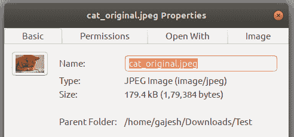
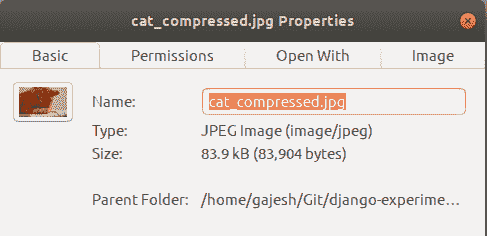

# 压缩 django 中的图像

> 原文：<https://dev.to/gajesh/compress-images-in-django-3la8>

存储是 web 应用程序开发的重要部分之一，需要特别注意，因为它会增加服务器成本。如果您必须为包含图像或任何其他非文本内容的 web 应用支付存储成本，那么最好专注于压缩，以降低存储成本并轻松扩展。这篇文章详细讨论了 Django 中的图像压缩(有损),并演示了一个实现的例子。您可以在这里找到所有的实现细节。

## 什么是压缩？

根据维基百科，数据压缩包括使用比原始表示更少的比特对信息进行编码。简而言之，压缩是一种使用特定技术或算法使文件变小的方法。

类型和方法数据压缩分为两种类型。

:在这种类型的压缩中，数据(在这种情况下是图像和视频)的质量在压缩时会降低。这被广泛用于压缩多媒体。

:在这种类型的压缩中，数据(在这种情况下是图像)的质量不会损失。这广泛用于压缩敏感数据，因为数据丢失是不可承受的。

## 安装和配置

安装 python 图像处理库`Pillow`

`pip install Pillow`

我们将建立一个简单的项目来演示图像上传和上传前后的文件大小。你也可以参考 [Django-docs](https://docs.djangoproject.com/en/2.0/) 或者在这里下载完整的[源代码](https://github.com/gajeshbhat/django-experiments/tree/master/Upload-compress)。

我们的 **models.py** 长得像，

```
import sys
from django.db import models
from PIL import Image
from io import BytesIO
from django.core.files.uploadedfile import InMemoryUploadedFile

class Upload(models.Model):
    nameImage = models.CharField(max_length = 140,blank=False,null=True)
    uploadedImage =  models.ImageField(upload_to = 'Upload/',blank=False,null=True)
    def save(self, *args, **kwargs):
        if not self.id:
            self.uploadedImage = self.compressImage(self.uploadedImage)
        super(Upload, self).save(*args, **kwargs)
    def compressImage(self,uploadedImage):
        imageTemproary = Image.open(uploadedImage)
        outputIoStream = BytesIO()
        imageTemproaryResized = imageTemproary.resize( (1020,573) ) 
        imageTemproary.save(outputIoStream , format='JPEG', quality=60)
        outputIoStream.seek(0)
        uploadedImage = InMemoryUploadedFile(outputIoStream,'ImageField', "%s.jpg" % uploadedImage.name.split('.')[0], 'image/jpeg', sys.getsizeof(outputIoStream), None)
        return uploadedImage 
```

Enter fullscreen mode Exit fullscreen mode

在上面的`models.py`文件中，我们声明了一个名为`compressImage`的实用方法，并把`uploadedImage`作为参数传递给它。在创建`Upload`对象时，该方法在`save`模块中被调用。

我们使用 python 图像处理库 [Pillow](https://www.geeksforgeeks.org/working-images-python/) (PIL)来处理图像处理。我们打开上传的图像并将其存储在临时对象`imageTemproary`中，我们初始化一个`BytesIO`流来处理将[更改](https://docs.python.org/3/library/io.html)写入图像。我们使用`resize()`方法将上传的图像调整到一个特定的大小(在这种情况下小于原始大小),并使用`seek()`方法将输出流指针流重置到初始位置。我们可以进一步使用 django 的`InMemoryUploadedFile`来覆盖现有的未压缩图像。

您可以根据自己的需要定制方法来更改图像类型、大小和质量水平。

我们的 **views.py** 长相，

```
from django.shortcuts import render
from CompressUpload.models import Upload
from CompressUpload.forms import imageUploadForm

def displayUploadedFiles(request):
    uploadImageList = Upload.objects.all()
    return render(request, 'CompressUpload/list.html', {'uploadImageList': uploadImageList})

def uploadImage(request):
    imageUploadFormResult = imageUploadForm(request.POST, request.FILES)
    if request.method == 'POST':
        if imageUploadFormResult.is_valid():
            imageUploadFormResult.save()
        else:
            return render(request, 'CompressUpload/list.html', {'imageUploadFormResult': imageUploadFormResult})
    return render(request, 'CompressUpload/upload.html', {'imageUploadFormResult': imageUploadFormResult}) 
```

Enter fullscreen mode Exit fullscreen mode

我们的 **forms.py** 长得像，

```
from django import forms
from CompressUpload.models import Upload

class imageUploadForm(forms.ModelForm):
    class Meta:
        model = Upload
        fields = ('Name','uploadedImage',) 
```

Enter fullscreen mode Exit fullscreen mode

我们的**URLs . py**(models . py 所在的应用)

```
from django.conf.urls import url, include
from CompressUpload.views import displayUploadedFiles , uploadImage

urlpatterns = [
url(r'^list/$',displayUploadedFiles,name='List Uploaded Images'),
url(r'^upload/$',uploadImage,name='Upload Images')
] 
```

Enter fullscreen mode Exit fullscreen mode

`templates`目录中`upload.html`的一个例子

```
<!DOCTYPE html>
<html>
<head>
Upload Image
</head>
<body>
<form id="create_podcast_form" method="post" enctype="multipart/form-data">
 
 {{ imageUploadFormResult.as_p }}
 <input type="submit" value="Submit"/>
 </form>
</body>
</html> 
```

Enter fullscreen mode Exit fullscreen mode

settings.py 必须包含常用的`static`和`media`设置来存储上传的文件。建议使用下面给出的设置。

```
TEMPLATES = [
  {
        'BACKEND': 'django.template.backends.django.DjangoTemplates',
        'DIRS': [
            os.path.normpath(os.path.join(BASE_DIR, 'templates')),
        ],
        'APP_DIRS': True,
        'OPTIONS': {
            'context_processors': [
                'django.template.context_processors.debug',
                'django.template.context_processors.request',
                'django.contrib.auth.context_processors.auth',
                'django.contrib.messages.context_processors.messages',
                'django.template.context_processors.request',
            ],
        },
    },
]

# Static files (CSS, JavaScript, Images)
# https://docs.djangoproject.com/en/2.0/howto/static-files/

STATIC_URL = '/static/'
STATICFILES_DIRS = [ os.path.join(BASE_DIR, 'static'), ]
MEDIA_ROOT = os.path.join(BASE_DIR, 'media')
MEDIA_URL = '/media/ 
```

Enter fullscreen mode Exit fullscreen mode

这里有一个正在上传的示例图像，注意上传前的大小是 179.4 KB，压缩和调整大小后的大小是 83.9 KB。当涉及到大规模的大文件时，这可以产生显著的差异。

[](https://res.cloudinary.com/practicaldev/image/fetch/s--YTgzdl-b--/c_limit%2Cf_auto%2Cfl_progressive%2Cq_auto%2Cw_880/https://thepracticaldev.s3.amazonaws.com/i/e3pnx9uuc4wbguz56tx9.png)
[T6】](https://res.cloudinary.com/practicaldev/image/fetch/s--FPuhPEZC--/c_limit%2Cf_auto%2Cfl_progressive%2Cq_auto%2Cw_880/https://thepracticaldev.s3.amazonaws.com/i/ye47janr2y1opffmq3xt.png)

### 关于调整大小和质量权衡的注意事项:

在这种压缩中，我们执行了有损压缩来减小图像大小，这带来了质量上的折衷。您可以尝试不同的值(从 1 到 100)来满足您的需要，也可以根据其用途调整图像的大小。举个例子，我们可以把只在缩略图中使用的图片尺寸缩小到网站允许的缩略图尺寸。关于这个主题的进一步阅读可以在参考文献中找到。

你可以阅读更多我的文章，在[媒体](https://medium.com/@gajeshbhat)或[推特](https://twitter.com/gajeshbhat)上关注我。

### 参考文献:

1.  [维基百科关于数据压缩的页面](https://en.wikipedia.org/wiki/Data_compression)
2.  [无损压缩进一步阅读](https://en.wikipedia.org/wiki/Lossless_compression)
3.  [有损压缩](https://en.wikipedia.org/wiki/Lossy_compression)
4.  用于创建简单 Django 应用程序的 Django 文档
5.  [geeks forgeeks 上的图像处理教程](https://www.geeksforgeeks.org/working-images-python/)
6.  [字节存储文档](https://docs.python.org/3/library/io.html#io.BytesIO)
7.  [Django 上传的文件处理程序](https://docs.djangoproject.com/en/2.0/_modules/django/core/files/uploadedfile/#InMemoryUploadedFile)