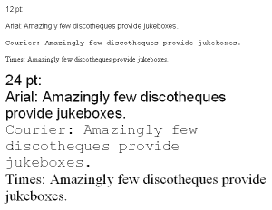

# 用 Python 实现计算机视觉和光学字符识别

> 原文：<https://dev.to/codesharedot/computer-vision-and-ocr-with-python-5d39>

让计算机有眼睛不是一件容易的事情。是的，你可以抓取网络摄像头的视频，但这并不意味着电脑可以解析它所看到的内容。

最近的发展确实推动了这一领域的发展。借助深度学习技术，他们现在可以在许多不同的位置对不同的对象进行基本观察。

那么如果你对深度学习或者神经网络一无所知，如何在计算机视觉领域入门呢？

[](https://res.cloudinary.com/practicaldev/image/fetch/s--h6VzmDJz--/c_limit%2Cf_auto%2Cfl_progressive%2Cq_66%2Cw_880/https://proxy.duckduckgo.com/iu/%3Fu%3Dhttps%253A%252F%252Fmedia.giphy.com%252Fmedia%252FdYoceNWjX7qes%252Fgiphy.gif%26f%3D1%26nofb%3D1)

当然，你不能从最复杂的概念开始，然后倒退。你必须从基础开始。

最基础的，你可以做模式识别。为了降低复杂性，我建议从学习 Python 开始，而不是 C++。

字符识别(OCR)是计算机视觉的一个非常基本的任务。

## 带魔方的 OCR

我们可以从图像中识别基本字符(a，b，c)。这被命名为“光学字符识别”。宇宙魔方是一个免费的 OCR 引擎。

```
apt-get install tesseract-ocr 
```

在终端中，您可以:

```
tesseract example.png output.txt
cat output.txt 
```

example.png 是这样的形象:

[](https://res.cloudinary.com/practicaldev/image/fetch/s--W2I-a_bQ--/c_limit%2Cf_auto%2Cfl_progressive%2Cq_auto%2Cw_880/https://thepracticaldev.s3.amazonaws.com/i/v59kxqwe5tgze9gvm8ou.png)

## 用 Python 进行 OCR

您可以使用 Python 与 Tesseract 进行交互。安装模块枕形和方形

```
pip install Pillow
pip install pytesseract 
```

然后，您可以运行此代码，它会将图像上的文本翻译成终端中的文本:

```
#!/usr/bin/python3
from PIL import Image
import pytesseract

def ocr_core(filename):
    text = pytesseract.image_to_string(Image.open(filename))
    return text

print(ocr_core('example.png')) 
```

这是计算机视觉的一个非常基本的例子。使用各种技术，你可以做更多的事情。然而，我认为任何对一个领域的介绍都应该尽可能简单。

### 相关链接:

*   [Pytesseract 模块](https://pypi.org/project/pytesseract/)
*   [计算机视觉入门课程](https://gum.co/GQWGG)
*   [用 Python 进行物体检测](https://pythonspot.com/object-detection-with-templates/)
*   [机器学习，一个密切相关的领域](https://pythonprogramminglanguage.com/how-do-i-learn-machine-learning/)