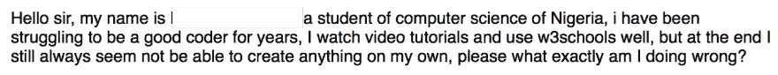

# 摆脱单调乏味的教程的具体步骤

> 原文：<https://dev.to/aryanjnyc/concrete-steps-to-get-off-the-tutorial-treadmill-2a77>

我最近收到一封邮件，询问如何摆脱[教程跑步机](https://www.thewebdevcoach.com/blog/2018-12-14-learning-to-code-get-off-the-tutorial-treadmill/):

我的教程跑步机博客帖子是不可否认的模糊和隐喻。在这里，我将构建一些具体的行动，你可以采取这些行动来最终编写你自己的项目。

# 建立基础

不要一开始就试图创造下一个脸书。相反:

学习 web 开发的基础部分:HTML 和 CSS。转到 [freeCodeCamp 课程](https://learn.freecodecamp.org/)并完成响应式网页设计认证，同时完成 Codecademy[HTML 简介](https://www.codecademy.com/learn/learn-html)和[CSS 简介](https://www.codecademy.com/learn/learn-css)教程。这应该需要半个月到一个月的时间来完成(假设你早上工作或上学，每天花一个小时学习 web 开发)。

# 完成你的第一个项目

您现在已经为您的第一个项目做好了准备！进入 freeCodeCamp [致敬页面项目描述](https://learn.freecodecamp.org/responsive-web-design/responsive-web-design-projects/build-a-tribute-page)开始吧。您将创建一个结构类似于:【https://codepen.io/freeCodeCamp/full/zNqgVx[的贡品页面。](https://codepen.io/freeCodeCamp/full/zNqgVx)

请做:

1.  谷歌你内心渴望的一切！用谷歌提醒自己可能已经忘记的 HTML 元素和属性并不是欺骗。也可以使用 Google 来提醒自己 CSS 选择器和属性。
2.  在 [Twitter](https://twitter.com/aryanjabbari) 或 [freeCodeCamp 论坛](https://www.freecodecamp.org/forum/)上提问。与其他和你同病相怜的未来开发人员交往。交一些网络朋友。
3.  不要害怕问*为什么*建议是以一种方式而不是另一种方式提出的。问为什么是你学习的方式。
4.  一步一步地创建代码。将你的愿景分成小块。确定下一步你可以采取什么措施来完成项目。例如，从弄清楚如何创建一个标题开始。一旦你完成了这些，渲染一个图像并居中。现在，接下来是什么？🤔

请**别**:

1.  从示例项目中复制代码。你将学到的一切都来自于自己创造东西(当然是在谷歌的帮助下)的斗争和挫折(这将会令人沮丧)。
2.  被森林吓倒。把网站一棵树一棵树砍掉。这直接对应于上面的第 4 点。

# 找同行评议

学习不会因为你完成了你的项目而停止。找一个更资深的开发人员来审查你的代码。Twitter 和 T2 自由代码营项目反馈论坛是寻找同行评审的绝佳场所。如果你找不到同行评议，不要害怕给我发推文。我非常乐意帮忙。

# 冲洗并重复

恭喜你！你已经完成了你的第一个项目！现在按照上面所有的步骤完成所有的[响应式网页设计项目](https://learn.freecodecamp.org/responsive-web-design/responsive-web-design-projects)。一旦你完成了这些，继续完成剩余的[免费代码营课程](https://learn.freecodecamp.org/)。只要确保避免可怕的[教程跑步机](https://www.thewebdevcoach.com/blog/2018-12-14-learning-to-code-get-off-the-tutorial-treadmill/)！