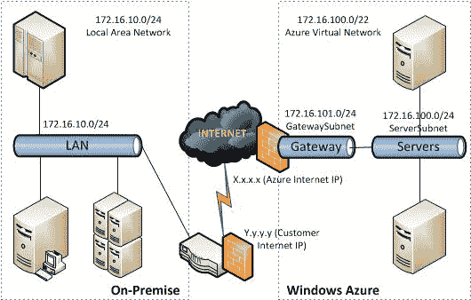

# 配置 Azure 虚拟网络网关

> 原文：<https://dev.to/cheahengsoon/configure-azure-virtual-network-gateways-16bl>

Azure 虚拟网络网关充当跨场所网关，将 Azure 虚拟网络中的工作负载连接到内部站点。它需要通过互联网协议安全(IPsec)站点到站点 VPN (S2S VPN)隧道或通过 ExpressRoute 电路连接到内部站点。对于 IPsec /互联网密钥交换(IKE) VPN 隧道，网关执行 IKE 握手，并在虚拟网络和内部站点之间建立 IPsec S2S VPN 隧道。对于 ExpressRoute，网关通过对等电路在虚拟网络中通告前缀，并将数据包从 ExpressRoute 电路转发到虚拟网络中的虚拟机。
 
打造高性能网关

若要为名为 MyAzureVNET 的虚拟网络创建网关，请使用以下 Azure PowerShell cmdlet:

**PS D:>**New-AzureVNETGateway–Newname MyAzureVNET–gateway type 动态路由–gateway SKU 高性能

**注意**动态路由是动态路由网关和专用(快速路由)网关的网关类型。因此，您还可以使用 cmdlet 示例创建虚拟网关来连接到 ExpressRoute 电路。

**测试 Azure 负载平衡器**

1.使用 New-AzureRmVirtualNetwork 创建虚拟网络。以下示例使用 mySubnet 创建了一个名为 myVNET 的虚拟网络:

**创建子网配置。**

$ subnet config = New-azurermvirtualnetworkksubnetconfig '

-Name “mySubnet” `

-地址前缀 10.0.2.0/24

**创建虚拟网络。**

$ vNET = New-AzureRmVirtualNetwork '

-resource group name " myResourceGroupLB "

-位置“伊斯特斯”

-Name “myVNET” `

-地址前缀 10.0.0.0/16 '

-Subnet $subnetConfig

2.通过为端口 3389 创建网络安全组规则，创建网络安全组来定义到虚拟网络的入站连接。
使用 New-azuremnetworksecurityruleconfig 创建网络安全组规则，以允许通过端口 3389 进行 RDP 连接。

$ rule 1 = New-AzureRmNetworkSecurityRuleConfig-Name ' myNetworkSecurityGroupRuleRDP '-描述'允许 RDP ' ` 1

-允许访问-协议 Tcp-方向入站-优先级 1000 '

-SourceAddressPrefix Internet-SourcePortRange *-DestinationAddressPrefix * `

-目标端口范围 3389

3.使用 New-azuremnetworksecurityruleconfig 创建网络安全组规则以允许通过端口 80 的入站连接。
$ rule 2 = New-azuremworknowlecsecurityruleconfig '

-Name ' myNetworkSecurityGroupRuleHTTP ' `

-描述'允许 HTTP '-访问允许-协议 Tcp '

-方向入站-优先级 2000-源地址前缀 Internet

-source portrange *-DestinationAddressPrefix *-DestinationPortRange 80

4.使用 New-azurernnetworksecuritygroup 创建网络安全组。

$ NSG = New-AzureRmNetworkSecurityGroup-resource group Name ' myResourceGroupLB '-Location ' EastUS '-Name ' myNetworkSecurityGroup '-security rules $ rule 1，$rule2

5.使用 New-AzureRmNetworkInterface 创建虚拟网络适配器。以下示例创建了两个虚拟网络适配器(在以下步骤中为您的应用程序创建的每个虚拟机一个)。您可以随时创建额外的虚拟网络适配器和虚拟机，并将它们添加到负载平衡器。

**为第一个虚拟机创建网络适配器。**

$ NIC VM 1 = New-AzureRmNetworkInterface `

-resource group name“myResourceGroupLB”

-位置“伊斯特斯”

-名称“MyNic1”

-loadbalancerbackendaddress pool $ backendPool ` s

-网络安全组$ nsg

-loadbalancercinboundnatrule $ NAT rule 1 '

-子网$vNET。子网[0]

**为第二台虚拟机创建一个网络适配器。**

$ NIC VM 2 = New-AzureRmNetworkInterface `

-resource group name“myResourceGroupLB”

-位置“伊斯特斯”

-名称“MyNic2”

-loadbalancerbackendaddress pool $ backendPool ` s

-网络安全组$ nsg

-loadbalancercinboundnatrule $ NAT rule 2 '

-子网$vNET。子网[0]

6.创建虚拟机以实现负载平衡。要提高应用的高可用性，请将虚拟机置于可用性集中。
使用 New-azuremavailabilityset 创建可用性集。以下示例创建名为 myAvailabilitySet 的可用性集:

$ availability set = New-azurermavailability set '

-resource group name " myResourceGroupLB "

-命名为“我的可用性集”

-位置“伊斯特斯”

-Sku 一致

-PlatformFaultDomainCount 2

-PlatformUpdateDomainCount 2

7.使用 Get-Credential 为虚拟机设置管理员用户名和密码。
$cred =获取凭证

8.使用 New-AzureRmVM 创建虚拟机。以下示例创建了两个虚拟机和所需的虚拟网络组件(如果它们尚不存在)。在虚拟机创建期间，之前创建的网络适配器与虚拟机相关联，因为它们被分配了相同的虚拟网络(myVNET)和子网(mySubnet)。
for($ I = 1；$ I-le 2；$i++)

{

New-AzureRmVm '

-resource group name " myResourceGroupLB "

-Name “myVM$i” `

-位置“美国东部”

-虚拟网络名称“我的网络”

-subnet name " my subnet " ` 0

-security group name " myNetworkSecurityGroup " ` 0

-开放端口 80 '

-availability set name " my availability set "

-凭证$cred '

-工作

}

-AsJob 参数将 VM 创建为后台任务，因此 Azure PowerShell 提示会返回给您。您可以使用 Job cmdlet 获取后台作业的详细信息。创建和配置这两个虚拟机需要几分钟时间。

**在新虚拟机**上安装带有自定义网页的微软互联网信息服务(IIS ),如下所示:

1.使用 Get-azurempublicipaddress 获取负载平衡器的公共 IP 地址。
Get-azurempublicipaddress-ResourceGroupName " myResourceGroupLB " `

-Name "myPublicIP" |选择 IP 地址

2.使用您在上一步中获得的公共 IP 地址创建到 VM1 的远程桌面连接。(注意，在下面的命令中，mstsc 指的是 Microsoft 终端服务客户端。)
mstsc/v:public IP address:4221

3.输入 VM1 的凭据以启动 RDP 会话。

4.在 VM1 上启动 Windows PowerShell，然后使用以下命令安装 IIS 并更新默认值。htm 文件。

**安装 IIS。**

install-windows feature-name Web-Server-IncludeManagementTools

移除默认值。htm 文件。

remove-item C:\ inetpub \ wwwroot \ IIS start . htm

**添加自定义。htm 文件。**

add-Content-Path " C:\ inetpub \ wwwroot \ IIS start . htm "-Value $(" Hello from "+$ env:computer name)

5.关闭与 myVM1 的 RDP 连接。

6.通过运行 mstsc /v:PublicIpAddress:4222 命令创建与 myVM2 的 RDP 连接，然后对 VM2 重复步骤 4。

**最后，测试负载平衡器**

使用 Get-azurempublicipaddress 获取负载平衡器的公共 IP 地址。以下示例获取先前创建的 myPublicIP 的 IP 地址:

get-azurempublicipaddress-ResourceGroupName " myResourceGroupLB " `

-Name "myPublicIP" |选择 IP 地址

现在，您可以在 web 浏览器中输入公共 IP 地址。将显示网站，包括负载平衡器向其分发流量的虚拟机的主机名。要查看负载平衡器在运行您的应用的两个虚拟机之间分配流量，您可以强制刷新您的 web 浏览器。

**恢复练习**

当不再需要资源组、虚拟机和所有相关资源时，可以使用 Remove-azuremresourcegroup 命令删除它们。

remove-azuremresourcegroup-Name myResourceGroupLB