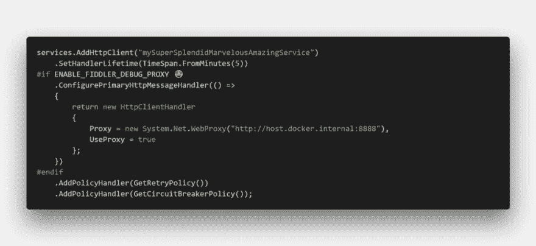
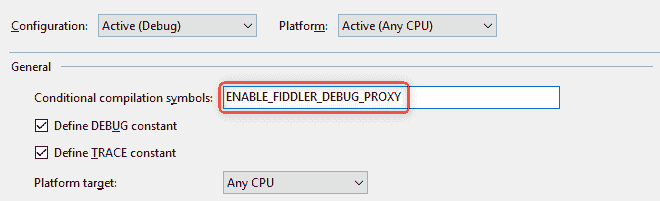

# 配置 HttpClientFactory 以在。基于 NET Core 微服务的 Docker 容器

> 原文：<https://dev.to/joni2nja/configure-httpclientfactory-to-use-fiddler-in-net-core-microservices-based-docker-containers-16kh>

这篇文章最初出现在[媒体](https://medium.com/@joni2nja/configure-httpclientfactory-to-use-fiddler-in-net-core-microservices-based-docker-containers-2540bd87c14)上

有没有想过如何配置你的 Dockerized 应用程序使用 Fiddler？

[](https://res.cloudinary.com/practicaldev/image/fetch/s--9ugtPHD3--/c_limit%2Cf_auto%2Cfl_progressive%2Cq_auto%2Cw_880/https://cdn-images-1.medium.com/max/1024/1%2ARrzfRcoC2Uh6Igm4S4eKnw.png)

如果以下所有条件都是真的，那么这篇文章可能会帮助你。希望如此。

*   您正在使用[开发基于微服务的应用。NET Core](https://dot.net) 2.1 或以上
*   你使用 [Docker Desktop for Windows](https://docs.docker.com/docker-for-windows/) 进行开发(最低版本:18.03)
*   您正在使用 [HttpClientFactory](https://docs.microsoft.com/en-us/dotnet/standard/microservices-architecture/implement-resilient-applications/use-httpclientfactory-to-implement-resilient-http-requests#what-is-httpclientfactory) ，这是一个用于创建 HttpClient 实例的自以为是的工厂
*   您喜欢 Fiddler 并试图配置您的 HttpClient 来使用 Fiddler 作为调试代理

假设我们的 Docker 容器应用程序在`Startup.cs`中有如下`HttpClientFactory`设置:

```
services.AddHttpClient("mySuperSplendidMarvelousAmazingService")
  .SetHandlerLifetime(TimeSpan.FromMinutes(5))
  .AddPolicyHandler(GetRetryPolicy())
  .AddPolicyHandler(GetCircuitBreakerPolicy()); 
```

请注意，`AddPolicyHandler(...)`可能是您可以使用的典型微服务模式。参见[。NET 微服务:容器化的体系结构。NET 应用程序](https://docs.microsoft.com/en-us/dotnet/standard/microservices-architecture/implement-resilient-applications/implement-http-call-retries-exponential-backoff-polly)参考文献。

现在，要配置`HttpClient`与主机端口 8888 上的 Fiddler“对话”( [Fiddler 默认监听端口 8888](https://docs.telerik.com/fiddler/configure-fiddler/tasks/UseFiddlerAsReverseProxy))，我们需要知道主机 IP 地址。感谢 Docker v18.03，我们可以使用特殊的 DNS 名称`host.docker.internal`。

有关更多详细信息，请参考文档:

[Docker 桌面 Windows 版的网络功能](https://docs.docker.com/docker-for-windows/networking/)

所以让我们使用那个特殊的 DNS:

```
services.AddHttpClient("mySuperSplendidMarvelousAmazingService")
  .SetHandlerLifetime(TimeSpan.FromMinutes(5))
// ADD THIS 👇👇👇
  .ConfigurePrimaryHttpMessageHandler(() =>  
  {  
      return new HttpClientHandler  
      {  
          Proxy = new WebProxy("http://host.docker.internal:8888"),  
          UseProxy = true  
      };  
  }) 
// --------- 👆👆👆
  .AddPolicyHandler(GetRetryPolicy())
  .AddPolicyHandler(GetCircuitBreakerPolicy()); 
```

就是这样！现在我们应该能够在 Fiddler 中检查请求/响应。

但是等等🛑⛔🚫！！我们不想将调试代码发布到产品中，对吗？当然不是。但有时我们只是希望能够在调试过程中通过简单的翻转来使用它。让我们探索一些可能的解决方案:

*   使用预处理器指令
*   使用 ConditionalAttribute

### 使用预处理指令

我们通过使用 C# [*预处理器指令*](https://docs.microsoft.com/en-us/dotnet/csharp/language-reference/preprocessor-directives/preprocessor-if) :
来完成这个任务

```
services.AddHttpClient("mySuperSplendidMarvelousAmazingService")
  .SetHandlerLifetime(TimeSpan.FromMinutes(5))
#if DEBUG 😎
  .ConfigurePrimaryHttpMessageHandler(() =>
  {
      return new HttpClientHandler
      {
          Proxy = new WebProxy("http://host.docker.internal:8888"),
          UseProxy = true
      };
  })
#endif
  .AddPolicyHandler(GetRetryPolicy())
  .AddPolicyHandler(GetCircuitBreakerPolicy()); 
```

这样，在生产构建中，它不会被编译成微软中间语言(MSIL，简称 IL)。

看起来不错。直到它不是。如果我们每次在调试模式下启动应用程序时忘记启动 Fiddler，就会失败。所以，一个更好的替代方案，定义并使用我们自己的自定义符号，例如:`ENABLE_FIDDLER_DEBUG_PROXY` :

```
services.AddHttpClient("mySuperSplendidMarvelousAmazingService")
  .SetHandlerLifetime(TimeSpan.FromMinutes(5))
#if ENABLE_FIDDLER_DEBUG_PROXY 😍
  .ConfigurePrimaryHttpMessageHandler(() =>
  {
      return new HttpClientHandler
      {
          Proxy = new WebProxy("http://host.docker.internal:8888"),
          UseProxy = true
      };
  })
#endif
  .AddPolicyHandler(GetRetryPolicy())
  .AddPolicyHandler(GetCircuitBreakerPolicy()); 
```

并且只在我们真正需要的时候定义它:

[](https://res.cloudinary.com/practicaldev/image/fetch/s--rPj8Q0dj--/c_limit%2Cf_auto%2Cfl_progressive%2Cq_auto%2Cw_880/https://cdn-images-1.medium.com/max/660/1%2AAgESqiTbEb_KXnLoWdvzZA.png)

厉害！👍

### 使用条件属性

另一个可能的解决方案，利用[条件属性](https://docs.microsoft.com/en-us/dotnet/api/system.diagnostics.conditionalattribute)。我们来添加一个扩展方法:

```
public static class FiddlerExtensions
{
[Conditional("ENABLE_FIDDLER_DEBUG_PROXY")]
  public static void AddFiddler(this IHttpClientBuilder builder)
  {
    builder.ConfigurePrimaryHttpMessageHandler(() =>
    {
      return new HttpClientHandler
      {
        Proxy = new WebProxy("http://host.docker.internal:8888"),
        UseProxy = true
      };
    });
  }
} 
```

并像这样使用:

```
var builder = services.AddHttpClient("mySuperSplendidMarvelousAmazingService")
  .SetHandlerLifetime(TimeSpan.FromMinutes(5))
  .AddPolicyHandler(GetRetryPolicy())
  .AddPolicyHandler(GetCircuitBreakerPolicy());
builder.AddFiddler(); 
```

这样做的好处是，如果我们没有定义`ENABLE_FIDDLER_DEBUG_PROXY`，IL 中就不会包含`builder.AddFidler()`。

现在，丑陋的部分，我们不能继续链接方法调用，因为它最终会被从 IL 中一起移除，因此我们在这里引入一个变量`builder`。您可以使用 [ILSpy](https://github.com/icsharpcode/ILSpy) 或 [dnSpy](https://github.com/0xd4d/dnSpy) 来拆解和验证此行为。

**奖励提示！**

还有一个很酷的调试技巧:[调试器。IsAttached](https://docs.microsoft.com/en-us/dotnet/api/system.diagnostics.debugger.isattached)

> 获取一个值，该值指示调试器是否附加到进程。

```
if (Debugger.IsAttached) { ... } 
```

这可能对某些场景有用，但是我不认为我会在这个场景中使用它。

你的解决方案是什么？