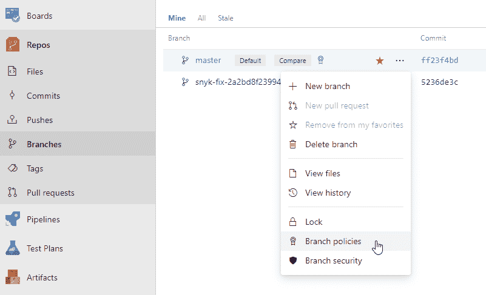
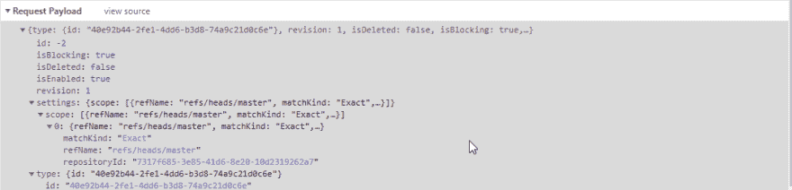

# 为 Azure Repos 中的所有存储库配置标准策略

> 原文：<https://dev.to/xpirit/configuring-standard-policies-for-all-repositories-in-azure-repos-a4f>

> 几周前，我写了一篇关于在 Azure Repos 上设置收藏级别权限的博客。这引发了一个问题，即在评论、twitter 和 Azure DevOps Club slack 频道的分支政策上是否可能出现同样的情况。

[](https://res.cloudinary.com/practicaldev/image/fetch/s--tp0XUFFF--/c_limit%2Cf_auto%2Cfl_progressive%2Cq_auto%2Cw_880/https://jessehouwing.net/conteimg/2019/08/law.jpg)

默认情况下，您只能在 Azure Repos 中的特定分支上配置策略。您可以通过分行的[...]菜单，并在那里设置策略。但是如果你正在为你的分支使用一个严格的命名模式(例如，当使用[发布流](https://docs.microsoft.com/en-us/azure/devops/learn/devops-at-microsoft/release-flow)或者 [GitHub 流](https://guides.github.com/introduction/flow/)时)，你可能想要为所有未来的发布分支或者所有特性分支设置一个策略。

如果你能把这些政策写进法律就好了，这样你就不必为未来的每个分支机构制定这些政策了。

> **让我们从坏消息**开始:策略 API 是特定于项目的。因此，您不能为一个帐户中的所有 Git 存储库设置策略，但是您可以为一个项目中的所有存储库指定策略。

[](https://res.cloudinary.com/practicaldev/image/fetch/s--RhinFeRA--/c_limit%2Cf_auto%2Cfl_progressive%2Cq_auto%2Cw_880/https://jessehouwing.net/conteimg/2019/08/image.png) 

<figcaption>对某个分支机构设置策略。</figcaption>

如果查看保存分支策略时生成的请求，可以看到 UI 在创建新策略时向`/{Project Guid}/api/policy/Configurations` REST API 发送 POST 请求。该请求包含每个策略的范围:

[](https://res.cloudinary.com/practicaldev/image/fetch/s--YFyOo1ru--/c_limit%2Cf_auto%2Cfl_progressive%2Cq_auto%2Cw_880/https://jessehouwing.net/conteimg/2019/08/image-1.png)

<figcaption>Azure Repos</figcaption>

中每个策略都有一个范围

如您所见，该策略有一个范围。您可以有多个活动策略，每个策略都有自己的范围。UI 将总是创建一个包含`repositoryId`和确切分支名称的特定范围。

```
"scope": [
    {
        "refName": "refs/heads/master",
        "matchKind": "Exact",
        "repositoryId": "7317f685-3e85-41d6-8e20-10d2319262a7"
    }
] 
```

<figcaption>Scope: (default) Specific Git Repo and single branch.</figcaption>

但是如果你看一下这个 API 的文档，你会发现这不是唯一可用的选项。您可以创建的最大范围根本没有存储库范围，并且适用于那个项目中的所有存储库:

```
"scope": [
    {
        "repositoryId": null
    }
] 
```

<figcaption>Scope: All Git Repos in the project.</figcaption>

但是还有其他很酷的选择。您可以通过将`matchKind`从`exact`设置为`prefix`来为具有特定前缀的所有分支配置策略。

```
"settings": {
    "scope": [
      {
        "repositoryId": null,
        "refName": "refs/heads/features/",
        "matchKind": "prefix"
      }
    ]
  } 
```

<figcaption>Scope: All feature branches for all repositories in the project.</figcaption>

不幸的是，看起来这个 API 只存在于项目级别。人们不能为所有未来的项目制定政策。*但是，仔细想想，这也有道理。你不能为还不存在的项目预测所有未来的组名、构建定义 id 等等。*但是它没有用户界面让你相信的那么严格。

为了弄清楚每个策略是如何指定的，按照您想要的方式配置一个分支，然后在您的帐户上打开`/{Project Guid}/_apis/policy/Configurations/`。您将会得到针对您当前配置的 JSON:

```
{
    "count": 1,
    "value": [
        {
            "isEnabled": true,
            "isBlocking": true,
            "settings": {
                "useSquashMerge": false,
                "scope": [
                    {
                        "refName": "refs/heads/master",
                        "matchKind": "Exact",
                        "repositoryId": "7317f685-3e85-41d6-8e20-10d2319262a7"
                    }
                ]
            }
        }
    ]
} 
```

通过从您的帐户中查询保单类型，找出您需要了解的所有保单类型，我的帐户返回这些:

```
[
    {
        "description": "GitRepositorySettingsPolicyName",
        "id": "0517f88d-4ec5-4343-9d26-9930ebd53069",
        "displayName": "GitRepositorySettingsPolicyName"
    },
    {
        "description": "This policy will reject pushes to a repository for paths which exceed the specified length.",
        "id": "001a79cf-fda1-4c4e-9e7c-bac40ee5ead8",
        "displayName": "Path Length restriction"
    },
    {
        "description": "This policy will reject pushes to a repository for names which aren't valid on all supported client OSes.",
        "id": "db2b9b4c-180d-4529-9701-01541d19f36b",
        "displayName": "Reserved names restriction"
    },
    {
        "description": "This policy ensures that pull requests use a consistent merge strategy.",
        "id": "fa4e907d-c16b-4a4c-9dfa-4916e5d171ab",
        "displayName": "Require a merge strategy"
    },
    {
        "description": "Check if the pull request has any active comments",
        "id": "c6a1889d-b943-4856-b76f-9e46bb6b0df2",
        "displayName": "Comment requirements"
    },
    {
        "description": "This policy will require a successfull status to be posted before updating protected refs.",
        "id": "cbdc66da-9728-4af8-aada-9a5a32e4a226",
        "displayName": "Status"
    },
    {
        "description": "Git repository settings",
        "id": "7ed39669-655c-494e-b4a0-a08b4da0fcce",
        "displayName": "Git repository settings"
    },
    {
        "description": "This policy will require a successful build has been performed before updating protected refs.",
        "id": "0609b952-1397-4640-95ec-e00a01b2c241",
        "displayName": "Build"
    },
    {
        "description": "This policy will reject pushes to a repository for files which exceed the specified size.",
        "id": "2e26e725-8201-4edd-8bf5-978563c34a80",
        "displayName": "File size restriction"
    },
    {
        "description": "This policy will ensure that required reviewers are added for modified files matching specified patterns.",
        "id": "fd2167ab-b0be-447a-8ec8-39368250530e",
        "displayName": "Required reviewers"
    },
    {
        "description": "This policy will ensure that a minimum number of reviewers have approved a pull request before completion.",
        "id": "fa4e907d-c16b-4a4c-9dfa-4906e5d171dd",
        "displayName": "Minimum number of reviewers"
    },
    {
        "description": "This policy encourages developers to link commits to work items.",
        "id": "40e92b44-2fe1-4dd6-b3d8-74a9c21d0c6e",
        "displayName": "Work item linking"
    }
] 
```

<figcaption>All policy types available in my account.</figcaption>

每个策略的配置有点神秘。我倾向于通过 UI 配置策略，然后检索配置好的策略，看看 JSON 是什么样子的。

现在您已经理解了底层的概念、guids 和其他东西，您可以使用 PowerShell 或...[你可以为 Azure DevOps 使用新的 Azure CLI](https://docs.microsoft.com/en-us/cli/azure/ext/azure-devops/repos/policy?view=azure-cli-latest):

```
az extension add --name "azure-devops"
az login

az repos policy create --org {your org} --project {your project name or guid} --config "path/to/config/file" 
```

供参考:

*   [策略 API 文档](https://docs.microsoft.com/en-us/rest/api/azure/devops/policy/?view=azure-devops-server-rest-5.0)
*   [策略配置 REST API](https://docs.microsoft.com/en-us/rest/api/azure/devops/policy/configurations/list?view=azure-devops-server-rest-5.0)
*   [策略类型 REST API](https://docs.microsoft.com/en-us/rest/api/azure/devops/policy/types/get?view=azure-devops-server-rest-5.0)
*   [政策示例](https://docs.microsoft.com/en-us/rest/api/azure/devops/policy/configurations/create?view=azure-devops-server-rest-5.0#examples)