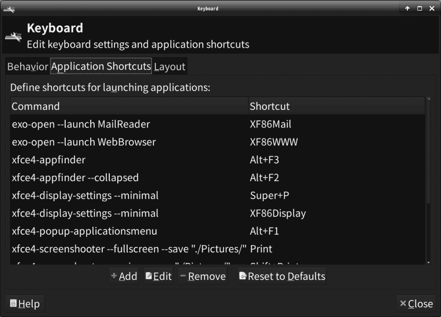
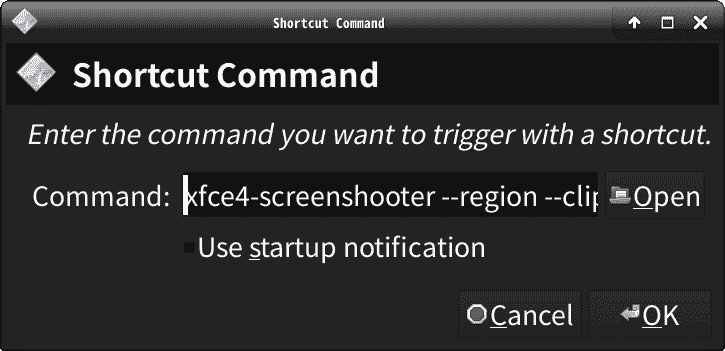
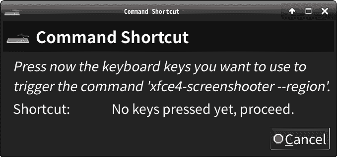
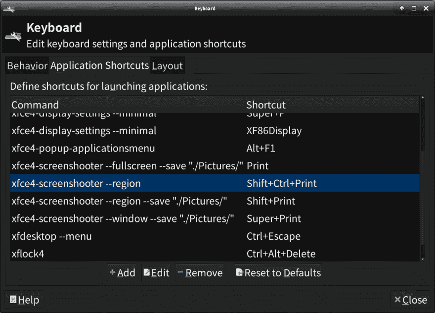

# Xfce:自定义键盘快捷键

> 原文：<https://dev.to/nabbisen/configuring-xfce-keyboard-shortcuts-3lm5>

[Xfce 桌面](https://www.xfce.org)支持自定义键盘快捷键。

打开 Xfce 菜单。
进入【设置】-【键盘】。
然后激活“应用程序快捷方式”:

要添加快捷方式，点击"添加"并输入命令和组合键:

此外，事后还可以“编辑”或“删除”它。