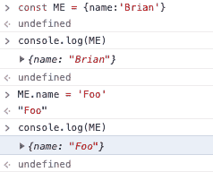
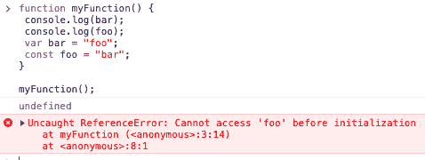

# 被 JavaScript 的 const 迷惑了？我也是！

> 原文：<https://dev.to/remotesynth/confused-by-javascript-s-const-me-too-4dfo>

前几天，我在 Twitter 上围绕 JavaScript 中的`const`概念争论了一会儿。凯尔·辛普森在我分享的一篇文章中指出了围绕`const`的一个误解。我的感觉是，或多或少，我能理解这种困惑来自哪里，因为它经常感觉`const`并没有按照我期望的方式行事(注意，我不是说它是错的，只是与我的期望不同)。

> 嗯（表示踌躇等）...看这篇文章的时候错过了这个问题。但是如果他(和许多其他人)误解了“const ”,部分原因可能是因为“const”经常不像你想象的那样表现。
> 
> — Brian Rinaldi ([@remotesynth](https://dev.to/remotesynth) ) [June 10, 2019](https://twitter.com/remotesynth/status/1138084777674924034?ref_src=twsrc%5Etfw)

即使在那次简短的谈话中，也出现了许多术语和概念。所以我想，让我深入研究一下，这样我可以更好地理解常量的概念以及用`const`声明的变量在 JavaScript 中实际工作的方式。

> 我应该指出的是，凯尔·辛普森确实就这个话题写了一篇文章，但似乎是在一个不再直播的博客上。他确实分享了通过时光倒流机获得的[版本。这值得一读，因为他比我计划的要深入得多。](https://web.archive.org/web/20151113135159/http://blog.getify.com/constantly-confusing-const)

## 什么是常数？

如果你谷歌一下“编程中的常数是什么？”，你会发现很多页面都像在 [Wikipedia](https://en.wikipedia.org/wiki/Constant_(computer_programming)) 上一样将常量定义为“在正常执行期间程序不能改变的值”

从表面上看，这似乎相当简单——设置一个值，它就不能更改。这对可读性和错误检查都很有用。然而，并不是所有的语言都有常量，那些有常量的语言也不总是以相同的方式处理它们。例如，在某些语言中，常量可以保存的值的类型是有限的。

一旦你超越了简单的值类型，事情就会变得混乱。这对于这里的讨论很重要(这也是我自己对 JavaScript 中常量的期望和现实的困惑所在)。我不想解释，而是举个例子。

假设我这样设置一个常数:

```
const NAME = "Brian"; 
```

Enter fullscreen mode Exit fullscreen mode

很明显，试图给`NAME`赋值会导致错误——事实也的确如此。但是如果我做了下面的事情呢:

```
const ME = {name:'Brian'}; 
```

Enter fullscreen mode Exit fullscreen mode

如果我改变了`ME.name`的值，我应该得到一个错误吗？有人可能会说，从技术上来说，我没有改变`ME`的值，因为它仍然指向同一个对象，即使该对象已经发生了变化。明确地说，在 JavaScript 中，这将*而不是*给你一个错误。

[](https://res.cloudinary.com/practicaldev/image/fetch/s--r6acc23L--/c_limit%2Cf_auto%2Cfl_progressive%2Cq_auto%2Cw_880/https://thepracticaldev.s3.amazonaws.com/i/vyw9a3kepjtlmslmbvo9.png)

正是在这一点上，计算机科学的人们将进入原语和不变性的概念。我们会谈到这些，但是为了不把它变成计算机科学书籍中的一章，我不打算深入讨论它们。

> 简而言之，不可变对象是一种在创建后其状态不能被修改的对象。JavaScript 中的原语是“不是对象并且没有方法的数据”(来源: [MDN](https://developer.mozilla.org/en-US/docs/Glossary/Primitive) )

## JavaScript 中的常量

在 ES6(又名 ES2015)的 JavaScript 中添加了`const`关键字。以前，通常的惯例是使用一个标准变量，但是使用像`MY_CONSTANT`这样的全大写名称。这并不影响变量是否可以被改变——它更多的是一个提示，告诉开发人员它不应该被改变。

用`const`声明的 JavaScript 常量可以是全局范围的，也可以是块范围的。如果它们在一个块内(即在`{`和`}`之间),它们会被自动限定块范围。如果它们不在一个块中，它们是全局范围的，但是不像用`var`声明的变量，它们不会成为窗口对象的属性。基本上，`const`声明的变量的范围总是最里面的封闭块。对于脚本，它是全局范围；对于模块，它是该模块的范围。(向 [Axel](https://twitter.com/rauschma) 脱帽示意，以便澄清。)

`const`和`var`另一个有趣的区别是[吊](https://developer.mozilla.org/en-US/docs/Glossary/Hoisting)的方式不同。当你使用`const`或`let`声明一个变量时，声明被提升，但是它的值没有被初始化为`undefined`，因此如果你试图在声明之前访问它，你会得到一个引用错误。正如您在下面看到的，引用用`var`定义的变量的第一个`console.log`返回`undefined`，但是使用`const`的第二个会产生一个错误。

[](https://res.cloudinary.com/practicaldev/image/fetch/s--WOetdKRH--/c_limit%2Cf_auto%2Cfl_progressive%2Cq_auto%2Cw_880/https://thepracticaldev.s3.amazonaws.com/i/vyqwphgeyhud9zwsl6h6.png)

这被称为[时间死区](https://developer.mozilla.org/en-US/docs/Web/JavaScript/Reference/Statements/let#Temporal_dead_zone)，这让它听起来比实际情况更加不祥。

如前所述，关于 JavaScript 中的`const`,需要注意的最后一点是:

> const *声明*创建一个值的只读引用。它确实*而不是*意味着它保存的值是不可变的，只是变量标识符不能被重新赋值。([来源](https://developer.mozilla.org/en-US/docs/Web/JavaScript/Reference/Statements/const))

同样，这也是围绕`const`的困惑的来源。如果你在使用`const`和 [JavaScript 原语类型](https://developer.mozilla.org/en-US/docs/Web/JavaScript/Data_structures#Primitive_values)(即布尔、数字、字符串等。)，它将按照您预期的方式运行(任何重新分配都会产生错误)。但是，当使用`const`与 [JavaScript 对象](https://developer.mozilla.org/en-US/docs/Web/JavaScript/Data_structures#Objects)(包括数组、函数等。)，该对象仍然是可变的，这意味着该对象的属性仍然可以更改。

关于围绕`let`和`const`的作用域的更详细的介绍，在 Axel Rauschmayer 的《 [JavaScript for 急躁的程序员](https://exploringjs.com/impatient-js/ch_variables-assignment.html#const)》中有整整一章是关于`let`和`const`的。

## 该不该用 Const？

这是一个很难回答的问题，尤其是因为`let`具有与块作用域和提升相同的好处(我认为后者是一个潜在的好处，因为`var`的提升方式可能会导致不寻常的错误，即变量在声明之前被无意中访问)。吹捧`const`好处的人通常会关注代码的可读性。通过使用`const`，您已经指出这个特定的变量不应该改变，并且它将在一定程度上强制执行。

然而，正如我们在本文开头所指出的，人们似乎经常误解它，这一事实削弱了对`const`可读性的争论。是的，有一些防止重新分配这个变量的保护措施，但是，引用[凯尔的文章](https://web.archive.org/web/20151113135159/http://blog.getify.com/constantly-confusing-const):

> 实际上，许多开发人员声称这种保护可以防止一些不知情的开发人员意外地更改一个`const`。除此之外，在现实中，我认为开发者需要改变一个变量并得到一个常量抛出的错误，他可能会把`const`改成`let`，然后继续他的工作。

所以，如果`const`提供的保护是最小的，那么这就变成了一个风格偏好的问题，特别是在`let`和`const`之间选择的时候。如果您的变量将保存一个不打算更改的原始值，当然，使用`const`是一个合理的选择。但是，要认识到，如果值不是原始值，从可读性的角度来看，使用`const`可能会更加混乱，而不是更有帮助。