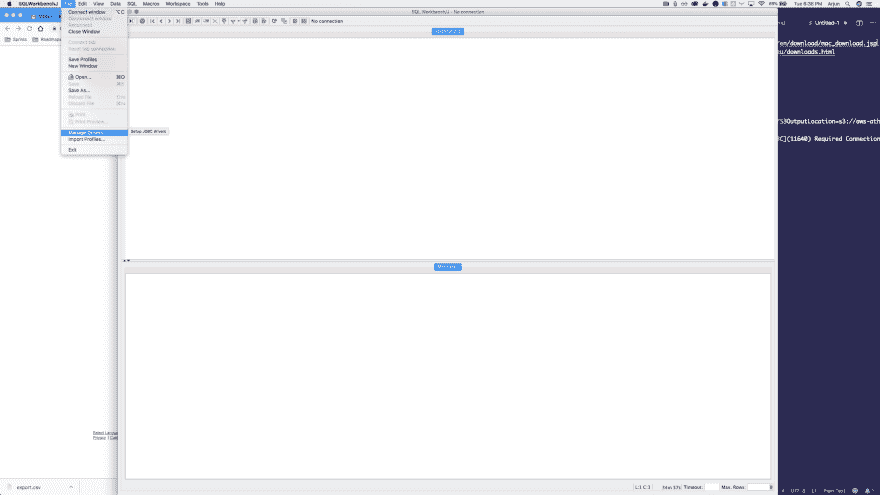
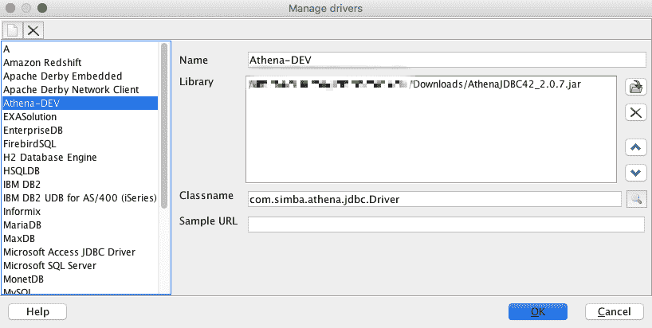
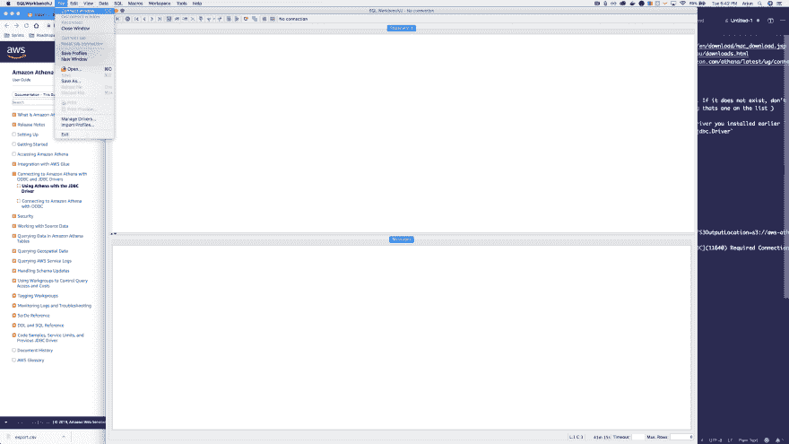
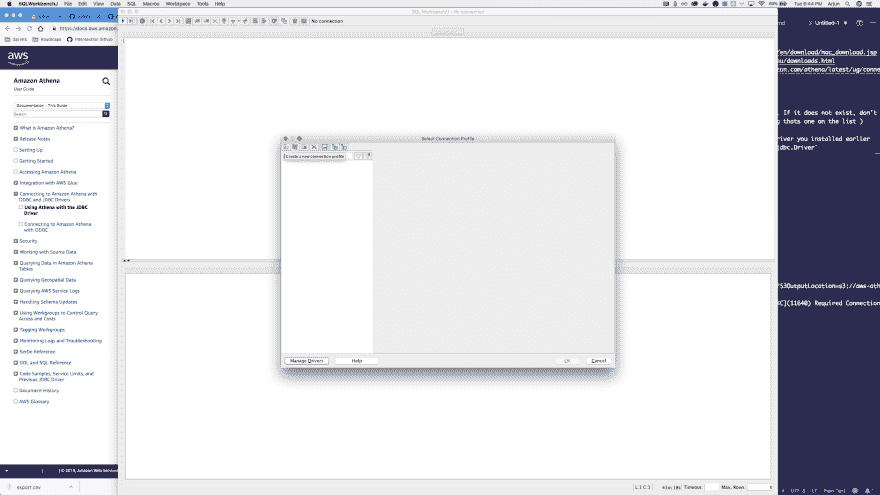
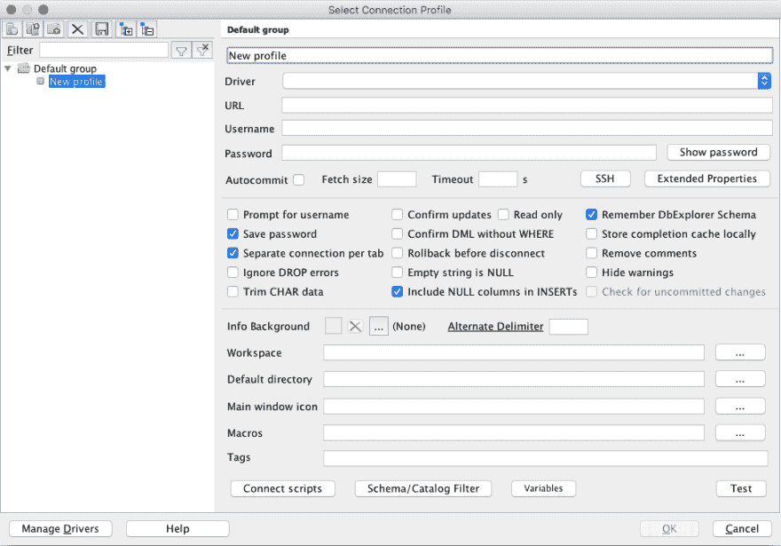
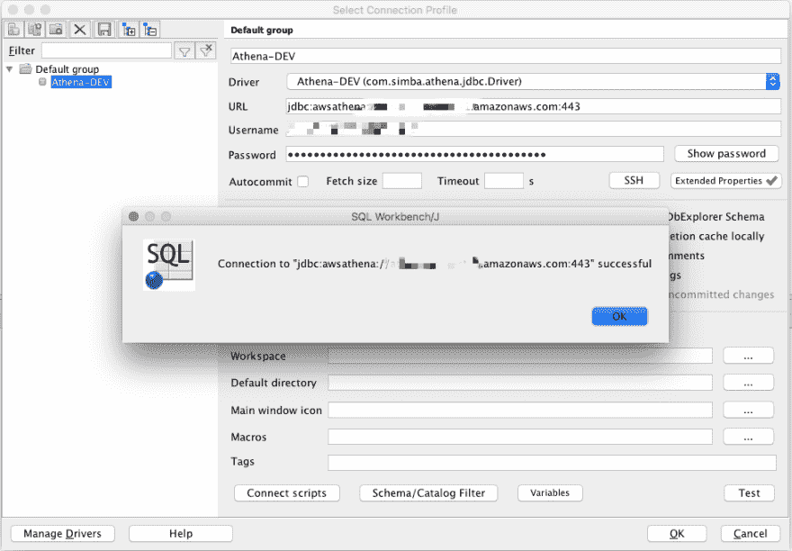

# 使用 SQL 客户端连接到 Amazon Athena

> 原文：<https://dev.to/arjunrao87/connect-to-amazon-athena-with-a-sql-client-155o>

[AWS Athena](https://aws.amazon.com/athena/) 让你在 S3 数据上运行 SQL，这是非常强大的。我想在 Mac 上使用 SQL Workbench 之类的 SQL 客户端连接到 Athena，这样我就可以执行这些查询来获得我想要的对数据的洞察力。让我们开始吧🚀

## 先决条件

*   确保您已经从[这里](https://java.com/en/download/mac_download.jsp)安装了 Java
    *   ⚠️ *如果你使用的是 Windows/Linux，确保你安装了合适的 Java 发行版*
*   从[这里](http://www.sql-workbench.eu/download-archive.html)安装 SQL 工作台
*   从[这里](https://docs.aws.amazon.com/athena/latest/ug/connect-with-jdbc.html)下载雅典娜驱动程序

## 设置雅典娜驱动程序

*   文件->管理驱动程序

*   如果列表中有 Athena 驱动程序，请选择该驱动程序。如果它不存在，不要担心。您可以选择任何选项，并按照下面的步骤使其成为 Athena 驱动程序
*   假设您选择了`Adabas`驱动程序(假设它在列表中)
    *   将`Name`改为`Athena-DEV`
    *   在`Library`部分，上传您之前安装的 athena 驱动程序
    *   将`classname`改为`com.simba.athena.jdbc.Driver`
    *   您可以将`Sample URL`字段留空
*   您最终的驱动程序设置应该是这样的

*   点击`OK`保存配置

## 设置雅典娜连接

*   文件->连接窗口

*   点击左上方的图标进入`Create a new connection profile`

*   你现在应该有这个视图了

*   连接名称(最上面的文本框)= `Athena-DEV`
*   下拉列表中的 Driver = `Athena-DEV`(因为您已经在上面的步骤中创建了驱动程序)
*   URL = `<your-athena-instance-based-on-region>`例如`jdbc:awsathena://athena.us-east-1.amazonaws.com:443`
*   用户名= `<AWS_ACCESS_KEY_ID>`
*   密码= `<AWS_SECRET_ACCESS_KEY>`
*   点击`Extended Properties`框，添加一个属性`S3OutputLocation`作为键。对于该值，使用您希望存储查询结果的亚马逊 S3 位置，前缀为 s3://。例如，如果您有一个名为`my-personal-bucket`的存储桶，并且您想将结果存储在名为`test-run`的文件夹中，那么值将是`s3://my-personal-bucket/test-run`
*   单击确定
*   点击`Test`按钮，你应该成功连接到你所在地区的雅典娜！

**您现在可以继续从 Athena 中查询您的 S3 数据**🔥

* * *

要了解我的更多信息，请访问我的[网站](https://www.arjunrao.co)，或者在[推特](https://mobile.twitter.com/raoarjun)上关注我。如果你想分享你自己的经历或者对你刚刚读到的有什么想法，欢迎在下面评论！👏👏👏