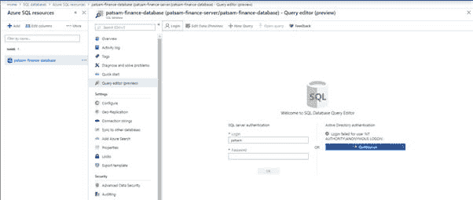

# 正在连接到 Azure SQL 数据库

> 原文：<https://dev.to/patricksameerajayalath/connecting-to-azure-sql-database-2kfm>

在本[教程](https://github.com/patricksameerajayalath/AzureTutorials/blob/master/Connecting%20to%20Azure%20SQL%20Database.pdf)中，我将展示如何:

通过 Azure 门户上的查询编辑器连接到 SQL Server 数据库
配置防火墙规则
在查询编辑器上运行 SQL 查询
通过 SQL Server Management Studio 连接到 SQL 数据库
将虚拟网络添加到 SQL Server 防火墙规则
设置 Azure Active Directory Admin

你可以在这里找到这个教程[的 PDF 版本。](https://github.com/patricksameerajayalath/AzureTutorials/blob/master/Connecting%20to%20Azure%20SQL%20Database.pdf)

你可以找到我所有的 Azure/。Net 教程[这里](https://dev.to/patricksameerajayalath)。

尽情享受吧！！