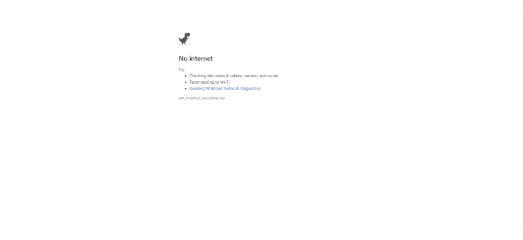

# 畅通无阻地连接到公共 Wi-Fi

> 原文：<https://dev.to/shimphillip/connecting-to-public-wi-fi-without-frustration-34f8>

你终于到达了期待已久的目的地。一个充满 lofi 音乐的咖啡馆，或者你住宿的酒店的舒适休息室——任何你试图接入公共 Wi-Fi(简称 wifi)热点的地方。你打开你的笔记本电脑或手机上网。你找到你的地方提供的无线网络的名称，然后点击连接。几秒钟后，您可以看到 wifi 图标上布满了线条。成功！😎然后你导航到你最喜欢的网站，等一会儿，然后...没什么！您最终会看到一个错误页面。

*Chrome 上默认无连接错误页面*

我经常看到我的朋友和家人努力连接公共 wifi，这应该是直观和直接的。让我们来高度概括一下幕后发生的事情。

## 但是我连上了，有什么问题？😔

首先，您预期看到的是一个强制网络门户页面。在这里，您将被重定向到由您的 wifi 主机提供的不同 URL，以便您可以阅读使用条款并接受其条件，然后授予您自由使用其网络的权限。然而，目前大多数流行的网站都使用 HTTPS 作为安全协议，这有助于安全地保护您和网站之间的数据交互。因此，当您尝试访问一个安全的网站时，现代浏览器会在重定向活动与目标网站的服务器安全连接之前对其产生怀疑。然后，它简单地产生一个无连接页面作为结果。

## 修罗

访问一个不使用安全协议的网站！一个不使用加密和认证的网站，只是一个使用 HTTP 的普通网站。在 2019 年很难找到这样的网站，但为此，你可以浏览一个网站。

**neverssl.com**

在浏览器的 URL 中键入此链接，您将被定向到强制网络门户页面！😁