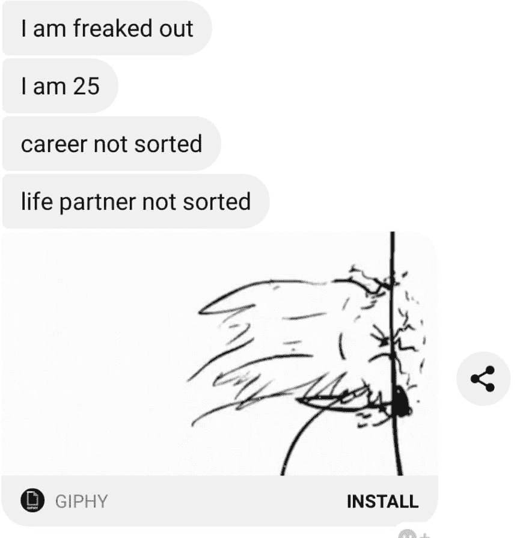
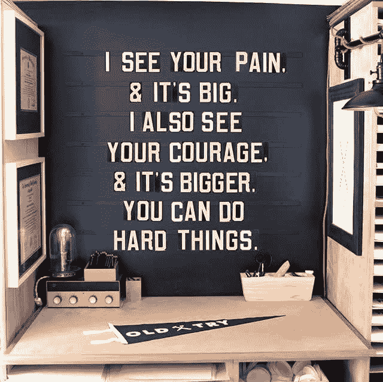
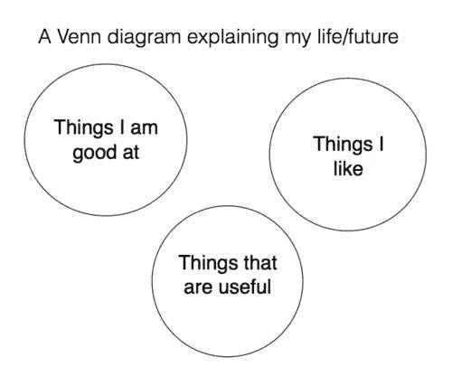
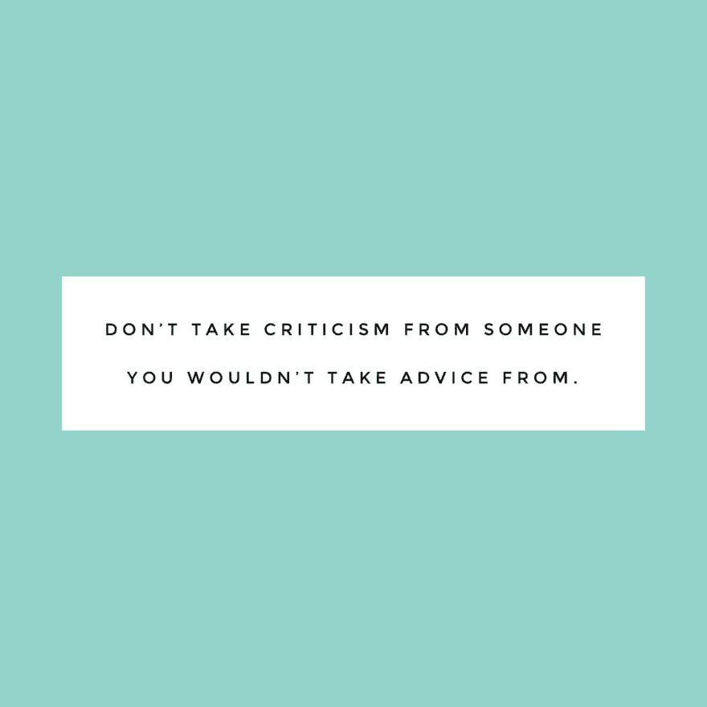

# 征服你的四分之一生活危机

> 原文：<https://dev.to/blender/conquering-your-quarter-life-crisis-kfd>

有几天(几周，有时几个月)我会感到**没有完成和困惑**。我的生活将走向何方，我是否充分利用了我的时间，吃下这盒奥利奥会对我的健康产生多严重的影响，这些问题在那些怀疑的日子里折磨着我。然而，在沉溺于我的虚荣心太久之后，我又回到了马鞍上，生活似乎又开始了。写这篇文章的时候，尽管我周围发生了好的和坏的事情，但我的心情很好。

我知道我不是一个人在奋斗，当人们来找我时，我经常想起这一点(想象一下发生了什么！)寻求帮助解决他们自己的四分之一生活危机。

最近，一个朋友给我发了一条短信-

我主动打电话给她，和她分享我的一些智慧，我正在用这些智慧让自己的船漂浮起来。她对我的回应是-

“当然，去吧，你也帮我试试！”

哎哟！看起来这个问题比我最初预想的要大。因为我知道四分之一生活危机严重打击了我和我的朋友们，所以我想做点什么。

我是一个狂热的读者，因此我是来自世界各地的读者群体中的一员。我们分享书籍推荐，并经常讨论我们正在阅读的书籍。

我加入这个小组已经有几个月了，我注意到小组中的人不仅充满了活力和智慧，而且他们还涵盖了广泛的年龄段。有高中生和 80 岁的老奶奶互相分享他们的故事和对书籍的热爱。

我向大家讲述了我和我的朋友的痛苦，她最近发现自己最好的朋友怀孕了，但仍未结婚，对自己的职业生涯犹豫不决。这群人的反应是我做梦也想不到的。来自不同职业、不同大洲和不同年龄组的数百人做出了回应，分享了他们对当今 25 岁左右成年人的建议。

说它改变了我可能有些言过其实，但我确实感到很平静，热爱我的生活和旅程。这里是会员们给的建议和故事的汇编，还有一些书籍推荐，因为对我来说，书籍在很多方面帮助了我。

*   “25 岁还在一起是完全正常的。我 25 岁前结过婚又离过婚，现在我又结婚了，很幸福。人生成就不是线性的。”

*   “20 多岁是用来解决问题的。你不应该把它们都放在一起。你还年轻。享受你的时间，不要匆忙。对自己要有耐心。”

*   “我觉得人直到 30 多岁才真正认识自己，对生活有了理解。你有时间。没有最后期限说你必须在某个年龄做这个或那个。对朋友来说是个不错的选择，并不意味着对你也是。”

*   “你必须做出错误的选择，才能学会在生活中做出正确的选择。不要害怕生活。😊"

*   一位 40 多岁、婚姻幸福的母亲:“我去澳大利亚的时候是 27 岁。所以比你大一点。我在 26 岁的时候和我的男朋友分手了，我想“好吧，万一你再也找不到你喜欢的人和你生孩子，你最好为你自己做些真正有益的事情。""

*   “我 40 岁时有了最后一个孩子。母乳喂养到 42 岁。你有时间。”

*   “我终于想通了我 46 岁长大后想做什么。不要担心别人的时间表。专注于你自己。生活不是一场赛跑。”

*   "只关注今天，如果你雄心勃勃，就关注明天."

*   “永远相信你对这个世界有所贡献，因为我向你承诺过。对此我绝对肯定。我祝愿你在每一次呼吸和每一步前进中都充满勇气、爱和快乐。”

*   “没有人是失败者。没有人。我们都在进步。读一些名人的传记，你会发现他们都失败了。”

*   “毫无疑问，20 多岁是我人生中最艰难的十年(目前 58 岁)。这似乎是老生常谈，但确实，你能做的最好的事情就是抛开目标，只是活在当下。你不会停滞不前，但你将能够敞开心扉面对你面前的可能性。如果这不起作用，你可以嘲笑这一切的荒谬。这基本上概括了我的 20 多岁:

*   “哎呀，姑娘...我 35 岁了，上面提到的事情还没有分类。放松生活……生活不是一张张清单。”

*   "尽可能多地节省你的薪水，但不要等到以后才开始生活."

*   “我记得我坐在银行工作的办公桌前，心想‘我就要 30 岁了，人们会认为我知道自己在说什么——我希望他们不会意识到我不知道’。”

*   “……没有成就，很迷茫……”在你 20 多岁的时候，这是意料之中的事，不管你的同龄人长什么样。直到我 50 岁的时候，我才完全适应我的皮肤/职业/关系/世界。那是我一生中最美好的十年…到目前为止……；-)善待自己，享受骑行！"

*   “我在 50 年代受到打击……当我不再在乎别人的想法时……当我变得真正满足时。我现在 60 多岁了，期待着更多令人兴奋的冒险和继续成长。”

*   “一棵树和一朵花在不同的时间线上茁壮成长，它们同样有效。20 多岁是探索的年龄，对一些人来说意味着孩子，对一些人来说意味着旅行，对一些人来说意味着享受今天。走自己觉得好看的小道！”

*   “如果我在 20 岁出头的时候嫁给了我的男朋友，那将会是一场灾难——当时我甚至都没有意识到我是萨福！你有时间。”

*   “去旅游，看一年世界！可以拿到很多国家的工作签证。”

*   “我 24 岁的时候吓坏了，很沮丧，不知道如何摆脱它。我的应该是这样的:我的朋友刚刚发布了她的硕士学位典礼-职业尚未分类-自我价值挣扎-尽快发送治疗师。作为人似乎是一种不断比较和自我进化的状态，你越早停止比较，自我评价就越有成效。”

*   “你不需要被‘排序’。仅仅因为社会对你有某些期望，并不意味着你应该遵循某种‘生活地图’。”

*   “25 岁时，我经历了一场彻底的危机。然后 26 岁我结婚了！给了一个完全错误的人。我出来了，已经离婚十一年了，有了最好的孩子，最好的猫，最好的家庭，最好的朋友。对那个愚蠢的年龄感到恐慌(25 岁，我还是个婴儿！).即使你把事情搞砸了，你也可以弥补。你的家人和朋友就是一切，所以把你的精力和爱倾注在他们身上。”

*   “我 64 了。我非常感激我的旅程。我有非常痛苦的经历…和难以置信的快乐…但最终…每天我都努力活出最好的自己…善良和爱。我觉得能活着真是太幸运了。”

*   “嗨。我记得我 25 岁。但是我眨了眨眼，现在 70 了！这些年来，我经历了许多起起落落。我学到的是没有什么是一成不变的。无论多低，事情都会改变，会有一些辉煌的时刻！每个十年都会带来不同的挑战，但是继续阅读，继续热爱生活，记得保持好奇心——有太多东西要学了！”

*   “不要再根据别人的生活来定义自己的生活。成功有很多种版本，有人可能会带着同样的自我评判的想法看待你的生活。”

*   “生活是你日复一日创造的……长期目标被大大高估了。祝福！”

*   “你还年轻，还有那么多时间。(这也是我告诉自己的，我比你大了差不多十岁。)"

*   “战胜你自己。不要用别人的尺子来衡量你的生活。如果你这样做了，你的生活会幸福得多。”

*   “我 60 岁开始了新的职业生涯，61 岁回到学校。孩子们已经长大了，走出了家门。谁说生命有秩序、时间表或期限？!"

*   "我希望我在 20 多岁的时候读过布琳·布朗的《在荒野中探险》. "当结婚生子等重大举措的时机成熟时，你会知道的

*   我在 25 岁时经历了一次“四分之一人生危机”，35 岁时又经历了一次。经历不确定阶段，甚至反复几次，这是完全正常的。我也明白了，不安定和不安全的时期通常会带来我最清晰和成长的时刻。❤️"

*   “每当我做出人生决定时，我都会问自己，以后最有可能后悔的是什么？对我来说，我知道我宁愿失败，也不愿去想可能会发生什么，所以知道这一点通常会解决问题。”

*   “你不可能付钱让我回到 20 多岁！这是最艰难的。”

*   “享受旅程吧。时光不能倒流，所以尽情享受吧。😊😊😊"

*   “我 80 岁了，我能告诉你的是..享受旅程。”

*   “不要急于完成里程碑，先爱自己，过好你最好的生活，事情会如你所愿。”

*   “你做你自己，做你觉得对的事情。享受那 20 年吧，那是你狂野自由的岁月。地狱，如果是你的个性(像我一样)你所有的岁月可以野生和自由:)”

*   “如果我能回到过去给我 20 多岁的自己提个建议，那就是少担心未来。多年来，我觉得每一个决定，不管从长远来看有多小，都是决定我余生的决定。当我三十多岁的时候，我终于放下了，这给了我真正成长的自由，因为我知道了重新创造总是有可能的。如果一件事没有成功，那是一次新道路或冒险的机会，而不是失败。”

*   “我 60 岁了，不确定我的生活是否已经安排妥当:)不过，说真的，你们这一代人面临着很大的压力，要在特定的时间表内完成某些事情(感谢社交媒体)，而过去几代人并没有这种压力。每个人都有自己的人生道路，没有办法预测未来会发生什么。有时候，起步晚的人在我这个年龄时会做得更好。”

*   “许多看起来生活在一起的人并不比你感觉更在一起。至于人际关系，正如我奶奶过去常说的，“独处比结交坏朋友更好。“慢慢来，深呼吸，不要担心其他人在做什么或他们在想什么。”

*   “Lol。我 46 岁了。谁说你需要在 25 岁的时候振作起来？还是 30？还是 40？或者任何年龄。这不是关于生活伴侣和婴儿或必须做任何一件事。而是享受生活中的任何时刻。”

*   “你永远不知道拐角处会发生什么，你只需要愿意给自己一个机会！找找马库斯·白金汉(Marcus Buckingham)的 dvd 系列，名为《征长号手》…它可以帮助你确定方向。”不要担心取悦他人或辜负他人的期望

*   “恭喜你，你的大脑已经在 25 岁完成了生长。尽管听到这个消息会很难过，但在 25 岁之前，你仍然是个孩子。”

*   “你总是可以自由地重塑自己。不要说闲话。如果有人说，“我真的很担心亚当的行为”，你的第一反应应该是“我相信亚当会感谢你的关心”。你需要和她谈谈。“你不要向亚当报告夏娃的担心。你不八卦。这会让你免除头痛和心痛。”

*   “与其说这是一场危机，不如说这是一个成为你真正想要成为的人的机会。找到你的伟大作品(查阅托马斯·贝里或布莱恩·斯威姆的概念),永远不要错过看一场让你兴奋的音乐会或戏剧的机会，即使花这笔钱在那一刻感觉很愚蠢。否则，量入为出，努力保持低负债。”

*   “所以……我会说得更具体一点，告诉你我希望人们在我 25 岁时告诉我的话。专注于一件事…实际上是任何事。很可能它会把你引向你自然感兴趣的东西。做你喜欢的事情，你会以那种方式认识人。事情自然发生。我在你这个年纪的时候在一个功夫课上认识了我丈夫😁我们已经有了一些共同点。”

*   “我认为我们担心做什么是正确的事情太多了。太多关于别人的想法，而不是对我们重要的事情。绝对不要太在意别人的想法，甚至是你自己的家庭(也许尤其如此)。你是你的专家。但也要珍惜它们，它们不会永远存在。”

*   “不要用别人说的你需要成功来定义你的生活。外面的世界很大，你刚刚进入第二个四分之一世纪，各种可能性展现在你面前。(P.S .我还不知道我长大后想做什么，我 73 了。).无论你在哪里，为自己创造一个可以一起欢笑的朋友家庭，当你需要支持时，他们会在你身边。”

# 书籍推荐

*   感受恐惧，无论如何都要去做
*   邀请函
*   你是一个坏蛋:如何停止怀疑自己的伟大，开始过一种令人敬畏的生活
*   化腐朽为神奇:佛教对整体的看法
*   理智与情感
*   银河系漫游指南
*   四个协议:个人自由实用指南
*   勇闯荒野:寻求真正的归属和独立的勇气
*   布里奇特·琼斯的日记
*   四分之一生活危机:二十多岁时生活的独特挑战
*   战争与和平
*   幻想:一个不情愿的弥赛亚的冒险
*   梅姨:无礼的越轨行为
*   如何停止担忧，开始生活
*   意图的力量:学会以你的方式共同创造你的世界
*   格蕾西:一个爱情故事
*   邻家的百万富翁:美国富人的惊人秘密
*   高效人士的 7 个习惯:个人改变的有力课程

我没有读过其中的大部分，但是它们现在已经在我的阅读清单上了。通过这次锻炼我也意识到，身边有一群志同道合、能激励我的人真的很神奇。是的，我有我的朋友和家人，但它给了我很好的回报，让我超越并为自己找到一个像这样的团体，它能**把我从我的脑海中拉出，有时是我自己强加的痛苦**。

快乐阅读。

来源:[我向 100 个人寻求帮助来解决我的四分之一生活危机，以下是我了解到的情况](https://byrslf.co/i-asked-100s-of-people-for-help-with-my-quarter-life-crisis-heres-what-i-learnt-bdc21beae088)