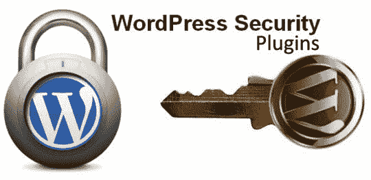
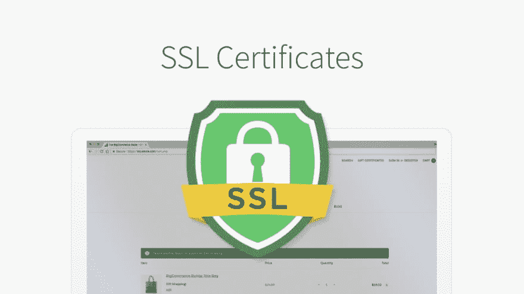
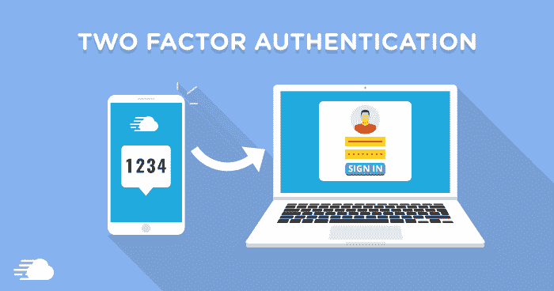

# 考虑这些 WordPress 网站开发的安全技巧，发展你的业务

> 原文：<https://dev.to/emilywordsuccor/consider-these-security-hacks-for-wordpress-website-development-and-grow-your-business-2o6n>

安全性和性能是 WordPress 网站所有者面临的两个主要问题。我们经常看到[新闻标题](https://www.theguardian.com/world/2019/may/29/new-zealand-police-called-in-after-mass-hacking-attempt-on-wellbeing-budget)详细描述网站黑客攻击企图。当一个网站被专业的网络暴徒成功入侵时，它的声誉、在网上的排名和商业机会都会受到极大的损害。

WordPress 网站性能问题也让使用 WordPress 进行网站创建和运营的公司寝食难安。许多人说 WordPress 网站在 100 页后开始加载缓慢。当一个 WordPress 网站变老时，性能问题开始急剧增加。那么， [WordPress 网站开发](https://www.wordsuccor.com/)有哪些安全技巧呢？你如何发展由 WordPress 驱动的在线商务网站？让我们找出答案。

## 1.保持一切更新

你应该更新 WordPress CMS、插件和主题来保护你的网站或其内容。更新的插件、主题或 WordPress 版本被认为是安全的。黑客在插件、主题或 CMS 中没有发现作为网站后门的安全缺陷。因此，您的网站仍然是安全的。

安全的网站赢得搜索引擎和互联网用户的信任。有许多网站所有者忽略 WordPress 发送的更新。当您的网站使用旧版本的 CMS、主题或插件运行时，过时的代码可能无法工作，并可能导致您的系统出现不正确的查询。这导致更高的资源消耗。黑客可以利用非工作主题或插件中的漏洞轻松黑掉网站。

## 2.使用安全插件

 
网站安全是广大创业者的一大课题。仅仅一个漏洞就足以让黑客闯入你的网站并完全控制它。网站所有者采取许多[措施](https://www.accuwebhosting.com/blog/7-essential-measures-to-protect-your-website-from-the-risk-of-hacking/)来保护他们的网站。

但是，他们是人类。他们不可能 24*7/365 天工作来保护网站。这就是为什么他们应该使用 [WordPress 安全插件](https://www.dailyblogtips.com/top-20-wordpress-security-plugins/)来自动化网站保护工作。成功安装和激活后，插件保护您的网站免受不同类型的在线安全威胁。他们跟踪网站周围的所有可疑活动，并通知您。注意那些更新&立即修复问题以保证你网站的安全。

## 3.使用强密码

所有那些拥有多个电子账户的人都有一个非常坏的习惯。他们对几个电子账户使用相同的简单明了的密码。这是一个非常危险和致命的习惯。如果黑客设法侵入了他们的一个电子账户，他们也能轻易地侵入其他电子账户。当你运行一个 WordPress 网站时，要认真对待它的登录 ID 的隐私。为你的网站使用一个随机和困难的登录 id。不时地更改它的密码。

## 4.使用不同于“Admin”的用户名

一个受欢迎和成功的网站是由不同的人组成的团队运营的。许多企业家允许所有团队成员完全访问网站。如果你对网站安全很认真，这是很危险的。任何团队成员，在一些误解之后，都可能变成敌人并控制网站。所以，根据他们的角色，限制他们在网站上的角色。不要授予对该网站的完全访问权限。

## 5.保护 wp-config.php 的档案

你必须知道“wp-config.php”文件保存了你的 WordPress 站点的重要配置信息。保护它不受入侵者的侵害是很重要的。为了保护这个文件，首先，您需要生成一组新的密钥。

你可以通过 WordPress 网站上的秘密密钥生成器来实现。请转到该网址并续订。将为您生成一组全新的密钥。将旧密钥直接复制并粘贴到您的 wp-config.php 文件中。现在，移动 wp-config 文件。

默认情况下，它位于网站的根文件夹中。WordPress 允许你把这个 wp-config 文件移到你的公共文件夹之外。如果您正在脱机工作，只需拖放该文件。

然而，在联机设置中，您可以使用文件管理器中的移动工具。选择您的 wp-config 文件，按下移动工具，然后更改您想要放置文件的目录。如果第一次没有成功，你需要和主机公司谈谈，确保你的服务器允许这样做。现在，在同一个目录中添加一个. htaccess 文件，以防止任何人访问 wp-config.php 文件。

## 6.隐藏作者 URL

请记住，链接标签是一种可以点击链接到其他 HTML 页面或互联网资源的标签。当您在企业的网页上放置链接标签来创建链接时，用户可以单击这些链接并导航到与这些链接相关联的 URL。你可能希望这些锚一直出现，因为这是你网站的一部分。如果锚点 URL 指向的某个网站关闭，请隐藏锚点和 URL 以保护您的网站。你可以很容易地做到这一点，而不用从你的网页上删除它。

## 7.使用安全主机

大多数网站所有者选择廉价的托管服务，以节省一些钱。我最好选择一个糟糕的主机，你以后会恨自己的。过几天你就要担心失去销量或者流量了。如果你想让你的网站安全快捷，选择一个快速、可靠、安全的托管服务公司。它将给你的网站带来无与伦比的速度和可扩展性。永远记住，一个虚拟主机可以决定你网站的成功与否。快速和安全的托管服务公司提供免费的数据备份，超快速上传服务器，出色的正常运行时间等，并保持您的网站在任何时候都活。

## 8.添加 SSL 证书

 
安全套接字层(SSL)是一种安全协议，它使用现代加密方法来保护网站上的敏感信息。它的工作原理是在用户的浏览器和网站服务器之间创建一个安全通道。通过这一通道的任何信息在一端被加密，而在另一端被个人接收时被解密。即使有人掌握了这些信息，也没有用，因为这些信息是加密的。所以，在你的网站上添加一个 SSL 证书。这样的网站是由 HTTPS 定义的，而不是简单的 HTTP。它将加密关键数据，使企业在竞争中脱颖而出。

## 9.始终保留多个备份

信息的快速存取和安全存储对于任何企业的正常运营都非常重要。技术问题、更新错误、网络攻击和其他因素通常会导致数据丢失、财务损失，甚至公司彻底崩溃。在发生崩溃时，所有数据的备份副本，允许您完全在线访问您网站上的所有信息。

通常，不同的备份和存储方法用于从数字媒体复制信息。数据备份和冗余允许您在出现故障后立即恢复文件。因此，如果您失去了对某个文件的访问权限，该文件将被其副本替换。这有助于避免[网站宕机](https://www.alertra.com/articles/layman%E2%80%99s-guide-website-downtime)。要备份网站文件，可以联系托管公司或者使用[备份插件](https://www.isitwp.com/best-wordpress-backup-plugins-compared/)。手动备份网站文件也很有帮助。

## 10.使用双因素身份验证

 
在当今高度数字化的世界里，单靠密码不足以保护电子账户。如果有人获得了登录 id。双因素身份验证为您的网站增加了额外的安全层。所以，为你的网站激活两步验证。此后，每当您尝试在新电脑上访问您的网站时，您都需要验证您的身份。您将被要求输入动态口令以确认您的身份并登录网站。这使得你的网站超级安全。如果攻击者设法获得登录和永久密码，无法输入临时密码可以防止对帐户的未授权访问。

## 11.限制登录尝试

默认情况下，网站允许在登录页面输入不限次数的密码。此设置允许攻击者通过检查所有最可能的替代方案来获取您的密码(如果密码不复杂)。如果您担心有人在登录网站时试图猜测您的密码，您可以在密码设置失败一定次数后暂时阻止登录尝试。

请始终记住，创建一个帐户锁定策略将通过在一定时间内限制输入密码的尝试来保护您的网站免受黑客攻击。攻击者猜测您的密码将变得更加困难。

在输入错误密码的次数达到您指定的时间后，您的网站将被自动阻止。在指定的时间间隔后，网站会自动解锁，系统会允许您输入密码。这为您的帐户提供了额外的保护，防止对所有密码选项进行有针对性的搜索。

### 最后的话

一个安全和高性能的网站是网上业务复兴的基础。在 WordPress 网站开发中使用这些安全技巧，保护你的网站安全。用户喜欢浏览安全网站，购买广告产品和服务。不要犹豫，与定制的 WordPress 开发者携手来保护网站安全。祝你好运！