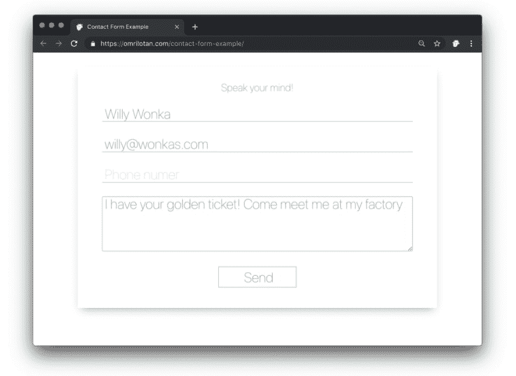
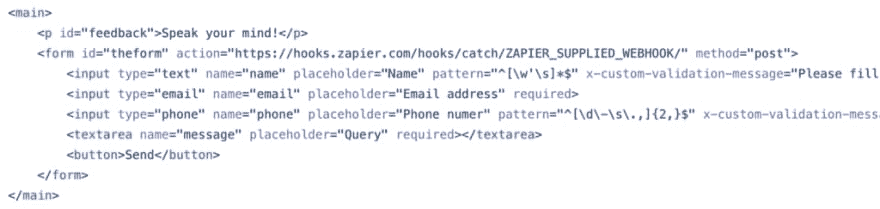

# 静态网站的联系方式

> 原文：<https://dev.to/omrilotan/contact-form-for-static-websites-1b97>

### 给静态网站添加联系人表单

#### TL；DR:使用 Zapier 从静态网站向几乎任何信息服务(当然包括电子邮件)发送联系表格。

我一直喜欢静态网站，并把它们作为第一选择推荐给其他人。对于个人网站、博客，甚至目录——它是完美的。你创建了一个网站，其中有许多可用的构建系统，把你的文件放在一些 CDN 上，瞧！您已经拥有了一个高性能、高可用性的网站。通常是免费的。

> 这也是我免费完成的方式:我在 [Github](https://github.com) 托管源代码，并创建一个构建管道，将结果发布到 [Github 页面](https://pages.github.com/)。之后，我在 [Cloudflare](https://www.cloudflare.com/) DNS 上设置了域名，并加入了他们的 CDN 功能和几个缓存头。免费层丰富。

唯一缺少的需要服务器的部分是联系表单。我已经尝试了几种解决方案，直到我找到一个对我来说很好的，而且是免费的。

 

<figcaption>[示例联系方式](https://omrilotan.com/contact-form-example/)</figcaption>

起初，我试着向 IFTTT 发送一个 webhook。但是他们不支持 CORS 头，所以没用。然后我开始向[的谷歌表单](https://www.google.com/forms/about/)发送提交材料，并在那里设置通知。输入名称需要使用不可读的标识符，但我很好地理解了这一点，只是当 Google 处理请求并插入条目时，它们没有响应成功消息——因此用户反馈是不可能的，误报也不会被注意到。

最后我试了试扎皮尔。它允许 CORS 消息传递，因此表单发送可以是交互式的，并向用户传递实际的反馈。我将具体描述如何实现这一点。

 

<figcaption>[示例联系方式](https://omrilotan.com/contact-form-example/)</figcaption>

首先建立一个联系表单。我不会进入表单构建、验证或发送。您可以查看我的[示例表单](https://omrilotan.com/contact-form-example/)及其[源代码](https://github.com/omrilotan/contact-form-example)，但要点是:创建一个具有实际提交帖子 URL (TBC)的表单。添加 Javascript 增强代码以防止默认行为，并在异步请求中发送输入。相应地提供用户反馈。

[这是我构建的示例表单](https://github.com/omrilotan/contact-form-example)及其发送模块的源代码。这是我将在本文中展示的所有代码。以这种方式实现任何东西并不重要，只要你最终向 webhook 发送一个 POST 请求，我们将在本指南的后面得到。

