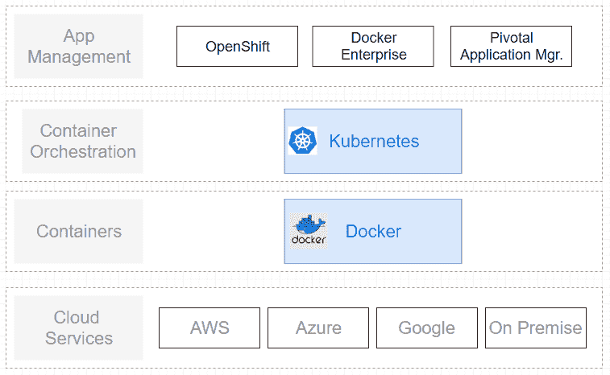

# 集装箱管理平台..免费的！！

> 原文：<https://dev.to/dariusx/container-management-platform-for-free-37kf>

微服务世界似乎已经决定了堆栈的两层:

*   集装箱码头工人
*   Kubernetes 来编排容器

“低于”级别(云服务)可以托管在 AWS 之类的东西上，也可以在本地托管。

上面的层次(应用程序管理)不太清楚。领先的竞争者是 RedHat 的 OpenShift 和 Docker Enterprise，Pivotal 的应用程序管理器与之竞争。

有趣的是:应用管理层没有可用的免费软件。可以下载使用 Docker 或者 Kubernetes，但是不能用 OpenShift 之类的。

这是一个空间乞求一个开源项目，还是我错过了什么？