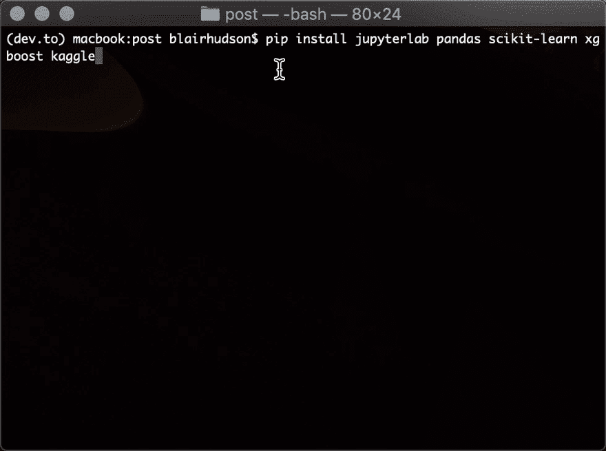
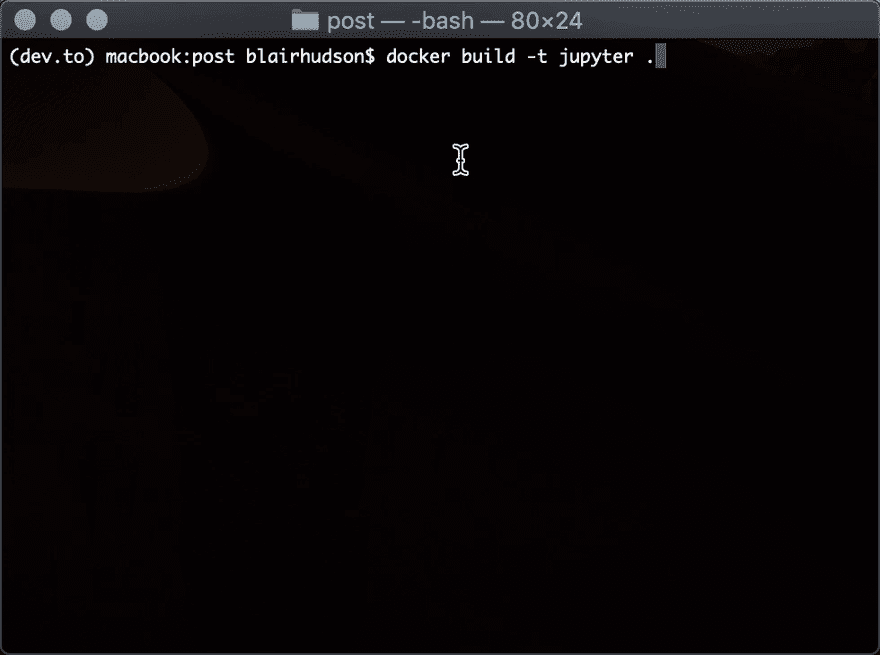

# 机器学习的容器，从无到有

> 原文：<https://dev.to/blairhudson/containers-for-machine-learning-from-scratch-to-kubernetes-2khj>

这篇文章是写给那些从 DevOps 世界中不断听说*容器*这个神奇概念，并且想知道它与来自数据科学世界的*机器学习*这个同样神奇(但可能更熟悉)的概念有什么关系的人的。

好了，不用再想了——在这篇文章中，我们将从头开始看一看使用容器进行机器学习*，为什么它们实际上是如此好的匹配，以及如何在轻量级 Docker Swarm 和它的流行替代品 Kubernetes 中大规模运行它们！*

 *(没有集装箱人...不是`FROM scratch`，尽管你可以在[我的后续文章](https://dev.to/blairhudson/machine-learning-microservices-python-and-xgboost-in-a-tiny-486kb-container-4on4)中读到这些

## Python 中的机器学习入门

如果您已经使用 Python 进行数据科学研究有一段时间了，那么您将会对 Jupyter、Scikit-Learn、Pandas 和 XGBoost 等工具非常熟悉。如果没有，你只能相信我的话，这些是目前机器学习领域最好的开源项目。

在本文中，我们将从大家最喜欢的在线数据科学社区 Kaggle 中提取一些样本数据。

假设您已经安装了 Python 3，让我们继续安装我们最喜欢的工具(尽管您可能已经安装了大部分工具):

*   `pip install jupyterlab pandas scikit-learn xgboost kaggle`

[](https://res.cloudinary.com/practicaldev/image/fetch/s--3qMcgSSW--/c_limit%2Cf_auto%2Cfl_progressive%2Cq_66%2Cw_880/https://i.imgur.com/A9PFWXy.gif)

(如果您在安装 Python 3 或上述包需求时遇到任何问题，您可能想直接跳到下一节。)

一旦我们配置好我们的[本地 Kaggle 凭证](https://github.com/Kaggle/kaggle-api#api-credentials)，切换到一个合适的目录，下载并解压缩银行贷款预测数据集(或任何其他您喜欢的数据集)！

*   `kaggle datasets download -d omkar5/dataset-for-bank-loan-prediction`
*   `unzip dataset-for-bank-loan-prediction.zip`

有了准备好的数据，让我们运行 Jupyter 实验室，开始研究我们的演示模型。使用命令`jupyter lab`启动服务，这将在您的浏览器中打开`http://localhost:8888`。

从启动器创建一个新的笔记本，并将其命名为`notebook.ipynb`。您可以将以下代码复制到笔记本的每个单元格中。

首先，我们将 Kaggle 数据读入 DataFrame 对象。

```
import pandas as pd
path_in = './credit_train.csv'
print('reading csv from %s' % path_in)
df = pd.read_csv(path_in) 
```

Enter fullscreen mode Exit fullscreen mode

现在，我们快速地将我们的数据框架分成特征和目标(*,但是不要在家里尝试...* )

```
def prep_data(df):
    X = df.drop(['Number of Credit Problems'], axis=1).select_dtypes(include=['number','bool'])
    y = df['Number of Credit Problems'] > 1
    return X, y

print("preparing data")
X_train, y_train = prep_data(df) 
```

Enter fullscreen mode Exit fullscreen mode

准备好数据后，让我们用所有默认的超参数来装配一个 XGBoost 分类器。

```
from xgboost import XGBClassifier
model = XGBClassifier()

print("training model")
model.fit(X_train, y_train) 
```

Enter fullscreen mode Exit fullscreen mode

运行完成后，我们现在有了...模特？虽然不可否认不是很好，但是这篇文章是关于没有调优 XGBoost 的容器的！让我们保存我们的模型，以便我们可以在以后需要时使用它。

```
import joblib

path_out = './model.joblib'
print("dumping trained model to %s" % path_out)
joblib.dump(model, path_out) 
```

Enter fullscreen mode Exit fullscreen mode

[](https://res.cloudinary.com/practicaldev/image/fetch/s--C3ssXLfX--/c_limit%2Cf_auto%2Cfl_progressive%2Cq_66%2Cw_880/https://i.imgur.com/F6cpKQ7.gif)

## 使用 Docker 管理您的数据科学环境和执行笔记本

所以我们做了所有的工作，用正确的包来设置我们的 Jupyter 环境。根据我们的操作系统和以前的安装，我们甚至可能有一些意想不到的错误。(*还有人第一次安装 XGBoost 失败吗？*)希望你找到了安装所有东西的变通方法，我希望你记下了这个过程——因为我们希望在以后将我们的机器学习项目投入生产时能够重复这个过程...

好了，有趣的部分来了。

Docker 为我们解决了这个问题，它允许我们将我们的整个环境(包括操作系统和所有安装步骤)指定为可复制的脚本，这样我们就可以轻松地移动我们的机器学习项目，而不必再次解决安装挑战！

你需要安装 Docker。幸运的是，用于 Mac 和 Windows 的 Docker 桌面包含了我们需要的所有东西。Linux 用户可以在他们最喜欢的包管理器中找到 Docker——但是你可能需要配置官方的 Docker 库来获得最新版本。

安装后，确保 Docker 守护进程正在运行，然后运行您的第一个容器！

该命令将提取 CentOS 7 官方 Docker 映像，并运行交互式终端会话。(*为什么是 CentOS 7？*鉴于与亚马逊 Linux 和红帽的相似性，你会经常在企业环境中遇到。通过对`yum`安装命令的一些调整，您可以使用任何基础操作系统。)

*   `docker run -it --rm centos:7`
    *   `-it`告诉 Docker 让你的容器 ***i*** 交互(而不是分离),并附加一个 ***t*** ty(终端)会话来实际与之交互
    *   `--rm`告诉 Docker 只要我们用 *ctrl-c* 停止它就移除你的容器

现在我们想找到正确的命令来安装 Python、Jupyter 和我们的其他包，我们将把它们写入 docker 文件，在`centos:7`之上开发我们的新容器。

创建一个新文件，命名为`Dockerfile`，内容应该是这样的:

```
FROM centos:7

# install python and pip
RUN yum install -y epel-release
RUN yum install -y python36-devel python36-pip

# install our pacakges
RUN pip3 install jupyterlab kaggle pandas scikit-learn xgboost 
# turns out xgboost needs this
RUN yum install -y libgomp

# create a user to run jupyterlab
RUN adduser jupyter

# switch to our user and their home dir
USER jupyter
WORKDIR /home/jupyter

# tell docker to listen on port 8888 and run jupyterlab
EXPOSE 8888
CMD ["jupyter", "lab", "--ip=0.0.0.0", "--port=8888"] 
```

Enter fullscreen mode Exit fullscreen mode

要构建您的新容器，从您的`Dockerfile`所在的目录运行这个命令:

*   `docker build -t jupyter .`

这将运行`Dockerfile`中的每个命令，除了最后一个“CMD”注释，这是启动容器时要执行的默认命令，然后用名为 *jupyter* 的构建图像进行标记。

[](https://res.cloudinary.com/practicaldev/image/fetch/s--dj3SE4IE--/c_limit%2Cf_auto%2Cfl_progressive%2Cq_66%2Cw_880/https://i.imgur.com/hzG7H9o.gif)

一旦构建完成，我们就可以使用我们提供的默认 CMD 运行基于新的 *jupyter* 映像的容器(这将有望启动我们的 jupyter 服务器！):

*   `docker run -it --rm jupyter`

完成了吗？不完全是。

因此，我们还需要将容器端口映射到我们的主机，这样我们就可以在浏览器中找到它。现在，让我们将当前目录映射到容器用户的主目录，这样我们就可以在 Jupyter 启动时访问我们的文件:

*   `docker run -it --rm -p "8888:8888" -v "$(pwd):/home/jupyter" jupyter`
    *   `-p "HOST_PORT:CONTAINER_PORT"`告诉 Docker 将我们主机上的一个端口映射到容器上的一个端口(在本例中是 8888 到 8888，但它们不必相同)
    *   `-v "/host/path/or/file:/container/path/or/file`告诉 Docker 在我们的主机上映射一个路径或文件，以便容器可以访问它(而`$(pwd)`只是输出当前的主机路径)

使用与上面相同的笔记本单元代码，使用“容器化的”Jupyter 服务编写并执行一个新的`notebook.ipynb`。

现在我们需要自动化我们的笔记本执行。在 Jupyter 终端提示符下输入:

*   `nbconvert --to notebook --inplace --execute notebook.ipynb`

这将调用一个 Jupyter 实用程序来转换我们的运行并就地更新我们的笔记本，因此除了脚本的任何实际输出之外，任何输出/表格/图表都将被更新。

当你完成后， *Ctrl-C* 几次退出 Jupyter(这样做，将退出并删除我们的容器，因为我们在前面的`docker run`命令中设置了`--rm`选项)。

为了使事情自动化，我们可以覆盖默认的 CMD 而不用创建新的 docker 文件。这样，我们可以跳过运行 Jupyterlab，而是运行我们的`nbconvert`命令:

*   `docker run -it --rm -p "8888:8888" -v "$(pwd):/home/jupyter" jupyter jupyter nbconvert --to notebook --inplace --execute notebook.ipynb`

注意，我们只是通过在`docker run`命令的末尾指定命令和任何参数来指定我们的定制命令(CMD)。(注意第一个 *jupyter* 是图像标签，而第二个是触发我们进程的命令。)

出于好奇，这与将我们的 *Dockerfile* CMD 修改为以下内容是一样的:

```
#...
CMD ["jupyter", "nbconvert", "--to", "notebook", "--inplace", "--execute", "notebook.ipynb"] 
```

Enter fullscreen mode Exit fullscreen mode

一旦容器退出，检查 *model.joblib* ，它应该在几秒钟前就被修改了。

成功！

## 使用 Docker Swarm 扩展您的环境

在计算机上运行容器是一回事，但如果您想加快机器学习工作流的速度，使其超过计算机本身所能达到的速度，该怎么办呢？如果您想同时运行许多这样的服务，该怎么办？如果您的所有数据都存储在远程环境中，并且您不想通过互联网传输千兆字节的数据，该怎么办？

有很多很好的理由说明在集群环境中运行容器是有益的，但是不管是什么理由，我将通过介绍 Docker Swarm 向您展示这是多么容易。

方便的是，Docker Swarm 是 Docker 的一个内置功能，所以要继续阅读这篇文章，你不需要安装任何东西。当然，在现实中，您更有可能选择在云中提供多个计算资源，并在那里初始化和加入您的集群。事实上，假设它们之间有网络连接，您甚至可以建立一个跨越多个云提供商的集群！(高可用性怎么样！？👊)

要启动单节点集群，请运行`docker swarm init`。这将该主机指定为“群”中的管理节点，这意味着它负责调度服务在集群中的所有节点上运行。如果您的 manager 节点离线，那么您将无法访问您的群集，因此，如果恢复能力很重要，那么在 1 个或 2 个节点出现故障时，最好有 3 个或 5 个节点来保持一致。

这个命令将输出另一个以`docker swarm join`开始的命令，当在另一个主机上运行时，它将作为一个工作者节点加入到您的群中。您可以在任意数量的工作节点上运行它，或者甚至以自动扩展的方式来确保您的集群总是有足够的容量——但是我们现在不需要它。

为了将 Jupyter 作为服务运行，Docker Swarm 有一个类似于上面`docker run`的特殊命令。关键区别在于，这将跨集群中的每个节点发布(公开)端口 8888，而不管容器本身实际运行在哪里。这意味着，如果您将流量发送到集群中任何节点上的端口 8888，Docker 会像变魔术一样自动将其转发到正确的主机！在某些用例中(如无状态 REST APIs 或静态应用程序前端)，您可以使用它来自动平衡您的服务负载——酷！)

在集群中的一个管理器节点(目前是您的计算机)上，运行

*   `docker service create --name jupyter --mount type=bind,source=$(pwd),destination=/home/jupyter --publish 8888:8888 jupyter`
    *   `--name`给服务起一个昵称，以便以后引用(例如，停止它)
    *   `--mount`允许您将数据绑定到容器中
    *   `--publish`暴露集群中的指定端口

(注意，在这种情况下，绑定安装一个主机目录是可行的，因为我们只有一个节点群。在多节点集群中，除非您能够保证每台主机上装载点的数据是同步的，否则这不会很好。这里不讨论如何实现这一点。)

[](https://res.cloudinary.com/practicaldev/image/fetch/s--UumUZeng--/c_limit%2Cf_auto%2Cfl_progressive%2Cq_66%2Cw_880/https://i.imgur.com/U7MO1Fi.gif)

运行命令后，服务会输出各种状态消息，直到收敛到稳定状态(基本上就是说一旦执行了容器命令，5 秒内没有发生任何错误)。

您可以运行`docker service logs -f jupyter`来检查日志(我告诉过您命名我们的服务会很方便)，如果您想在浏览器中访问 Jupyter，您需要这样做来检索访问令牌。

现在，您可以通过运行以下命令删除该服务

*   `docker service rm jupyter`

我们的笔记本执行力呢？尝试运行以下命令:

*   `docker service create --name jupyter --mount type=bind,source=$(pwd),destination=/home/jupyter --restart-condition none jupyter jupyter nbconvert --to notebook --inplace --execute notebook.ipynb`
    *   这里很重要的一点是防止你在容器执行完毕后重启它
    *   `jupyter jupyter [params]`表示容器的名称、要运行的自定义命令的名称及其后续参数(`nbconvert ...`)

这些命令现在变得相当复杂，所以开始记录它们可能是个好主意，这样我们以后就可以轻松地重现我们的服务。幸运的是，我们有 Docker Compose，这是一个基于配置的服务。下面是第一个服务命令的样子，它是一个 *compose.yaml* 文件:

```
version: "3.3"
services:
  jupyter:
    image: jupyter
    volumes:
      - ${PWD}:/home/jupyter
    ports:
      - "8888:8888" 
```

Enter fullscreen mode Exit fullscreen mode

如果保存它，您可以使用以下命令将它作为服务的“堆栈”来运行(尽管它现在只描述了一个服务):

*   `docker stack deploy --compose-file compose.yaml jupyter`

整洁多了。原来您可以在一个 Docker 组合栈中包含许多相关的服务，因此当您部署一个服务时，这些服务被命名为 *stackname_servicename* ，因此要检索日志，请输入:

*   `docker service logs -f jupyter_jupyter`

这是运行 Jupyter 笔记本的 Docker Compose 配置。注意`restart_policy`的介绍。这对于运行我们的作业非常重要，因为我们希望它能完成，默认情况下 Docker Swarm 会自动重启停止的容器，这将重复执行你的笔记本。

```
version: "3.3"
services:
  jupyter:
    image: jupyter
    deploy:
      restart_policy:
        condition: none
    volumes:
      - ${PWD}:/home/jupyter
    command: jupyter nbconvert --to notebook --inplace --execute notebook.ipynb 
```

Enter fullscreen mode Exit fullscreen mode

## Kubernetes 入门

Docker Desktop for Mac and Windows 还包括一个单节点 Kubernetes 集群，因此在 Docker Desktop 的设置中，您需要打开它。启动 Kuberenetes 可能需要一段时间，因为它是一个为运行大量工作负载而设计的重量级集群。想一下成千上万的集装箱！

在实践中，您会希望在多个主机上配置您的 Kubernetes 集群，随着像`kubeadm`这样的工具的引入，这个过程类似于我们前面所做的配置 Docker Swarm。我们不会在本文中进一步讨论如何建立 Kubernetes，但是如果你感兴趣，你可以在这里阅读更多关于`kubeadm` [的内容](https://kubernetes.io/docs/setup/production-environment/tools/kubeadm/create-cluster-kubeadm/)。如果你打算使用 Kubernetes，你也可以考虑使用云供应商管理的服务，比如谷歌云上的 [AWS 弹性 Kubernetes 服务](https://aws.amazon.com/eks/)或[谷歌 Kubernetes 引擎](https://cloud.google.com/kubernetes-engine/)。

在 Docker 和 Kubernetes 的最新版本中，您实际上可以将 Docker 栈直接部署到 Kubernetes——使用我们之前创建的相同的 Docker Compose 文件！(虽然也有一些问题，比如我们之前部署的方便的绑定挂载的主机目录。)

要定位本地配置的 Kubernetes 集群，只需更新您的命令来添加`--orchestrator kubernetes`:

*   `docker stack deploy --compose-file compose.yaml --orchestrator kubernetes jupyter`

这将部署 Kubernetes 堆栈，就像它部署 Docker Swarm 堆栈一样，包含您的服务(没有双关语)。在 Kubernetes，Docker 群“服务”被称为“pod”。

[](https://res.cloudinary.com/practicaldev/image/fetch/s--geSAYauu--/c_limit%2Cf_auto%2Cfl_progressive%2Cq_66%2Cw_880/https://i.imgur.com/FOexn4Y.gif)

要查看哪些 pod 正在运行，并确认我们的 Jupyter 堆栈是其中之一，只需运行这个并记下您的 Jupyter pod 的确切名称(如`jupyter-54f889fdf6-gcshl`)。

*   `kubectl get pods`

像往常一样，您需要获取 Jupyter 令牌来访问您的笔记本，访问日志的等效命令如下。请注意，您需要使用上述命令中 pod 的确切名称。

*   `kubectl logs -f jupyter-54f889fdf6-gcshl`

当您在 Kubernetes 上使用完 Jupyter 后，您可以使用以下工具拆除堆栈:

*   `kubectl delete stack jupyter`*