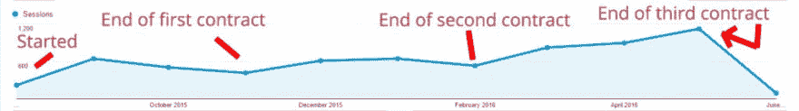

# 内容营销带来流量——案例研究

> 原文：<https://dev.to/garrett/content-marketing-brings-in-traffic-a-case-study-1pkb>

*注:这是来自[GarrettMickley.com](https://garrettmickley.com)的旧内容。我不再追求数字营销职业，但[我不想浪费内容](https://dev.to/garrett/why-i-m-switching-careers-to-coding-19g8)，所以我把它搬到这里。希望 Dev.to 社区觉得有用。*

## 目录

0。目录
[1。通过发布有规律的、优化的内容来增加你网站的目标流量，重点是给读者带来价值。](#increase-targeted-traffic-to-your-website-by-posting-regular-optimized-content-focused-on-bringing-value-to-the-reader)
[2。内容营销就是利用内容帮助人们找到你。](#content-marketing-is-all-about-using-content-to-help-people-find-you)
[3。内容营销的重点是让人们意识到，保持意识，并培养兴趣。](#the-point-of-content-marketing-is-to-bring-people-to-awareness-hold-awareness-and-develop-interest)
[4。你的竞争对手在做内容营销。如果你不是，你就不能竞争。](#your-competitors-are-doing-content-marketing-if-you-are-not-you-cant-compete)
[5。内容营销不仅仅是博客文章。](#theres-more-to-content-marketing-than-just-blog-posts)
[6。内容营销适合你的业务。](#content-marketing-is-right-for-your-business)

## 通过发布有规律的、优化的内容，增加网站的目标流量，为读者带来价值。

网络营销人员几乎一直遵循“内容为王”的原则，但这一点在今天比以往任何时候都更加正确。正如我在[这篇文章](https://dev.to/garrett/how-to-write-with-seo-in-mind-and-get-more-blog-readers-1k4j)中所写的，SEO 正在消亡，因为撰写专注于为读者提供价值的常规内容会让**自动为搜索引擎优化你的页面**。

> [SEMRush 在 2017 年](https://email.semrush.com/acton/attachment/13557/f-0ae3/1/-/-/-/-/Ranking%20factors%202017.pdf)发现，“在你的页面搜索引擎优化元素中有一个精确匹配的关键词并不重要。”

不需要 SEO 公司。你需要的是**知道如何为营销**写内容。

其实 SEO 只是作为一个概念*存在，因为内容的*。**内容为王**。

## 内容营销就是利用内容帮助人们找到你。

如果你的整个营销漏斗有不同的阶段，它们将是:*意识、兴趣、欲望和行动*。这是由 E. St. Elmo Lewis 在 1898 年创造的 *AIDA 模型*。也许不出所料，人们并没有改变太多，这在今天仍然有效。

*   **认知度**–客户知道你品牌的存在。
*   **兴趣**–客户主动表达了对您品牌的兴趣。
*   **渴望**–客户渴望获得你品牌的特定产品或服务。
*   **行动**–客户正在采取下一步行动，购买您品牌的产品或服务。

内容营销甚至在 AIDA 模式开始之前就存在了，然后通过认知和兴趣阶段继续进行。

## 内容营销的要点是让人产生认知，持有认知，培养兴趣。

内容营销有如此多的好处，以至于现在人们都忽略了。首先，它建立了你的品牌。所有的内容都将**通过你的品牌声音说话，为所有访问者创造一致的体验**。

为你的网站编写的所有内容也是可以通过你所有的社交媒体渠道分享的内容，提醒人们你的存在，并将他们引向你的网站，在那里**他们可以培养兴趣和欲望，并最终采取行动**。

但最重要的是，**内容营销建立了一个长期的受众群体**，只要你继续为他们的生活提供价值，他们就会继续追随你。这对你营销计划的其余部分来说是一种飞轮效应。

## 你的竞争对手在做内容营销。如果你不是，你就不能竞争。

让我们来看看一个客户。这个客户雇我为他们的网站写定期内容，目的是增加品牌知名度和流量。我的所有内容旨在首先(通过内容本身)为读者提供**价值，其次(通过结尾的行动号召)为品牌提供**。

每份合同为期三个月。我发现三个月是看到差异的时间，六个月是感觉到差异的时间。

在这里，你可以看到**内容在发布常规内容的九个月中持续增长**。

在前三个月的合同中，我专注于反复试验，以获得对行业的感觉，并**发现我能为网站访问者提供什么价值**。从周一到周五，我连续五天发布每日内容。

对于第二个三个月的合同，我已经想出了什么内容会带来新的客户，以及**带来其他的回头客**。虽然客户对合同结束时的结果很满意，但我却不满意。我为第三份三个月的合同投了一个**的焦点转移**。

在第三个三个月的合同中，我将内容量从每周五篇减少到每周三篇。这让我有机会更专注于提供有价值的内容，而不增加合同费率。如你所见，内容营销的规则是**“质量胜于数量”**，流量开始更快地增长。

内容在最后大幅下降的原因是因为这张截图是在 6 月初拍摄的，所以一个月的流量还没有出现。

这位客户没有 SEO 计划，也没有购买广告，也没有创建任何其他内容来引导访问者访问他们的网站。所有的内容增长都是通过我的努力，以及他们对朋友和家人的口碑营销。他们还会定期分享我在社交媒体上写的内容。

## 内容营销不仅仅是博客文章。

显然，内容营销非常有效。也就是说，如果你能找到能创作其他媒体内容的专业人士，你会受益匪浅。或者学习自己创造。

书面内容的伟大之处在于**它可以在其他地方重新利用**。

我建议你联系一位专业人士，他可以接受你的书面内容，并为 YouTube 创建视频内容。

另一个流行的想法是根据你写的内容创建一个播客，如果它不需要视觉效果的话。

## 内容营销适合你的企业。

**每个企业都将从内容营销**中受益，而这些好处只有在直接与其他营销活动合作时才会加剧。

 [## 关于营销，开发人员需要知道什么？

### 加勒特 6 月 29 日 1 分钟阅读

#marketing #seo #searchengineoptimization #discuss](/garrett/what-do-devs-need-to-know-about-marketing-51go)

> “我一直知道我想让加勒特为我的网站写作，这只是一个找到合适项目的问题。把一个你以前没有合作过的作家带到你的网站上总是有风险的，所以审查他们并考虑他们的声音在你的网站上的位置是很重要的。加勒特是一个完美的专业人士。他按时提交了他的稿子，写得很好，很准确，很精致，而且他快速有效地完成了我们要求的任何编辑。与倾听反馈并利用反馈创作出更好产品的作家一起工作总是令人愉快的。
> 
> 它帮助我们为我们的网站推出了旗舰内容，最终获得了成功，部分原因是因为 Garrett 的努力。我真的很喜欢加勒特对我们要求他写的主题所做的研究。因为他做了功课，所以他能够有权威地写作。
> 
> 我们在加勒特的作品上获得了非常好的流量，这个项目最终成为了一个重新设计的展示，这是我们网站整体计划的核心。我绝对会推荐加勒特的服务。Garrett 能够快速理解并掌控一项任务，这意味着**你可以获得高质量的工作，而不必经常检查**，或者更糟糕的是，处理一个吹掉的截止日期。还有一点:加勒特非常擅长在社交媒体上推广他的作品，并通过仔细的搜索引擎优化。
> 
> 我会说加勒特是一个有创造力的，有经验的作家，他有一种可以做的态度，他会从一开始就接受一个写作任务，直到完成，而你的麻烦最少。他总是愿意付出额外的努力来确保你得到你需要的副本。”——Bankrate.com·克拉斯·贝尔