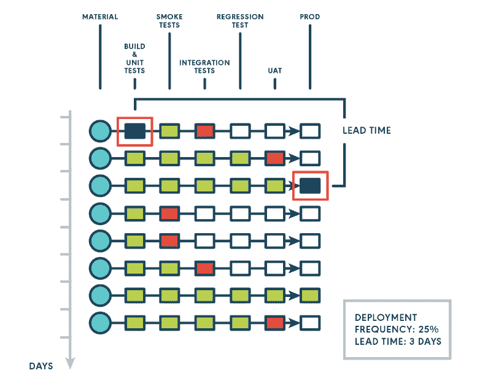
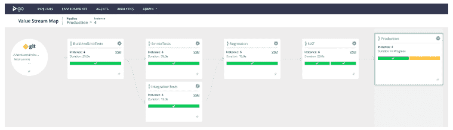
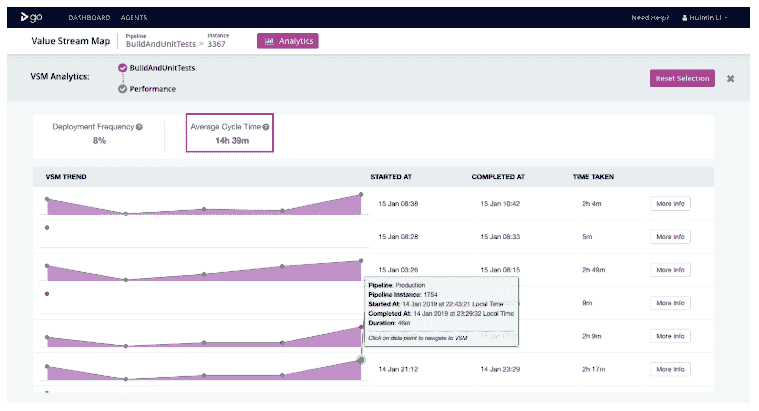
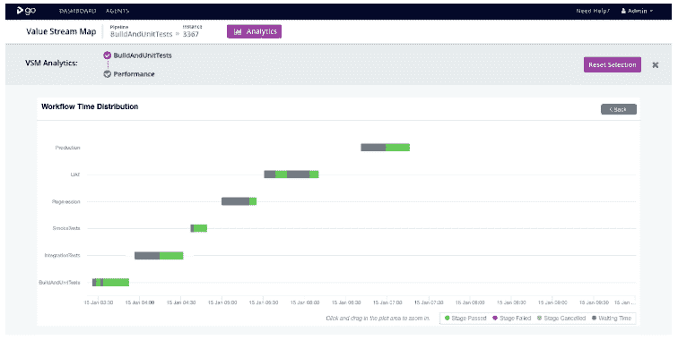
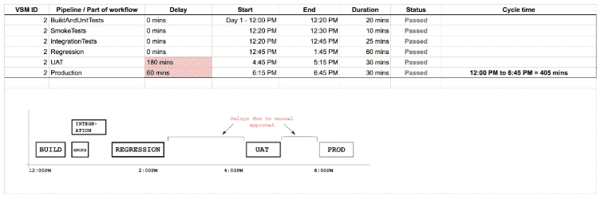

# 连续交付度量标准第 3 部分:从提交代码到生产需要多长时间？

> 原文：<https://dev.to/gocd/continuous-delivery-metrics-part-3-how-long-does-it-take-to-get-from-committing-code-to-production-4kbo>

这是可操作的持续交付指标系列的第三篇文章。在之前的文章中，我们概述了为什么和什么指标对您的 CD 过程很重要，并深入讨论了部署频率。在本帖中，我们将深入探讨交付时间。

## **什么是提前期**

部署频率是部署发生的次数，而变更的前置时间是从开始到部署所花费的累计时间。这个度量被表示为一个持续时间，它有助于回答“从代码提交到生产需要多长时间？”

你可能会看到提前期和周期时间交替使用，围绕这两个术语的含义有很多混淆。根据定义，提前期时钟从提出特性请求时开始，到交付时结束，而周期时钟从处理请求时开始，到项目准备交付时结束。在这篇文章中，我们不打算区分这两个术语。我们认为重要的是你清楚地定义你的意思，并与你的定义保持一致。在我们的上下文中，我们建议避免在没有限定起点和终点的情况下说提前期或周期时间。

在上图中，我们计算了从提交(在 CD 管道的开始)到代码提交进入生产(在 CD 管道的结束)的时间。虽然 CD 管道中的其他点已经发生了多次，但是部署是在三天后才发生的，所以我们将提交的交付周期计算为三天。

## **为什么前置时间很重要**

交付周期是精益理论的一个关键要素。专注于减少交付周期将允许你把你的过程作为一个整体来看，并理解最慢的部分。如果团队和组织只专注于缩短交付周期，他们将会改进并为他们的组织增加更多的价值。

交付时间有助于你回答诸如“什么时候能完成？如果我们现在开始，什么时候能投入生产？我们下周能送货吗？”它有助于商业决策和规划。

最后，我们建议在计算 CD 流程的交付周期时只考虑“交付”部分。如果您从第一行代码开始定义开始时间，并删除“模糊前端”，包括需求收集、系统分析、优先级排序等活动，这是一个简单且非常实用的计算指标。

## **举例:如何使用提前期**

我们将继续我们在本系列的第 2 部分中使用的假设场景，在这个场景中，开发团队收到了来自他们的涉众的抱怨，他们没有经常得到价值。

上图快速回顾了 GoCD 价值流图(VSM)中展示的该团队的 CD 渠道。它包括一些并行的单元测试、集成测试和冒烟测试，然后是回归测试。最后，是用户验收测试(UAT)和生产部署。

在之前的帖子中，我们发现部署频率低至 8%。在这里，GoCD 企业分析插件可以帮助找出 CD 管道的哪些部分导致了如此低的部署频率。

在下面的截图中，你可以看到从 BuildAndUnitTests 到生产的平均周期时间是 33m。

当您深入每个管道时，您可以看到这些详细信息，包括等待时间(以灰色显示)和生产运行时间(以紫色显示)，每个阶段都单独显示。从那里，你可以确定你最慢的步骤。

这个过程也可以手动完成，或者使用其他工具。当您跟踪时间并绘制工作流程的不同部分时，您可以获得类似的结果。下面的例子是在 GoCD 之外完成的过程的一个可能的表示。您可以看到您的管道中有一些长时间运行的部分(如这里的“回归”),以及一些由于人工批准而导致的长时间延迟。

正如您从我们的示例中看到的，有了交付时间度量和支持细节，您可以识别出有问题的步骤:完成缓慢且需要大量等待时间的步骤将导致整体部署频率较低。从这里，我们建议

*   首先关注最慢的步骤，这将会给你带来最大的收获。
*   将手动批准转换为自动化批准，这将增加您对测试和自动化的信心。
*   如果可能的话，用最慢的步骤重写测试。

有时候，仅仅专注于优化一些缓慢的步骤是不够的。考虑对你的管道进行更大的改变。从绘制价值流图开始，真正理解流程的依赖关系。识别并行化的机会，重新安排您的测试，在过程的早期开始运行缓慢的测试。

## **总结**

在这篇文章中，我们讨论了什么是提前期，为什么它很重要，以及如何处理长的提前期。正如我们在第 1 部分中所讨论的，我们推荐测量另外两个重要的度量:变更失败率和 MTTR。这些指标与部署频率和交付时间密切相关。我们将在以后的文章中讨论这些指标的相互关系。