# 持续集成 Angular 和 Azure DevOps

> 原文：<https://dev.to/thisdotmedia/continuously-integrating-angular-with-azure-devops-2k9l>

# 简介

Azure DevOps 是一款微软产品，与其他功能(如源代码管理和项目管理)一起，允许您的团队为他们的项目建立持续集成。

持续集成是一种开发实践，它使您的团队能够提高质量，并交付更稳定的软件，这对团队和最终用户都有好处。

通过持续集成，一些检查(称为管道)会在某些触发器上自动运行，比如代码变更。这些检查通常确保代码可以成功编译，并且所有测试都通过。在一个隔离的环境中自动运行这些检查，消除了我的机器上的大部分问题，并确保我们的代码库始终处于良好的健康状态。

# 角度应用

对于这个演示，我们将使用一个默认的 Angular CLI 应用程序，为此我们将在 Azure DevOps 上添加一个构建管道。

通过运行`npm install --global @angular/cli`确保您拥有最新版本的`@angular/cli`，并使用`ng new ng-azure-devops --skipInstall=true`创建一个新的角度应用；我们不需要角度路由，您可以选择自己喜欢的样式表格式。

# 创建 Azure DevOps 项目

如果你还没有关于 Azure DevOps 的项目，请前往[https://dev.azure.com](https://dev.azure.com)，为这个演示创建一个新项目，提供一个名称和(可选的)描述。您可以选择想要的可见性。我要去公立医院，但是私立医院也可以。

[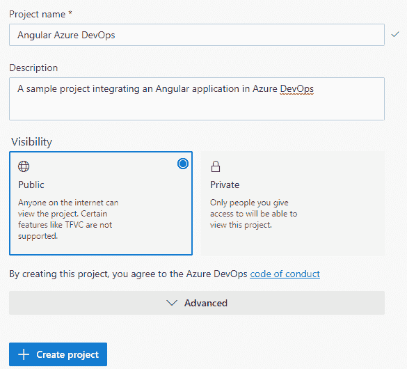](https://res.cloudinary.com/practicaldev/image/fetch/s--tkmoysG_--/c_limit%2Cf_auto%2Cfl_progressive%2Cq_auto%2Cw_880/https://thepracticaldev.s3.amazonaws.com/i/g4k8tekixmzvmpylc7fq.png)

创建项目后，您将被带到项目的仪表板。

# 向 Azure DevOps 添加代码

在你项目的侧边栏，你应该可以找到回购。单击它将带您到为这个项目创建的默认 g it 存储库。如果需要，您可以在项目中添加更多的存储库，因此如果您的应用程序分布在多个 Git 存储库中，您就不需要创建多个项目。对于本文，我们只需要一个存储库，所以我们将使用默认创建的存储库。

存储库的 home 应该告诉你它是空的，并为你提供将代码推送到存储库的指令。

你需要[配置你的 SSH 密钥](https://docs.microsoft.com/en-us/azure/devops/repos/git/use-ssh-keys-to-authenticate?view=azure-devops)或者使用 [Git 凭证管理器](https://docs.microsoft.com/en-us/azure/devops/repos/git/set-up-credential-managers?view=azure-devops)，以便能够提交到 Azure DevOps 上的存储库。

配置身份验证后，提交并推送我们使用 Angular CLI 创建的 Angular 项目。

> 如果你想使用 Github，你可以将你的代码添加到 Github 中，并通过进入项目设置> Github 连接来连接你在 Azure DevOps 中的 GitHub 帐户(它在项目设置中的 Boards 下分类)。您需要选择 GitHub 组织，以及您想要集成到当前项目中的存储库。
> 
> 接下来的步骤对于 GitHub 仓库和 Azure DevOps 仓库都是一样的。

# 创建构建管道

现在，我们已经在 Azure DevOps 存储库中或 GitHub(通过项目设置连接 GitHub 帐户)上拥有了代码，我们可以通过从项目的侧栏导航到管道来为该存储库创建一个构建管道。

单击 New Pipeline，选择 Azure Repos Git 或 GitHub(或者任何其他可用选项)，单击相应的存储库(如果您选择了 GitHub，系统会提示您授权 Azure Pipelines)并选择 Node.js with Angular 作为管道配置。这将预配置管道运行`npm install`和`ng build —-prod`。

在审查步骤中，我们将看到一个由 Azure DevOps 生成的 yaml 文件的示例。

```
# Node.js with Angular
# Build a Node.js project that uses Angular.
# Add steps that analyze code, save build artifacts, deploy, and more:
# https://docs.microsoft.com/azure/devops/pipelines/languages/javascript

trigger:
- master

pool:
  vmImage: 'ubuntu-latest'

steps:
- task: NodeTool@0
  inputs:
    versionSpec: '10.x'
  displayName: 'Install  Node.js'

- script: |
    npm install -g @angular/cli
    npm install
    ng build --prod
  displayName: 'npm  install  and  build' 
```

主分支上的每个更改都会触发默认配置。它将使用一个 ubuntu 映像，并执行两个步骤:

*   安装 Node.js
*   安装依赖项并构建应用程序。

单击 Save And Run 会将 yaml 文件添加到您的存储库中，将您的构建管道配置与源代码保存在一起。我们甚至可以在本地对 yaml 文件进行更改，并提交它们，Azure DevOps 将获取这些更改，并相应地更新您的构建管道。

[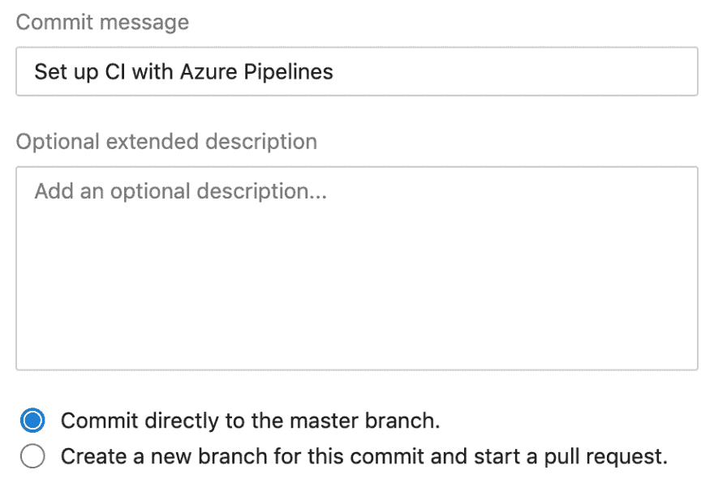](https://res.cloudinary.com/practicaldev/image/fetch/s--0UsH9Q4F--/c_limit%2Cf_auto%2Cfl_progressive%2Cq_auto%2Cw_880/https://thepracticaldev.s3.amazonaws.com/i/h5bezc3zlbyud0pti9g8.png)

创建一个单独的分支，并启动一个拉请求，这样您就可以在 master 中按照您想要的方式完成配置之前不合并这个配置。为了简化，我们将直接向 master 提交更改。

> 如果您喜欢使用单独的分支，您仍然可以这样做。但是，要知道，只要主分支上没有 azure-pipelines.yml 文件，就不会自动触发构建。这意味着您需要手动触发构建，直到您的配置被合并到 master 中。
> 在创建管道的情况下，单击“保存并运行”将运行管道，但由于我们将对源代码进行更改，因此不会自动触发构建。

一旦保存了配置文件，就会触发一个新的构建，过一会儿，所有步骤都应该已经成功完成了。

[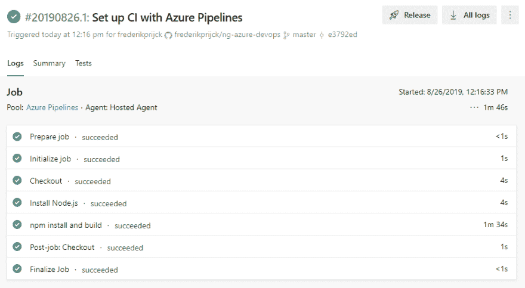](https://res.cloudinary.com/practicaldev/image/fetch/s--GxKkkoXr--/c_limit%2Cf_auto%2Cfl_progressive%2Cq_auto%2Cw_880/https://thepracticaldev.s3.amazonaws.com/i/5z5mja33511djjwzt4mw.png)

上面的一些步骤是由 Azure DevOps 添加的(准备、初始化、检验、检验后和完成)，而其他步骤则被定义为我们 yaml 配置的一部分(安装 Node.js 和 npm 安装和构建)。如果您想获得特定步骤的更多信息，单击它将显示该特定步骤的所有输出:

[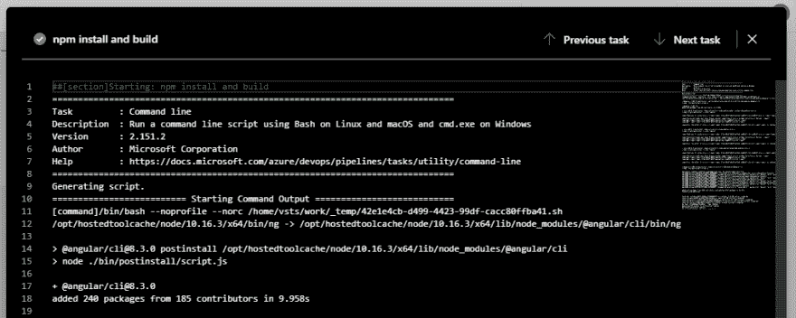](https://res.cloudinary.com/practicaldev/image/fetch/s--IE_RsNOZ--/c_limit%2Cf_auto%2Cfl_progressive%2Cq_auto%2Cw_880/https://thepracticaldev.s3.amazonaws.com/i/e23c7wj0623oht38p6xw.png)

## 微调构建管道

我们还没有用 Angular 配置对默认的 Node.js 做任何修改。在添加额外的步骤之前，让我们以这样一种方式更改配置，即安装依赖项和构建项目是两个独立的步骤:删除`@angular/cli`的全局安装并使用 [npx](https://github.com/npm/npx) 来代替。
要编辑构建管道，请在项目的侧栏中单击 pipelines，选择相应的构建管道，然后单击右上角的 edit:

[](https://res.cloudinary.com/practicaldev/image/fetch/s--fxfGVjPj--/c_limit%2Cf_auto%2Cfl_progressive%2Cq_auto%2Cw_880/https://thepracticaldev.s3.amazonaws.com/i/n90n1ql5vrhzy92lbj71.png)

当点击编辑时，Azure DevOps 将为之前创建的 yaml 文件打开一个编辑器。编辑文件的内容，使其与下面的 yaml 配置相同:

```
# Node.js with Angular
# Build a Node.js project that uses Angular.
# Add steps that analyze code, save build artifacts, deploy, and more:
# https://docs.microsoft.com/azure/devops/pipelines/languages/javascript

trigger:
- master

pool:
  vmImage: 'ubuntu-latest'

steps:
- task: NodeTool@0
  inputs:
    versionSpec: '10.x'
  displayName: 'Setup  Environment'

- script: npm install
  displayName: 'Install  Dependencies'

- script: npx ng build --prod
  displayName: 'Build' 
```

保存配置应该会触发一个新的构建。您应该看到安装依赖项和构建步骤是两个独立的步骤。

[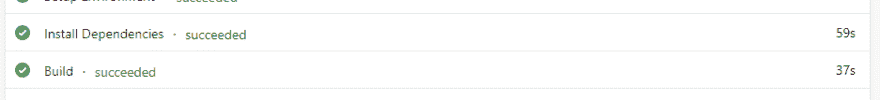](https://res.cloudinary.com/practicaldev/image/fetch/s--6RD94N3s--/c_limit%2Cf_auto%2Cfl_progressive%2Cq_auto%2Cw_880/https://thepracticaldev.s3.amazonaws.com/i/elu2ad8t6qleu8a0r8jr.png)

Azure DevOps 现在集成为在每次提交给 master 时运行`ng build`。除了构建项目之外，我们可能还想运行所有的单元测试，这样我们就知道所有的代码仍然按预期工作。

### 在 Azure DevOps 上运行单元测试

在我们能够在 Azure DevOps 上运行单元测试之前，我们需要对使用 Angular CLI 生成的项目进行一些更改。

由于 pipeline 在其上执行所有自动化步骤的主机没有安装 Chrome，因此我们需要添加 puppeteer，以便能够在 Azure DevOps 上使用 ChromeHeadless。

`npm install puppeteer --save-dev`

打开 karma.conf.js，在顶部添加以下内容:

```
const process = require('process');
process.env.CHROME_BIN = require('puppeteer').executablePath(); 
```

这将加载 puppeter，并使用它的 executablePath 作为 CHROME_BIN 环境变量，允许 karma 在运行 CHROME 或 ChromeHeadless 时使用 puppeter。

最后一步，更新 karma.conf.js 文件以使用 **ChromeHeadless** 浏览器。

```
{
  //...
  browsers: ['ChromeHeadless']

  //...
} 
```

> 更新 karma.conf.js 以使用 puppeteer 也会在您的本地机器上使用 puppeteer。如果这不是您想要的，您可以创建一个 karma.conf.js 文件的副本，将其命名为 karma.conf.ci.js(或者您喜欢的任何名称)，并在管道中运行它时将其传递给`ng test --karmaConfig karma.conf.ci.js`命令(我们稍后将对此进行配置)。

提交并将这些更改推送到存储库。这将触发一个构建，但是这还不会执行测试，因为我们首先必须更新构建管道来运行测试。在构建步骤之前或之后，向 Azure DevOps 中的配置添加新步骤。

```
- script: npx ng test --watch=false
  displayName: 'Tests' 
```

一旦保存，构建应该被成功地触发和完成，包括一个测试步骤。点击 Tests 步骤应该会显示与本地运行`ng test`时相同的信息。

[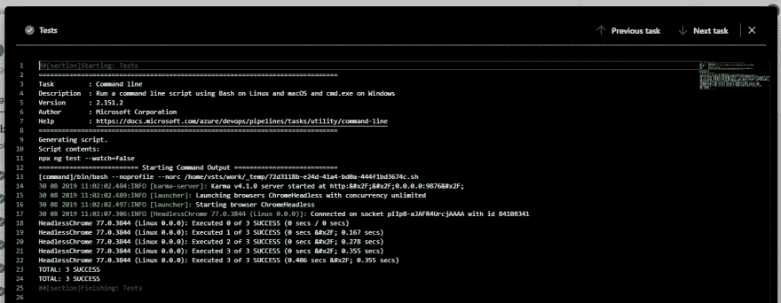](https://res.cloudinary.com/practicaldev/image/fetch/s--_OghASag--/c_limit%2Cf_auto%2Cfl_progressive%2Cq_auto%2Cw_880/https://thepracticaldev.s3.amazonaws.com/i/hhpj89qgio8b9f0b8jd5.png)

尽管这给了我们关于测试所需的所有信息，Azure DevOps 有一个显示测试报告的内置功能，使您能够更容易地导航成功/失败的测试。

### 将测试结果发布到 Azure DevOps

我们需要以 Azure DevOps 能够解释的格式发布测试结果。为了理解支持什么格式，让我们来看看我们的构建管道，然后单击 edit。

在构建管道的编辑屏幕的右侧，您应该会看到一个可用任务的列表。搜索名为**发布测试结果**的任务，并选中它。
在任务详情界面，你会看到一个测试结果格式的下拉菜单。您可以使用任何可用的格式，只要您的测试运行程序允许您以给定的格式导出结果。由于 Karma 支持 JUnit，我们将使用它。

[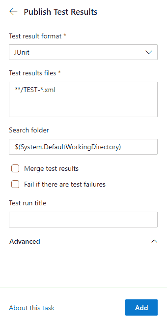](https://res.cloudinary.com/practicaldev/image/fetch/s--Jw5o8qBs--/c_limit%2Cf_auto%2Cfl_progressive%2Cq_auto%2Cw_880/https://thepracticaldev.s3.amazonaws.com/i/qexzcfozq51ewly3um4g.png)

添加之后，yaml 配置现在将包含 PublishTestResults 任务的一个新部分:

```
- task: PublishTestResults@2
  inputs:
    testResultsFormat: 'JUnit'
    testResultsFiles: '**/TEST-*.xml' 
```

确保这个部分被添加到正在运行的步骤`npx ng test`之后，并进行以下更改，以便它有一个 displayName，并为它提供一个条件，以便它即使在测试失败时也能发布测试结果(因为我们也希望能够检查失败的测试)。

```
- task: PublishTestResults@2
  condition: succeededOrFailed()
  inputs:
    testResultsFormat: 'JUnit'
    # Make sure you've changed testResultsFiles to the one below 
    testResultsFiles: '**/TESTS-*.xml'
  displayName: 'Publish  Test  Results' 
```

由于我们还没有将我们的 Angular 应用程序配置为以 JUnit 格式发布测试结果，所以在保存上述更改时触发的构建还不会发布任何测试结果。

[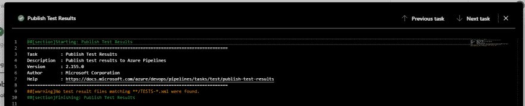](https://res.cloudinary.com/practicaldev/image/fetch/s--7ygc9oBb--/c_limit%2Cf_auto%2Cfl_progressive%2Cq_auto%2Cw_880/https://thepracticaldev.s3.amazonaws.com/i/p4jz5pc1hxz9vzqfqr78.png)

### 配置 Karma 发布 JUnit

通过运行`npm install karma-junit-reporter --save-dev`，在 Angular 项目中为 JUnit 安装合适的 reporter。

更新 karma.conf.js，在插件中包含`karma-junit-reporter`并添加`junit`作为报告者之一。

```
module.exports = function (config) {
  config.set({
    ...
    plugins: [
      ...,
      require('karma-junit-reporter')
    ],
    ...,
    reporters: ['progress', 'kjhtml', 'junit'],
    ...
  });
}; 
```

为了让我们的单元测试完全集成到 Azure DevOps 中，这就是我们所要做的全部改变。将您所做的更改提交并推送至存储库。

这应该会触发一个新的构建，一旦完成，您应该会在构建细节的 tests 部分看到 3 个默认测试(您可能需要检查过滤器，默认情况下它只显示失败的测试)。

[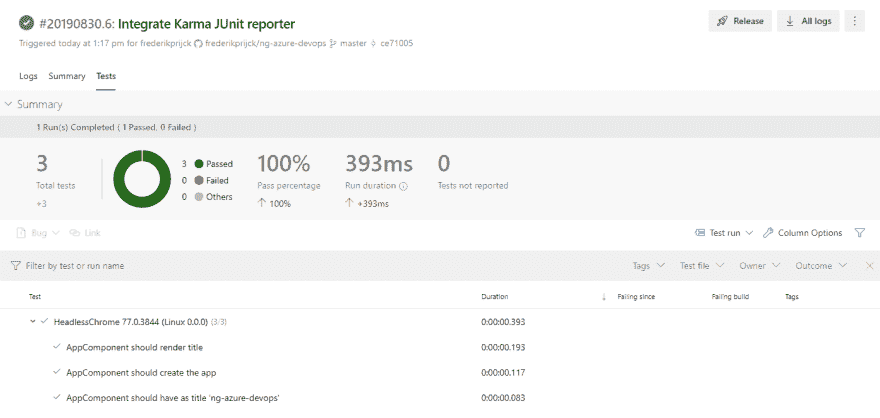](https://res.cloudinary.com/practicaldev/image/fetch/s--8IrNGNd5--/c_limit%2Cf_auto%2Cfl_progressive%2Cq_auto%2Cw_880/https://thepracticaldev.s3.amazonaws.com/i/9188vckvg9fv173hk1uf.png)

通过将我们的测试与 Azure DevOps 集成，我们有了一个结构化的 UI 来跟踪我们所有的单元测试。每当测试失败时，我们不必在测试步骤中滚动控制台输出。相反，我们可以检查所有的测试，并过滤出我们想要的测试。

如果我们有一个失败的测试，我们甚至可以点击它来显示出错的细节，显示与我们在控制台中得到的信息相同的信息:

[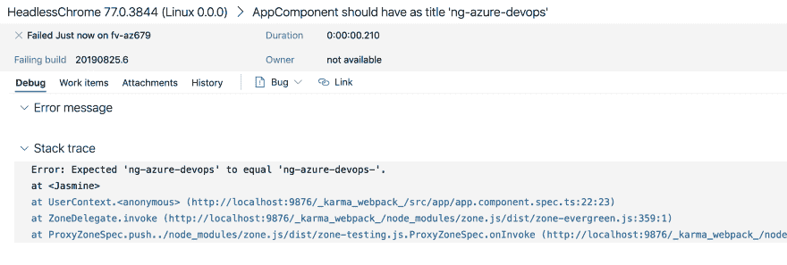](https://res.cloudinary.com/practicaldev/image/fetch/s--ELDyVL39--/c_limit%2Cf_auto%2Cfl_progressive%2Cq_auto%2Cw_880/https://thepracticaldev.s3.amazonaws.com/i/yta0wkrpytenp4q8z7jh.png)

### 显示构建管道中的代码覆盖率

Azure DevOps 为我们提供了显示应用程序单元测试代码覆盖率概览的能力。为此，就像以特定格式发布测试结果一样，我们需要以支持的格式发布代码覆盖结果。目前，Azure DevOps 同时支持 Cobertura 和 JaCoCo。伊斯坦布尔，Angular CLI 使用的代码覆盖工具，内置了对 Cobertura 的支持，所以我们不需要添加任何依赖来使用 Cobertura。

我们需要更新 karma 配置，以便在 coverageistanbullreporter:
的报告中包含 Cobertura

```
coverageIstanbulReporter: {
  dir: require('path').join(__dirname, './coverage/ng-azure-devops'),
  reports: ['html', 'lcovonly', 'text-summary', 'cobertura'],
  fixWebpackSourcePaths: true
}, 
```

这将在。/coverage/ng-azure-devops 目录。我们将在构建管道中需要这条路径。

提交，并将这些更改推送到您的存储库(这将触发一个尚未发布代码覆盖的构建)，然后转到 Azure DevOps 上的构建管道配置，并添加以下步骤:

```
- task: PublishCodeCoverageResults@1
  condition: succeededOrFailed()
  inputs:
    codeCoverageTool: 'Cobertura'
    summaryFileLocation: '$(Build.SourcesDirectory)/coverage/ng-azure-devops/cobertura-coverage.xml'
  displayName: 'Publish  Code  Coverage  Results' 
```

就像发布测试结果一样，我们也希望包含失败测试的代码覆盖率结果。这就是我们将条件设置为`succeededOrFailed()`的原因。我们还需要提供摘要文件(由伊斯坦布尔创建)的位置，并确保它与伊斯坦布尔生成的文件的位置一致。

为了能够发布代码覆盖结果，我们需要使用`--code-coverage`标志运行`ng test`。更新构建管道配置中的相应步骤，以包含该标志:

```
- script: npx ng test --watch=false --codeCoverage=true
  displayName: 'Tests' 
```

保存配置应该会运行一个构建，该构建一旦完成，就会在构建的详细信息页面上显示代码覆盖率部分。

[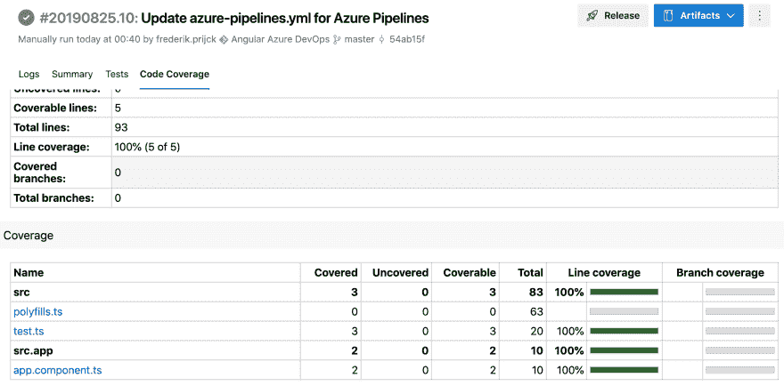](https://res.cloudinary.com/practicaldev/image/fetch/s--Qv9u1Q0_--/c_limit%2Cf_auto%2Cfl_progressive%2Cq_auto%2Cw_880/https://thepracticaldev.s3.amazonaws.com/i/beungetiwbetf2qinluj.png)

发布代码覆盖率结果还将创建一个报告，并使其作为一个工件，附加到您的构建中。如果您希望检查报告，您可以通过打开右上角的工件菜单来下载它。一般来说，你应该在 Azure DevOps 本身的代码覆盖率选项卡上找到大部分信息。

### 添加林挺

通过集成我们的 linter，我们可以确保当代码不遵循编码指南时，构建管道会失败。让我们添加一个运行`npx ng lint`的步骤，在构建步骤之前或之后。

```
- script: npx ng lint
  displayName: 'Code  Analysis' 
```

这将增加一个基本的集成与我们的棉绒。Azure DevOps 没有内置的方法来跟踪代码质量。不过，如果你想集成 SonarQube 等第三方工具的话，它确实有任务可以完成。

## 发布神器

既然我们已经有了一种自动的方法来验证源代码是否编译，所有的单元测试是否成功运行，代码是否符合我们的编码指南，我们可以发布`ng build`的输出，这样我们就可以使用它来进行部署，无论是手动的还是自动的。

将以下步骤添加到构建管道配置的末尾

```
- task: PublishBuildArtifacts@1
  inputs:
    PathtoPublish: 'dist/ng-azure-devops'
    ArtifactName: 'web-app'
    publishLocation: 'Container'
  displayName: 'Publish  Artifacts' 
```

为了发布工件，我们需要提供 PathtoPublish，这是`ng build`命令的输出文件夹、工件名称和发布位置。提供“Container”作为 publishLocation 意味着它将发布工件作为 Azure 管道本身的一部分。

保存更改，并等待构建完成。完成后，您可以从构建结果页面下载工件:

[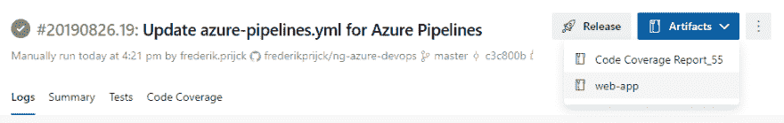](https://res.cloudinary.com/practicaldev/image/fetch/s--X24c-4E6--/c_limit%2Cf_auto%2Cfl_progressive%2Cq_auto%2Cw_880/https://thepracticaldev.s3.amazonaws.com/i/zp2urr0vm8ua8matu0kb.png)

每次构建成功，最新的版本将作为工件发布。这允许我们下载它，或者以自动化的方式使用它来部署我们的应用程序。

# 结论

使用 Azure DevOps，我们可以轻松地集成我们的 Angular 应用程序，从而确保我们的代码库始终处于良好状态。这应该会降低发布 bug 的风险，导致更稳定的软件，以及更快乐的团队和最终用户。

我们还以自动化的方式创建我们的构建工件，减少部署我们的应用程序的时间和复杂性。

在以后的文章中，我们将建立一个发布管道来自动部署构建工件。

这篇文章是由 T2 的软件工程师弗雷德里克·普里查克写的。

你可以在推特上关注他，电话: [@frederikprijck](https://dev.to/frederikprijck) 。

需要 JavaScript 咨询、指导或培训帮助吗？在 [This Dot Labs](https://thisdot.co) 查看我们的服务列表。