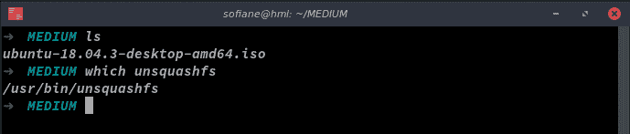
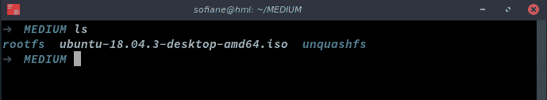
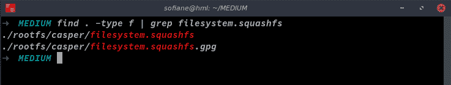
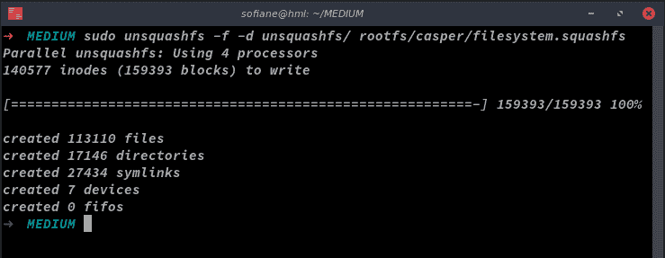
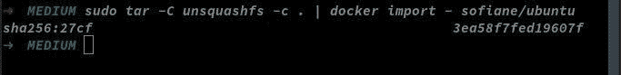
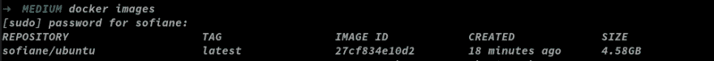
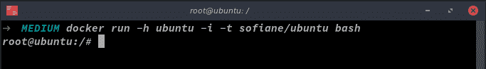

# 将 ISO 图像转换为 docker 图像

> 原文：<https://dev.to/sofianehamlaoui/convert-iso-images-to-docker-images-18jh>

### 🐳将 ISO 图像转换为 docker 图像

没错。我正在寻找一种方法或技巧来转换 ISO 文件到 docker 图像，很难找到一个！但唯一的一个并没有真正解释，缺乏一些信息。所以我们来了！！

### 选择 ISO 文件:

在开始这个过程之前！请记住，你必须使用一个****，*** 是指操作系统的可启动版本。*

 *### 出发前！：

在这个教程/故事里，我会用 Ubuntu 18.04.3 [LTS](https://en.wikipedia.org/wiki/Long-term_support) 的 live disc ISO，

### 关键词:

*   ***rootfs*** :一个[文件系统](https://en.wikipedia.org/wiki/File_system)。在 [Linux](https://en.wikipedia.org/wiki/Linux) 中，所有文件系统都有一个挂载点，这是挂载的文件系统连接到根文件系统的目录
*   ***squashfs :*** a [压缩](https://en.wikipedia.org/wiki/Data_compression)只读[文件系统](https://en.wikipedia.org/wiki/File_system)为 [Linux](https://en.wikipedia.org/wiki/Linux)
*   ***unsquashfs :*** 用于[解压缩](https://en.wikipedia.org/wiki/Data_compression) squashfs [文件系统](https://en.wikipedia.org/wiki/File_system)的工具

### 要求:

*   ***squashfs-tools :*** 在你的系统中安装 [squashfs-tools](https://www.tldp.org/HOWTO/html_single/SquashFS-HOWTO/)
*   下载 LiveCD ISO 版本

<figure>[](https://res.cloudinary.com/practicaldev/image/fetch/s--md1CvpKV--/c_limit%2Cf_auto%2Cfl_progressive%2Cq_auto%2Cw_880/https://cdn-images-1.medium.com/max/689/1%2A5iKRJRqEauoShmFeUK0CEg.png) 

<figcaption>ISO 文件下载&squashfs-工具安装</figcaption>

</figure>

### 开始吧！：

***1-首先创建两个文件夹(rootfs 和 unsquashfs)***

```
$: mkdir rootfs unquashfs 
```

<figure>[](https://res.cloudinary.com/practicaldev/image/fetch/s--SeV9Whes--/c_limit%2Cf_auto%2Cfl_progressive%2Cq_auto%2Cw_880/https://cdn-images-1.medium.com/max/689/1%2ANURaMl8Ci4YwdiiQtStmOw.png) 

<figcaption>创建 rootfs & unsquashfs 文件夹</figcaption>

</figure>

***2-将你的 ISO 文件挂载到 rootfs 文件夹中作为循环设备***

```
$: sudo mount -o loop ubuntu-18.04.3-desktop-amd64.iso rootfs 
```

<figure>[](https://res.cloudinary.com/practicaldev/image/fetch/s--QsjX3UnK--/c_limit%2Cf_auto%2Cfl_progressive%2Cq_auto%2Cw_880/https://cdn-images-1.medium.com/max/738/1%2ATsYCriGIdOADKWutnvevNA.png) 

<figcaption>挂载 ISO 文件</figcaption>

</figure>

***3-找到 filesystem.squashfs 文件***

```
$: find . -type f | grep filesystem.squashfs 
```

<figure>[](https://res.cloudinary.com/practicaldev/image/fetch/s--ccHfPt3---/c_limit%2Cf_auto%2Cfl_progressive%2Cq_auto%2Cw_880/https://cdn-images-1.medium.com/max/737/1%2A-E1VJCkjliKF50-yftzmhg.png) 

<figcaption>查找 filesystem.squashfs 文件</figcaption>

</figure>

***4-使用 unsquashfs 将文件系统文件提取到 unsquashfs 文件夹中(这需要 5-10 分钟)***

```
$: sudo unsquashfs -f -d unsquashfs/ rootfs/casper/filesystem.squashfs 
```

<figure>[](https://res.cloudinary.com/practicaldev/image/fetch/s--VIFReI-8--/c_limit%2Cf_auto%2Cfl_progressive%2Cq_auto%2Cw_880/https://cdn-images-1.medium.com/max/739/1%2A1VvqdeBDYCkPLqe5IhQ4HA.png) 

<figcaption>将文件系统文件提取到 unsquashfs 文件夹</figcaption>

</figure>

***5-使用 docker 压缩并导入图像(需要 10-20 分钟)***

```
$: sudo tar -C unsquashfs -c . | docker import - sofiane/myimg 
```

***6-你会得到一个 sha256 hash(类似这样的东西)***

```
$:sha256:qf917d58831f926c6b93ff84bd6az68550a6cd6c36aeb6c837c53d655d9453sh 
```

<figure>[](https://res.cloudinary.com/practicaldev/image/fetch/s--h-5tocy9--/c_limit%2Cf_auto%2Cfl_progressive%2Cq_auto%2Cw_880/https://cdn-images-1.medium.com/max/683/1%2AQi0hAgYD_Z1ZbpQdYKcAcA.jpeg) 

<figcaption>***压缩然后使用 docker***</figcaption>

</figure>

导入图像

***7-测试你的 docker 形象:***

```
$:docker run -h ubuntu -i -t sofiane/myimg bash 
```

<figure>[](https://res.cloudinary.com/practicaldev/image/fetch/s--rGNtxNQR--/c_limit%2Cf_auto%2Cfl_progressive%2Cq_auto%2Cw_880/https://cdn-images-1.medium.com/max/965/1%2AZRWqyHmN1z8ivdzJLKr7zA.png) 

<figcaption>码头工人图片</figcaption>

</figure>

<figure>[](https://res.cloudinary.com/practicaldev/image/fetch/s--xHyrG3iE--/c_limit%2Cf_auto%2Cfl_progressive%2Cq_auto%2Cw_880/https://cdn-images-1.medium.com/max/683/1%2Axe0m7QiM-0c-XBl3oizNtw.png) 

<figcaption>你的 docker 形象准备好了！</figcaption>

</figure>

给你。

感谢您的阅读，

#### 我的推特:

[Sofia hamlaoui](https://twitter.com/S0fianeHamlaoui)

#### **我的 Github :**

[sofiianeharmaoui-概述](https://github.com/SofianeHamlaoui)

#### 支持我:

*   贝宝:[paypal.me/SofianeHamlaoui](http://paypal.me/SofianeHamlaoui)
*   BTC:1 NR 2 oqsuevwjwzcyxmqea 5 eyaaojofk*