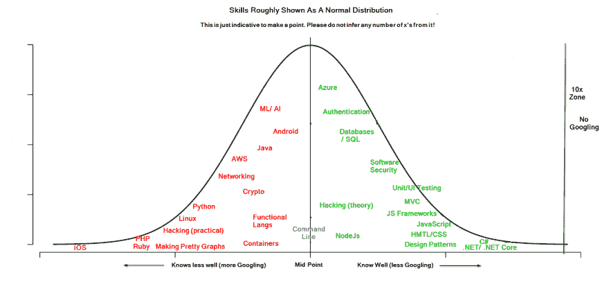
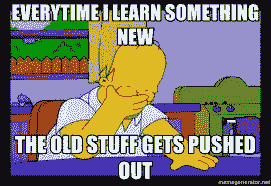

# 我能成为 10 倍的人吗？

> 原文：<https://dev.to/jsanddotnet/could-i-be-a-10x-er-4ejl>

不久前，下面这条推文买下了关于 10x
开发者的旧对话。开发人员非常优秀，他们的价值相当于 10 个“穷人阶层”的普通开发人员。

> 10 位工程师
> 
> 创始人如果你曾经遇到过这种罕见的工程师，抓住他们。如果你的第一批工程师中有 10 倍于你的工程师，你的创业成功的几率会大大增加。
> 
> 好了，下面是一个棘手的问题。
> 
> 如何发现一个 10x 的工程师？
> 
> — Shekhar Kirani (@skirani) [July 11, 2019](https://twitter.com/skirani/status/1149302828420067328?ref_src=twsrc%5Etfw)

我最近没有机会写，所以它不是热门话题，但这在我脑海中挥之不去，我想我应该写。

作为一名初级开发人员。我渴望成为那些疯狂地敲击键盘、只生产黄金的“摇滚明星”中的一员🏆。

10 多年过去了，让我们看看进展如何？

### 1。10 倍工程师讨厌开会。

> 1.10 倍工程师讨厌开会。他们认为这是浪费时间，显而易见的事情正在讨论。他们参加会议是因为经理要求召开“员工会议”来讨论特性和状态。
> 
> — Shekhar Kirani (@skirani) [July 11, 2019](https://twitter.com/skirani/status/1149302830345248769?ref_src=twsrc%5Etfw)

是啊！那就是我。我真的很讨厌开会。尤其是当它们是关于“办公室冰箱的使用”或者“我们应该给我们的项目取什么名字”的时候。

除...之外...我喜欢 scrum 会议。它们真的很方便，我相信它们总体上节省了时间。此外，了解我们作为一个团队的表现也很好。

有时候团队中的其他人已经发现了一些非常聪明的解决方案，你可以在以后自己使用。

哦，我也喜欢一些客户会议。尤其是那些客户真正欣赏你为他们付出的努力，或者以一种建设性的方式使需求正确的项目。

嗯（表示踌躇等）...好的。一个混合的开始。我同意他关于冰箱的评论，然后继续。

### 2。非常不规则的时间。

> 2.10x 工程师在办公室的时间安排非常不规律。他们倾向于在很少人在的时候工作。如果有人群或全体会议，他们是不可见的。大部分都是深夜码员，来办公室很晚。
> 
> — Shekhar Kirani (@skirani) [July 11, 2019](https://twitter.com/skirani/status/1149302832526286848?ref_src=twsrc%5Etfw)

呃。我有一个孩子。当你有一个学校运行排序时，尝试不规则的时间安排。也许 10x-er 也不能成为(好)父母？

我合作过的最好的开发人员之一每天早上 8 点就开始工作。所以我打算驳回这个问题，给自己留个机会。

这是我的减分。

### 3。黑色背景

> 3.10x 工程师笔记本电脑屏幕背景色通常为黑色(他们总是更改默认值)。他们的键盘按键如 I，f，x 通常比 a，s，e(电子邮件发送者)更破旧。
> 
> — Shekhar Kirani (@skirani) [July 11, 2019](https://twitter.com/skirani/status/1149302834619248640?ref_src=twsrc%5Etfw)

对我来说黑色背景= +1。这对你的眼睛好得多。如果你没有做，你真的应该做。还有——投资一台好的显示器！保护好你的眼睛！

在你们这些白人背景介绍者开始咆哮之前——我曾经是一个白人背景介绍者——现在我不戴太阳镜就不能出门。在二月的雨里，晒着太阳，我在外面看起来很傻，所以为什么要冒这个险呢？

现在我使用黑色背景，我是否更擅长编码？

没有。

我想说最大的进步是晚上睡个好觉，但这听起来不太像“摇滚明星”，不是吗？

### 4。10x 工程师知道已经投入生产的每一行代码

> 4.10x 工程师知道已经投入生产的每一行代码。如果 QA 或支持人员发现了问题，他们可以准确地知道故障(或 bug)在哪里，并且可以在几个小时而不是几天内修复
> 
> — Shekhar Kirani (@skirani) [July 11, 2019](https://twitter.com/skirani/status/1149302836808704001?ref_src=twsrc%5Etfw)

我曾在一家初创公司工作过(2 名编码员)，我想说，一旦你接触到 3 名编码员，没有人知道所有进入代码库的东西。通常，只有当您创建了故障时，您才能立即“准确地知道故障在哪里”🤫。

通常会有比其他人更了解产品的人，但那不一定是 10 倍的人。

在那家公司，我特别想了解最原始的产品。结果是；当新的酷的东西出现时；我被老产品困住了，因为我“在工作上更快”。我必须努力奋斗才能被允许接触新的东西。

我可不想在短时间内再次陷入这种境地，所以在我 10 年后退休之前，我甚至不想在这里拿到+1 分。

### 5。全栈+不做 UI

> 5.10x 工程师大多是全栈工程师。对他们来说代码就是代码，他们不在乎是前端、后端、API、数据库、无服务器等。我很少看到他们做 UI 的工作。
> 
> — Shekhar Kirani (@skirani) [July 11, 2019](https://twitter.com/skirani/status/1149302838746464256?ref_src=twsrc%5Etfw)

全栈= +1 给我。尽管几乎所有的软件在某些时候都需要 UI，对吗？

事实上，我认为这是最终用户最看重的东西？如果你有一个很棒的软件，但是背景是绿色的，橙色的按钮都放在屏幕的右中间，人们会讨厌它。制作优秀的 UI 是一项真正的技能(我希望我有)，不应该被我看不起。

### 6 思想转化为代码

> 6.10x 工程师可以在头脑中将“思想”转化为“代码”，并以迭代的方式编写。给定一个产品特征，他们可以在一两次 4 到 6 个小时的时间里，一边喝着含咖啡因的饮料，一边毫不分心地写下整个特征。
> 
> — Shekhar Kirani (@skirani) [July 11, 2019](https://twitter.com/skirani/status/1149302840751378433?ref_src=twsrc%5Etfw)

这只是通过实践和良好的需求分解来实现的。

分两次写一个完整的特性——这取决于这个特性有多大，不是吗？

如果新功能需求是“添加一个新的文本框并将数据保存到一个简单的应用程序中”，那么是的。我也可以利用时间在网上玩。

对我来说是另一个+1(尽管还有回旋的余地！)

### 7。很少看帮助文档

> 7.10x 工程师很少看类或方法的帮助文档。他们在记忆中知道它，并能从记忆中回忆起来。他们写代码和写英语一样容易。没有休息，没有停顿，只是打字。
> 
> — Shekhar Kirani (@skirani) [July 11, 2019](https://twitter.com/skirani/status/1149302842504540165?ref_src=twsrc%5Etfw)

我在这里留出一点余地。当我开始我的第一份工作时，我开始尝试自己解决一个问题。我的老板进来了。在解释了我在做什么后，他喊道:“我不是付钱给你来满足你他妈的自负的！谷歌一下他妈的答案！”。

虽然他的观点可以说得更好一点，但他是对的。你几乎没有什么是别人没有面对过的。我确信我可以比我写东西更快地 google/stackoverflow 一些东西，更不用说解决问题了。所以我谷歌了一下。我经常在谷歌上搜索。

我的想法是学习基础知识，谷歌其余的。

当你需要知道如何找出一个双精度数是一个质数还是某种复杂的日期函数时——不要费事去想它。谷歌一下答案，在 StackOverflow 上取被接受的答案。复制粘贴继续前进。

为了满足这里的标准，10 倍的人必须处于大量知识的正态分布的远端。

这里大概是我所在的地方。注意:我并不想在这里要求任何数量的 x。我想说的是，没有大量的谷歌搜索，我真的做不了很多事情！

如你所见，我的机会渺茫，但请坚持，我们就要结束了。

### 8。一直在学习。

> 8.10 倍的工程师总是比公司里的每个人都更早地学习新的框架和语言。他们不害怕任何新事物。如果有新的东西(例如区块链)，他们会在任何人开始之前狼吞虎咽，安装，试验。
> 
> — Shekhar Kirani (@skirani) [July 11, 2019](https://twitter.com/skirani/status/1149302844291338240?ref_src=twsrc%5Etfw)

是的。我喜欢新东西....

但有一点要记住，这可能在某个时候会改变。几乎每个开发人员在生活中都会遇到这样一种情况，他们只是不愿意去追逐那些他们已经知道的闪亮的方式。值得一提的是，我和几个这样的人一起工作过，他们仍然是非常优秀的 T2 开发者。

一个对公司如此重要的人，他们甚至给他上了保险！

“总是学习新东西”的另一个好处是，到了某个时候，学习就没有任何益处了。这些年来，我学到了太多东西，以至于我要么从未实施过，要么使用过，但不再有任何价值。即使是有效的技术也会过时。我真的建议学习你需要知道的东西，而不是像我过去那样倾向于“无所不知”。

被遗忘/过时的学习😭、Knockout JS、Visual Basic、MATLAB、Web Forms、经典 ASP、Flash...这样的例子不胜枚举。

### 9。糟糕的导师

> 9.10 倍的工程师是糟糕的导师，因为他们不能教别人做什么或包工作。他们总是认为“教别人或和别人讨论需要太长时间，我宁愿自己做。”他们也是差劲的面试官。
> 
> — Shekhar Kirani (@skirani) [July 11, 2019](https://twitter.com/skirani/status/1149302845990031365?ref_src=twsrc%5Etfw)

我曾经共事过的最伟大的开发人员也是我杰出的导师。做一个脾气暴躁、不合群的混蛋不会让你成为一个伟大的开发人员。

事实上，我最大的满足之一是指导一个毫无专业开发经验的人。我对此非常自豪。

我要把这家伙归类为一个工具(好像我还没有)。我会骄傲地接受负分🏅。

### 10。不要黑也不要记录

> 10.10x 工程师不黑东西。他们编写高质量的代码，确切地知道代码应该如何发展，并且有一个整体代码结构的心智模型。他们最多写一个设计文档，剩下的在代码里。
> 
> — Shekhar Kirani (@skirani) [July 11, 2019](https://twitter.com/skirani/status/1149302847822974977?ref_src=twsrc%5Etfw)

不知道自己在入侵和知道如何编码，但仍然实现入侵是有区别的。

*短期*即“现在”破解通常比正确地完成更快，有时在勉强应付/优先级为 1 的 bug 场景中是必需的。

当然，这可能会严重影响你以后的工作，但是如果你的老板威胁说如果你不在两个小时内完成三周的工作就解雇你，或者如果不采取快速行动系统就无法使用，你就黑掉它。不要害怕实施一个短期的黑客/修复。在我看来，一个好的公司会让你以后适当地编码——一个差的公司不会。

> 与其“责怪 git ”,我更希望看到“git 我已经用我能得到的工具和组织结构尽了最大努力，所以只要给我一点空间和时间，它最终会得到解决”
> 
> — Scott Hanselman ([@shanselman](https://dev.to/shanselman) ) [March 4, 2019](https://twitter.com/shanselman/status/1102678644030234624?ref_src=twsrc%5Etfw)

如果你真的想欺骗你的队友- DONT 文档。

好的代码文档本身就是一派胡言。

未记录的配置是一个等待发生的事故。

同样，我也遇到过完全理解一点代码，但不理解为什么它是这样的情况。为什么很重要，因为当你改变它的时候，你就冒着破坏它所工作的场景的风险。我认为每个开发人员都曾在某个时候更改过代码，结果却发现他们破坏了另一个场景。

几乎没有人在他们的单元/集成测试中有 100%的代码覆盖率。

此外，如果你做文档，当人们问你时，你可以礼貌地说“阅读文档”，这样你就可以花更多的时间编码，而不是花更少的时间告诉人们你已经告诉他们的东西。

再说一次-这家伙是个工具。我尽可能地记录。

### 11。四处走动？

> 11.10 倍工程师很少找工作或离开公司。他们搬出去是因为你让他们的生活因为流程、会议、培训和其他非增值活动而变得痛苦。如果你遇到他们，抓住他们。庆祝他们。
> 
> — Shekhar Kirani (@skirani) [July 11, 2019](https://twitter.com/skirani/status/1149302849555189761?ref_src=twsrc%5Etfw)

在我看来，有雄心壮志的优秀人才往往会跳槽。认为忠诚的人是忠诚的可能是一个很大的错误。

我过去认为你必须每三年换一次公司。开始的时候有人告诉我，我坚持了一段时间。

我已经在现在的公司工作了 5 年，我真的很开心。如果我没有搬家，只是成熟了一点，我在以前的公司会很开心。我认识一些优秀的开发人员，他们从第一份工作开始就一直在一家公司工作。

### 12。我想补充的一个评论总结了一种刻板印象。

> 伟大的线程！更多的指示:
> 
> -他们知道 vi 并在任何地方使用 vi 键
> -他们不使用默认的浏览器或 IDE(他们总是在尝试)
> -他们会花几个小时试图说服你他们选择的浏览器或 IDE
> -更喜欢从命令行做事情
> 
> — Sarang Lakare (@SarangLakare) [July 13, 2019](https://twitter.com/SarangLakare/status/1149878295590137858?ref_src=twsrc%5Etfw)

见鬼，就像 200 多万人一样，[我甚至不能退出那该死的东西](https://stackoverflow.com/questions/11828270/how-do-i-exit-the-vim-editor)。

-我得 10 分。

### 结论

当我还是一名初级开发人员时，我渴望成为“伟大”的人。

我在第一份工作中与一位“演技 10 倍”的同事共事。经理们喜欢他，但事实上，他的代码是一大堆热气腾腾的马粪，而且总是迟到。正如我的一个朋友/同事所说的“如果你的方法中有区域，你的方法就太长了”。尽管如此，因为他上演了一出好戏，人们相信了他自己的炒作。

有一段时间，我试图以类似的方式行事，因为我认为你必须这样做才能得到尊重。

这些天我不在乎。显然，我完全不符合这一章的标准。

我就是我。我是一个很好的人，喜欢在团队中，喜欢认为自己“工作出色”。

这描述了数以百万计的我们程序员，这没有什么不对。

在这个世界上，媒体认为埃隆·马斯克在制造火箭的同时独自编写了特斯拉的所有 ML，10 岁的孩子编写了所有你做的东西*但更好的*，很容易感到自卑。

不像有些人，我不否认 10 倍人的存在。我认为可能有极少数人能成为伟大的 T2。

如果他们的态度符合这个人的刻板印象，不要仰视他们。选择那些可以变得伟大，但不会因此让你自卑的人。

> 去吧，伙计们。现在正在找人。我很幸运，那天我五年级的老师想把苹果借给我。那年晚些时候，我爸爸卖掉了我们的货车，给我买了一辆 C64。11 年前我偶遇了 [@scottgu](https://twitter.com/scottgu?ref_src=twsrc%5Etfw) ，他给了我一份工作。去[#贝瑟洛克](https://twitter.com/hashtag/BeTheLuck?src=hash&ref_src=twsrc%5Etfw)。
> 
> — Scott Hanselman ([@shanselman](https://dev.to/shanselman) ) [February 27, 2019](https://twitter.com/shanselman/status/1100609008728125440?ref_src=twsrc%5Etfw)

我希望如果你已经走了这么远，你会觉得这给了你希望。不成为某种“超人编码员”是完全可以的，你真的不需要去适应这些被误导的刻板印象。

在我看来，只要你喜欢你所做的事情，那才是最重要的。

我每天醒来都期待着去上班。我希望未来几年都是这样。

> "你是如何了解到你所知道的关于库伯内特的一切的？"我:[pic.twitter.com/Tfz3FjBqU1](https://t.co/Tfz3FjBqU1)
> 
> — Daniele Polencic ([@danielepolencic](https://dev.to/danielepolencic) ) [August 6, 2019](https://twitter.com/danielepolencic/status/1158737805557686277?ref_src=twsrc%5Etfw)