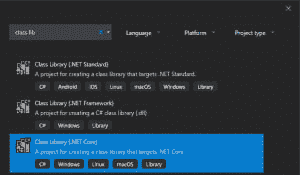
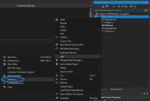
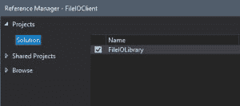

# 创建一个 C#类库(DLL)

> 原文：<https://dev.to/bradwellsb/create-a-c-class-library-dll-3cbb>

[来源](https://wellsb.com/csharp/advanced/create-csharp-class-library-dll/)

您是否发现自己正在编写希望在多个 C#项目中重用的代码？在本教程中，您将学习如何创建类库并在项目中添加对它的引用。

## 什么是类库？

通过创建 C#类库，您正在创建一个可以包含在您的项目中的包。这个包包含代码，比如类和方法，您会发现这些代码非常有用，可以跨多个应用程序使用。

当您生成 C#类库时，会创建一个. dll 文件。通过在其他项目中引用该 DLL 文件，您将能够使用其中包含的类和方法。您还可以通过包管理库或开源项目来分发您的类库，以允许其他开发人员使用您创建的函数。

## 如何创建类库

要创建一个 C#类库项目，从新建项目对话框中，(**文件** > **新建** > **项目……**，选择**类库(。**网芯)项目类型。

[](https://wellsb.com/csharp/wp-content/uploads/sites/2/2019/06/beginners-class-library-new-min.png)

在之前的教程中，您编写了一个[方法来从文本文件](https://wellsb.com/csharp/beginners/streamreader-read-specific-line/)中读取特定的行号。在本教程中，您将通过创建一个名为 FileIOLibrary 的类库来构建该示例。

类库项目布局看起来类似于您对典型 C#项目的预期。将以下代码添加到您的库的。cs 文件。

```
using System;
using System.IO;

namespace FileIOLibrary
{
    public class FileIO
    {
        public string ReadLine(string filePath, int lineNumber)
        {
            return ReadSpecificLine(filePath, lineNumber);
        }

        private string ReadSpecificLine(string filePath, int lineNumber)
        {
            using (StreamReader file = new StreamReader(filePath))
            {
                string content = null;
                for (int i = 1; i < lineNumber; i++)
                {
                    file.ReadLine();

                    if (file.EndOfStream)
                    {
                        break;
                    }
                }
                content = file.ReadLine();
                return content;
            }
        }
    }
} 
```

第 4 行的名称空间标识符是您将通过客户端项目中的`using`指令引用的依赖项名称。在这里，我选择了名字**fileolibrary**。

第 6 行中的公共类名是您准备在项目中实例化类对象实例时将引用的名称。在这里，我把它叫做 **FileIO** 。

这个类有一个公共方法和一个私有 helper 方法。一旦你初始化了一个类对象，你将能够从你的其他项目中调用公共方法。不能从该类外部调用私有方法。

记住，你总是可以[重载方法构造函数](https://wellsb.com/csharp/beginners/csharp-constructor-overload/)，以便提供不同的方法来调用函数。作为练习，考虑创建一个重载版本的 ReadLine()方法，它接受三个输入参数`ReadLine(string directoryName, string fileName, int lineNumber)`。

您可以向该库中添加其他几个公共方法。例如，您可能希望将一个`ReadFile()`方法、`WriteFile()`方法和一个`WriteFileAsync()`方法添加到同一个类库中。然后，任何时候您有一个需要文件 I/O 操作的项目，您都可以导入您的库并有一个简单的方法来访问您的项目所需的方法。

## 使用类库 DLL

当您构建一个典型的 C#项目文件时，一个可执行文件。将生成 EXE 文件。当您生成类库项目时，会在源目录中创建一个. DLL 文件。通过简单地添加对这个的引用。DLL 文件，您的任何项目都将能够利用您编写的自定义类和方法。

对于本教程，向您的解决方案添加第二个项目，类型为**控制台应用程序(。净芯)**。将项目命名为**filioclient**。要导入。DLL，在解决方案资源管理器中找到客户端项目。点击右键**添加>参考**。

[](https://wellsb.com/csharp/wp-content/uploads/sites/2/2019/06/beginners-class-library-reference1-min.png)

如果类库和你当前的项目在同一个解决方案中，你会在**项目>解决方案**窗格中找到它。否则，您可以**浏览** …。dll 文件。

[](https://wellsb.com/csharp/wp-content/uploads/sites/2/2019/06/beginners-class-library-reference2-min.png)

一旦成功地添加了对类库的引用，只需通过一个`using`指令来包含它。您将使用库的命名空间的名称来声明引用。参考上面例子中的第 4 行。

```
using FileIOLibrary; 
```

下面是一个客户端应用程序的例子，它使用了我们之前编写的类库。注意，我们能够引用库的定制类和方法，即使它们在我们当前项目的名称空间之外。

```
static void Main(string[] args)
{
    string filePath = "ReadFile.txt";
    int lineNumber = 3;

    string lineContents = null;

    try
    {
        FileIO fileIO = new FileIO();
        lineContents = fileIO.ReadLine(filePath, lineNumber);
    }
    catch (IOException e)
    {
        Console.WriteLine("There was an error reading the file: ");
        Console.WriteLine(e.Message);
    }

    if (lineContents != null)
        Console.WriteLine(lineContents);

    Console.ReadLine();
} 
```

在实例化了 FileIO 类的一个新实例(第 18 行)之后，就可以在新项目中自由使用它的方法了。例如，在第 19 行，我已经调用了我们在类库项目中编写的`ReadLine()`方法。

## 关于错误处理的说明

创建类库时遵循最佳实践很重要。例如，您可能已经注意到我们的类库代码包含了最少的错误检查。类库应该抛出异常，因为恰当地处理异常是客户端的责任。注意，包含在`try` / `catch`块中的是客户端文件 I/O 操作，而不是类库本身的操作。

[来源](https://wellsb.com/csharp/advanced/create-csharp-class-library-dll/)