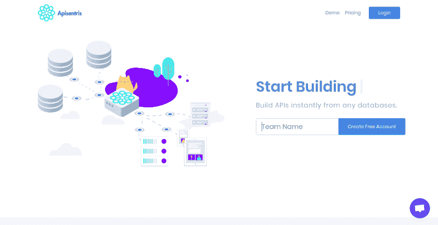
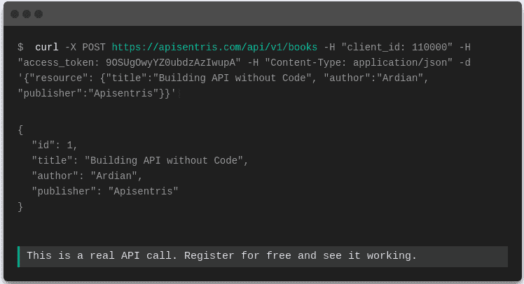
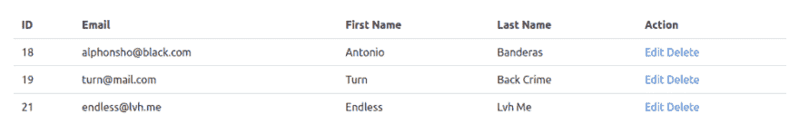
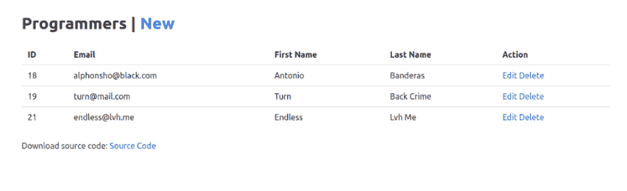
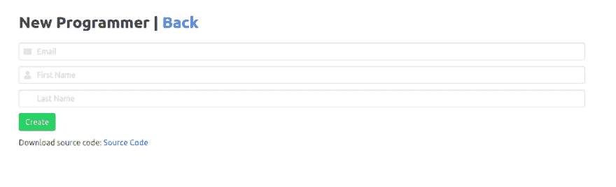
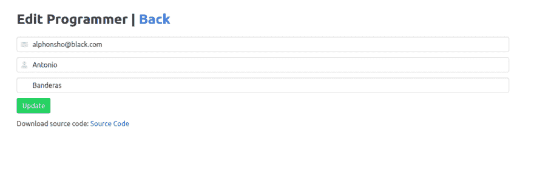

# 使用 Apisentris 创建一个没有后端的动态网站

> 原文：<https://dev.to/_absyah_/create-a-dynamic-website-without-backend-using-apisentris-4e63>

### 有没有想过回到那个 web 只有 HTML 和 CSS + JavaScript 的时代？

我有，但如果我想创建一个动态网站，必须明确考虑后端技术，将用于处理对服务器和数据库的请求，总是受到如何做的阻碍。然而，在今天，许多后端即服务正在出现，这使得有可能绕过开发后端本身的疲劳。

> 阿丁[@ _ absyah _](https://dev.to/_absyah_)* * *与此同时在创客宇宙的另一边🌏
> 
> [apisentris.com](https://t.co/vdroE4knKC)❄️转换你的 MySQL🐬一种数据库系统🐘Google BigQuery 到 API。MongoDB 即将加入！
> 
> 不涉及编程语言。不需要服务器设置👋只是一个科学魔术🧙‍♂️
> 
> [@ apisentrishq](https://twitter.com/ApisentrisHQ)2019 年 2 月 07 日下午 14:19[](https://twitter.com/intent/tweet?in_reply_to=1093514484100980736)[](https://twitter.com/intent/retweet?tweet_id=1093514484100980736)1[](https://twitter.com/intent/like?tweet_id=1093514484100980736)9

我开发了一个可以作为后端服务的应用程序，名为 Apisentris，后端采用 API 优先的方法。我想通过这个教程来证明我开发的 Apisentris 可以正常使用。

#### 创建 Apisentris 账户

Apisentris 是一个可以将各种数据库转换成 RESTful API 的服务。

<figure>

[](https://res.cloudinary.com/practicaldev/image/fetch/s--E_43B-ls--/c_limit%2Cf_auto%2Cfl_progressive%2Cq_auto%2Cw_880/https://thepracticaldev.s3.amazonaws.com/i/dxjktrfkffdazcm1lwxn.png)

<figcaption>Apisentris Landing Page</figcaption>

</figure>

在这里，数据库被称为连接。Apisentris 提供测试连接，可以用作演示，以便用户可以立即了解 Apisentris 提供的功能。

<figure>

[https://www.youtube.com/embed/77rthlWoNz0](https://www.youtube.com/embed/77rthlWoNz0)

<figcaption>Apisentris - How It Works</figcaption>

</figure>

演示连接提供了可在其上使用的表格，即`programmers`表格和`languages`表格。保存演示连接后，每个表中都会出现一个指向文档的链接。如果用户想通过 Linux /命令提示符终端直接使用 cURL，这个文档页面还提供了使用 cURL 的例子。

<figure>

[](https://res.cloudinary.com/practicaldev/image/fetch/s--Kf8X0Le6--/c_limit%2Cf_auto%2Cfl_progressive%2Cq_auto%2Cw_880/https://thepracticaldev.s3.amazonaws.com/i/imee558fxf09qomdfdt5.png)

<figcaption>Accessing API from Console</figcaption>

</figure>

#### 创造 index.html

创建名为 index.html 的文件，见下面的例子:

```
<!DOCTYPE html>
<html>
  <head>
    <meta charset="utf-8">
    <meta name="viewport" content="width=device-width, initial-scale=1">
    <link rel="stylesheet" href="https://cdnjs.cloudflare.com/ajax/libs/bulma/0.7.1/css/bulma.min.css">
    <script src="https://code.jquery.com/jquery-3.3.1.min.js" integrity="sha256-FgpCb/KJQlLNfOu91ta32o/NMZxltwRo8QtmkMRdAu8=" crossorigin="anonymous"></script>
  </head>
  <body>
    <section class="section">
      <div class="container">
        <!-- content is going here -->
      </div>
    </section>
  </body>
</html> 
```

这个页面标题只包含 bulma 作为 css 框架来增强外观，还包含 JQuery cdn 作为网站和 Apisentris 之间的通信器。我们将使用这个索引页面在一个表中显示程序员列表，该表包含 id、电子邮件、名字、姓氏和操作等列。为此，我们应该用这个 html 标签:
替换`<!- content is going here ->`

```
<table class="table is-fullwidth" id="records-table">
   <tr>
      <th>ID</th>
      <th>Email</th>
      <th>First Name</th>
      <th>Last Name</th>
      <th>Action</th>
    </tr>
</table> 
```

我们将使用 AJAX 来获取程序员的 Apisentris 帐户。在关闭`</ body>`标签之前写标签`<script> </ script>`，如下:

```
<script>
    $(document).ready(function() {
        // render list
        $.ajax({
            url: "https://apisentris.com/api/v1/programmers",
            type: "GET",
            beforeSend: function(xhr) {
                xhr.setRequestHeader('client_id', '12000');
                xhr.setRequestHeader('access_token', 'dhxjIWAMYp-aYWpNfVkGPA');
                xhr.setRequestHeader('Content-Type', 'application/json');
            },
            success: function(response) {
                $.each(response, function(i, programmer) {
                      $('<tr id=row-' + programmer.id + '>').append(
                      $('<td>').text(programmer.id),
                      $('<td>').text(programmer.email),
                      $('<td>').text(programmer.firstname),
                      $('<td>').text(programmer.lastname),
                      $('<td data-programmer-id="' + programmer.id + '">').text('')
                    ).appendTo('#records-table').html();
                });
            }
        });
    });
  </script> 
```

AJAX 使用 **GET** http 方法调用**API/v1/程序员**端点。在`beforeSend`中，我们应该添加需要的头，即`client_id`和 Apisentris `access_token`。来自这个端点的响应是 json 对象数组的形式。显示在我们之前提供的表中，因此响应是循环的，然后追加到表中。

<figure>

[](https://res.cloudinary.com/practicaldev/image/fetch/s--ctMNUFMC--/c_limit%2Cf_auto%2Cfl_progressive%2Cq_auto%2Cw_880/https://thepracticaldev.s3.amazonaws.com/i/fxjzugov9i5ozpwylj2c.png)

<figcaption>index.html - List of Programmers</figcaption>

</figure>

我们只查看 Actions 列，该列仍然是空的。该列应该有一个菜单，用于编辑和删除有问题的行。为此，我们可以稍微修改我们的脚本，以适应我们需要的功能。

```
$('*[data-programmer-id='+ programmer.id +']')
    .html('<a href="edit.html?id='+ programmer.id +'">Edit</a>')
    .append('<a class="delete-record" data-programmer-id='+ programmer.id +'> Delete</a>'); 
```

在将每个程序员行追加到表中后，在`success`回调中编写脚本。

因为删除程序员特性不使用新页面，所以我们将在这个**index.html**页面上添加一个脚本来删除它。通过 **DELETE** http 方法对 **api/v1/programmers/:id** 端点的 AJAX 调用也可以移除程序员。

```
// assign delete action

$('.delete-record').on('click', function() {
    var programmerId = $(this).attr("data-programmer-id");
    var endpoint     = 'https://apisentris.com/api/v1/programmers/' + programmerId;
// remove from row
    $('#row-' + programmerId).remove();

    // do ajax delete
    $.ajax({
        url: endpoint,
        dataType: 'json',
        type: "DELETE",
        beforeSend: function(xhr) {
            xhr.setRequestHeader('client_id', '12000');
            xhr.setRequestHeader('access_token', 'dhxjIWAMYp-aYWpNfVkGPA');
            xhr.setRequestHeader('Content-Type', 'application/json');
        },
        success: function(response) {
            console.log('Record was successfully deleted.')
        }
    });
}); 
```

这是一个 JavaScript 与 JQuery 从索引显示程序员列表，也链接到编辑页面，并从数据库中删除程序员。

```
<script>
    $(document).ready(function() {
        // render list
        $.ajax({
            url: "https://apisentris.com/api/v1/programmers",
            type: "GET",
            beforeSend: function(xhr) {
                xhr.setRequestHeader('client_id', '12000');
                xhr.setRequestHeader('access_token', 'dhxjIWAMYp-aYWpNfVkGPA');
                xhr.setRequestHeader('Content-Type', 'application/json');
            },
            success: function(response) {
                $.each(response, function(i, programmer) {
                      $('<tr id=row-' + programmer.id + '>').append(
                      $('<td>').text(programmer.id),
                      $('<td>').text(programmer.email),
                      $('<td>').text(programmer.firstname),
                      $('<td>').text(programmer.lastname),
                      $('<td data-programmer-id="' + programmer.id + '">').text('')
                    ).appendTo('#records-table').html();
// create link to update
                    $('*[data-programmer-id='+ programmer.id +']')
                      .html('<a href="edit.html?id='+ programmer.id +'">Edit</a>')
                      .append('<a class="delete-record" data-programmer-id='+ programmer.id +'> Delete</a>');
});
// assign delete link
                $('.delete-record').on('click', function() {
                    var programmerId = $(this).attr("data-programmer-id");
                    var endpoint     = 'https://apisentris.com/api/v1/programmers/' + programmerId;
// remove from row
                    $('#row-' + programmerId).remove();

                    // do ajax delete
                    $.ajax({
                        url: endpoint,
                        dataType: 'json',
                        type: "DELETE",
                        beforeSend: function(xhr) {
                            xhr.setRequestHeader('client_id', '12000');
                            xhr.setRequestHeader('access_token', 'dhxjIWAMYp-aYWpNfVkGPA');
                            xhr.setRequestHeader('Content-Type', 'application/json');
                        },
                        success: function(response) {
                            console.log('Record was successfully deleted.')
                        }
                    });
                });
            }
        });
    });
</script> 
```

<figure>

[](https://res.cloudinary.com/practicaldev/image/fetch/s--Q7QQ9bJ7--/c_limit%2Cf_auto%2Cfl_progressive%2Cq_auto%2Cw_880/https://thepracticaldev.s3.amazonaws.com/i/0t2xuetkze0bd6fdd730.png)

<figcaption>List of Programmers with Action Links</figcaption>

</figure>

#### 创造 new.html

在这一页中，我们将向您展示一个可用于创建记录功能的表单。HTML 和 Javascript 将非常简单。

```
<section class="section">
    <div class="container">
      <h1 class="title">
        New Programmer | <a href="index.html">Back</a>
      </h1>
      <div class="field">
        <p class="control has-icons-left has-icons-right">
          <input class="input" type="email" placeholder="Email" name="email">
          <span class="icon is-small is-left">
            <i class="fas fa-envelope"></i>
          </span>
        </p>
      </div>
      <div class="field">
        <p class="control has-icons-left">
          <input class="input" type="text" placeholder="First Name" name="firstname">
          <span class="icon is-small is-left">
            <i class="fas fa-user"></i>
          </span>
        </p>
      </div>
      <div class="field">
        <p class="control has-icons-left">
          <input class="input" type="text" placeholder="Last Name" name="lastname">
        </p>
      </div>
      <div class="field">
        <p class="control">
          <button class="button is-success" id="create-record-btn"> Create
          </button>
        </p>
      </div>
    </div>
  </section> 
```

我们将使用 AJAX 调用 **/api/v1/programmers** 端点与 **POST** http 方法。

```
<script>
    $(document).ready(function() {
        $('#create-record-btn').click(function() {
            var email     = $('input[name="email"]').val();
            var firstname = $('input[name="firstname"]').val();
            var lastname  = $('input[name="lastname"]').val();
            var request   = {
                resource: {
                    email: email,
                    firstname: firstname,
                    lastname: lastname
                }
            }

            // do ajax post
            $.ajax({
                url: "https://apisentris.com/api/v1/programmers",
                data: JSON.stringify(request),
                dataType: 'json',
                type: "POST",
                beforeSend: function(xhr) {
                    xhr.setRequestHeader('client_id', '12000');
                    xhr.setRequestHeader('access_token', 'dhxjIWAMYp-aYWpNfVkGPA');
                    xhr.setRequestHeader('Content-Type', 'application/json');
                },
                success: function(response) {
                    window.location.replace('index.html')
                }
            });
        });
    });
  </script> 
```

这个页面非常简单，只需从现有表单中获取值，然后以 JSON 的形式作为请求体发送，然后在响应中，可以根据需要再次处理数据。对于上述代码，响应成功后，它将被重定向回索引页面。

#### 创造 edit.html

编辑页面要求我们进行两次 AJAX 调用，即获取将要更改的数据，这是通过 **GET** http 请求完成的，当保存更改时，使用 **PATCH** http 方法。

**GET** 是通过调用 **api/v1/programmers/:id** 端点完成的，其中`:id`是之前保存的数据的 id，然后在每个输入表单上显示每个属性。

```
// get resource details
$.ajax({
    url: endpoint,
    type: "GET",
    beforeSend: function(xhr) {
        xhr.setRequestHeader('client_id', '12000');
        xhr.setRequestHeader('access_token', 'dhxjIWAMYp-aYWpNfVkGPA');
        xhr.setRequestHeader('Content-Type', 'application/json');
    },
    success: function(response) {
        $('input[name="email"]').val(response.email);
        $('input[name="firstname"]').val(response.firstname);
        $('input[name="lastname"]').val(response.lastname);
    }
}); 
```

**PATCH** http 方法与我们在执行 **POST** http 方法时使用的代码非常相似，只是将 AJAX 类型参数:`POST`改为`PATCH`

```
$.ajax({
    url: endpoint,
    data: JSON.stringify(request),
    dataType: 'json',
    type: "PATCH", // uses PATCH http method
    beforeSend: function(xhr) {
        xhr.setRequestHeader('client_id', '12000');
        xhr.setRequestHeader('access_token', 'dhxjIWAMYp-aYWpNfVkGPA');
        xhr.setRequestHeader('Content-Type', 'application/json');
    },
    success: function(response) {
        window.location.replace('index.html')
    }
}); 
```

#### 源代码和现场演示

[Github 上的源代码](https://github.com/apisentris/demo)
[现场演示](http://absyah.com/apisentris/demo/jquery/index.html)

<figure>

[](https://res.cloudinary.com/practicaldev/image/fetch/s--drAFC1fL--/c_limit%2Cf_auto%2Cfl_progressive%2Cq_auto%2Cw_880/https://thepracticaldev.s3.amazonaws.com/i/kh1685zbpohvcegly1m1.png)

<figcaption>List of Programmers</figcaption>

</figure>

<figure>

[](https://res.cloudinary.com/practicaldev/image/fetch/s--O-uB0YtS--/c_limit%2Cf_auto%2Cfl_progressive%2Cq_auto%2Cw_880/https://thepracticaldev.s3.amazonaws.com/i/sf0fxoycjf30ozwilr1f.png)

<figcaption>New Programmer</figcaption>

</figure>

<figure>

[](https://res.cloudinary.com/practicaldev/image/fetch/s--_PFcyJiI--/c_limit%2Cf_auto%2Cfl_progressive%2Cq_auto%2Cw_880/https://thepracticaldev.s3.amazonaws.com/i/83vxv9lq37pyoonyx33y.png)

<figcaption>Edit Programmer with Prefilled Data</figcaption>

</figure>

* * *

我是推特上的 [@_absyah_](https://dev.to/_absyah_) ，ardian@apisentris.com 的是我的邮箱。Apisentris 的制造者。
关注 Twitter ApisentrisHQ，了解 Apisentris 的最新功能更新。