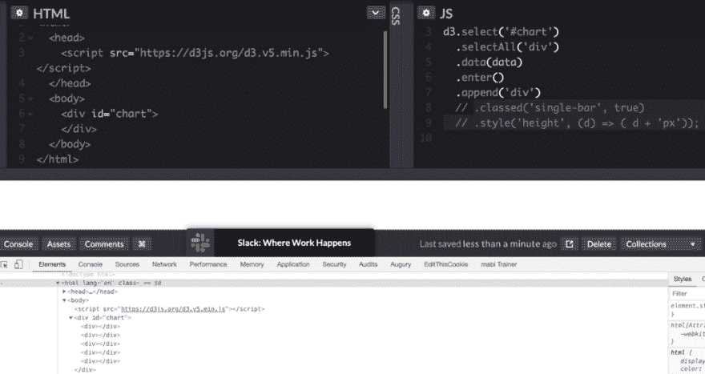
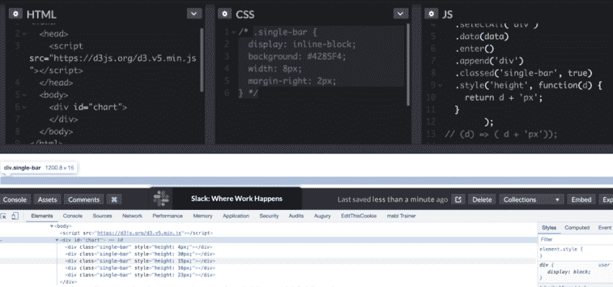

# 用这个最简单的 D3 指南快速创建一个图表

> 原文：<https://dev.to/cavezza/create-a-graph-fast-with-this-simplest-guide-to-d3-1af8>

D3.js 做了两件事:(1)将 HTML 添加到页面中，以及(2)将数据绑定到 HTML 中。就是这样。最简单的例子是绑定到像素大小的条形图。大多数 D3 例子都使用 SVG 或 Path html 元素。理解这些几乎是完全不同的技能。在本教程中，我们将学习不需要任何 SVG 或路径知识的 D3 代码。

*警告:这不是你想要投入生产的图表。这是一个非常简单的例子，展示了 D3 的功能。*

让我们先来看看一些代码，然后解剖一下，看看幕后到底发生了什么。

[https://codepen.io/cavezza/embed/pozPzdM?height=600&default-tab=result&embed-version=2](https://codepen.io/cavezza/embed/pozPzdM?height=600&default-tab=result&embed-version=2)

看笔[你会在](https://codepen.io/cavezza/pen/pozPzdM/) [CodePen](https://codepen.io) 上看到鲍勃·卡韦扎([@卡韦扎](https://codepen.io/cavezza))写的最简单的 d3 例子。

如您所见，这段代码生成了一个没有标签和轴的条形图。在这篇文章中，我们将一行一行地剖析代码，看看发生了什么。

如果您想要重新创建它，您将需要 CodePen 中的所有三个元素。您需要 html 和将 d3 脚本加载到您的页面中。您还需要设计`single-line-bar`类的样式。这段代码最重要的部分是 javascript 部分，因为这是我们使用 D3 的地方。让我们深入研究代码。

```
const data = [4, 30, 15, 16, 23];

d3.select('#chart')
  .selectAll('div')
  .data(data)
  .enter()
  .append('div')
  .classed('single-bar', true)
  .style('height', (d) => ( d + 'px')); 
```

第一行是我们将要绘制的数据。`const data = [4, 30, 15, 16, 23];`是包含五个整数的普通 javascript 数组。在下一行，我们开始看到 D3 特定的语法。

d3 的第一行，`d3.select('#chart')`与 CSS 选择器的工作方式完全相同。您正在 HTML 中选择想要创建可视化的区域。这些选择器的工作方式与它们在任何前端框架中的工作方式完全相同。`#`被附加在 id 上，`.`被附加在类上，任何 HTML 元素都会像`d3.select('div')`一样被选中。其他选择器也可以工作，

接下来你会注意到 D3 支持链接。注意第一行后面没有分号。第一行的结果是一个对象，我们可以将额外的 d3 命令链接到这个对象。这很简单，因为每个方法的输出都可以被下一个方法使用。

下一行是`.selectAll('div')`，选择所有在`#chart`中的`div`。这很有趣，因为在我们的示例 HTML 中没有位于`#chart` div 中的`div`。当这种情况发生时，D3 返回一个空的选择。我知道这很混乱，但是让我们继续分解剩下的代码，这样很快就会有意义了。

魔法在下一行开始发生。在`.data(data)`中，我们将数据绑定到 div 元素。`.data`正在调用 d3 的数据方法。括号内的`data`变量是对我们想要绘制的整数数组的引用。我们在代码的第一行初始化了这个变量。数据现在被绑定到我们的 d3 对象，但是我们仍然有一个问题，即在`#chart`元素中没有 div。所以我们要把这些数据绑定到零上？！？！？

这就是`.enter`发挥作用的地方。如果我们选择的元素数量和我们绑定到的数据数量不匹配，`.enter()`允许我们添加 div 元素来弥补差异。`.enter()`后面通常接一个`.append`。我们这里的例子没有什么不同。

*重要提示:有一个对应的`exit`方法可以用来移除元素，类似于`enter`添加元素。*

既然我们调用了`.enter()`，我们现在必须将值追加到选择中，以弥补从 0 `div`到数组中整数数量之间的差距。因为我们调用了`.append('div')`，所以这样做的是将 div 的数量之差加到 5(我们数组的长度)。

如果您在这里删除剩余的代码，您将会在图表中看到 5 个空的 div。

<figure>[](https://res.cloudinary.com/practicaldev/image/fetch/s--_Rr8sKnp--/c_limit%2Cf_auto%2Cfl_progressive%2Cq_auto%2Cw_880/https://ibuildmvps.com/wp-content/uploads/2019/08/Screen-Shot-2019-08-26-at-9.24.56-PM-1024x543.png) 

<figcaption>在这里，你可以看到，如果你不添加单栏类和样式化高度，你的 html 仍然会呈现在页面上，但它不会显示，因为它没有样式，也没有高度。</figcaption>

</figure>

如果第二个参数为真，将一个类分配给所有追加的 div。在我们的例子中，`.classed('single-bar', true)`给我们刚刚添加的每个`div`分配一个`single-bar`类，因为`true`总是真实的。

最后一行`.style('height', (d) => ( d + 'px'));`向我们添加的每个 div 添加一个内联样式属性。第一个参数定义内联样式元素。第二个参数是一个 javascript 函数，其中的`d`引用我们的数据数组中的每个特定项。

如果您不熟悉胖箭头函数，不要担心。该行与下面的一模一样:

```
.style('height', function(d) {
    return d + 'px';
} 
```

你可以随意调用`d`，但是`d`通常是你在 D3 代码中看到的约定。由于`d`引用数组中的每个数据项，即第一个追加的 div 元素，它将呈现为`style="height: 4px;"`。

您可能知道，这些 D3 代码所做的就是创建 HTML 元素。这就是 D3 所做的一切！它创建数据并将数据绑定到 HTML 元素。

在我们上面的例子中，d3 代码创建了这个 html 输出:

```
<div id="chart">
    <div class="single-bar" style="height: 4px;"></div>
    <div class="single-bar" style="height: 30px;"></div>
    <div class="single-bar" style="height: 15px;"></div>
    <div class="single-bar" style="height: 16px;"></div>
    <div class="single-bar" style="height: 23px;"></div>
</div> 
```

不要忘记这个例子中 CSS 的重要性。如果您在 CodePen 中注释掉 css，图形将停止显示。

<figure>[](https://res.cloudinary.com/practicaldev/image/fetch/s--4CoI7D3n--/c_limit%2Cf_auto%2Cfl_progressive%2Cq_auto%2Cw_880/https://ibuildmvps.com/wp-content/uploads/2019/08/Screen-Shot-2019-08-26-at-9.38.57-PM-1024x480.png) 

<figcaption>我们的 CodePen 指南截图显示，如果您注释掉 css，图形将不会显示</figcaption>

</figure>

这是因为当您创建空 div 时，没有最小宽度。您将看到自己创建的 HTML 元素，但看不到它们。

我们示例中的 CSS 设置了每个 div 的宽度，在每个 div 之间分配了空间，设置了每个 div 的背景颜色，并设置了一个显示值，这样它们就会像图形一样并排显示。

```
.single-bar {
    display: inline-block;
    background: #4285F4;
    width: 8px;
    margin-right: 2px;
} 
```

有很多关于 D3 的讨论，因为它帮助创建了一些疯狂的图表。随着您需要构建更复杂的可视化，一切都会变得更加复杂。你需要学习 SVG 和路径 HTML 元素。但是不要让 D3 吓到你。到最后，它只是 HTML、CSS 和 javascript。

**定期收到我的电子邮件，里面有最好的在线资源和链接**
[https://tinyletter.com/rcavezza](https://tinyletter.com/rcavezza)

**在我的博客上阅读更多内容**

[http://ibuildmvps.com](http://ibuildmvps.com)

**联系我**

[http://twitter.com/cavezza](http://twitter.com/cavezza)

[http://linkedin.com/in/cavezza](http://linkedin.com/in/cavezza)