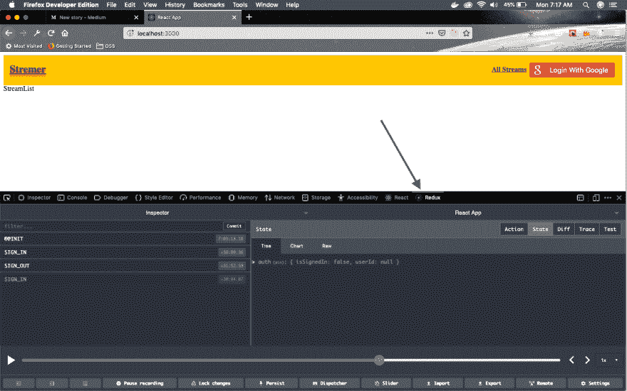
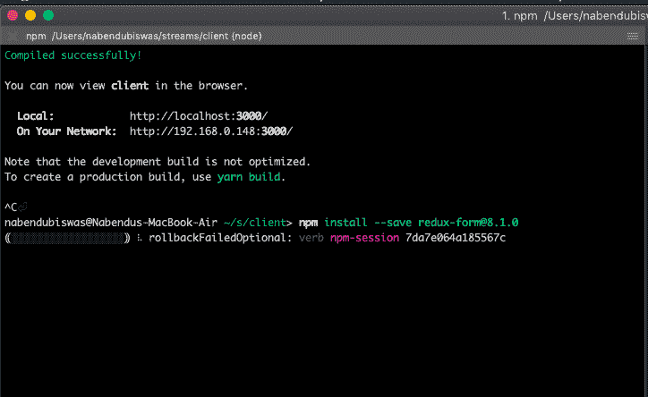
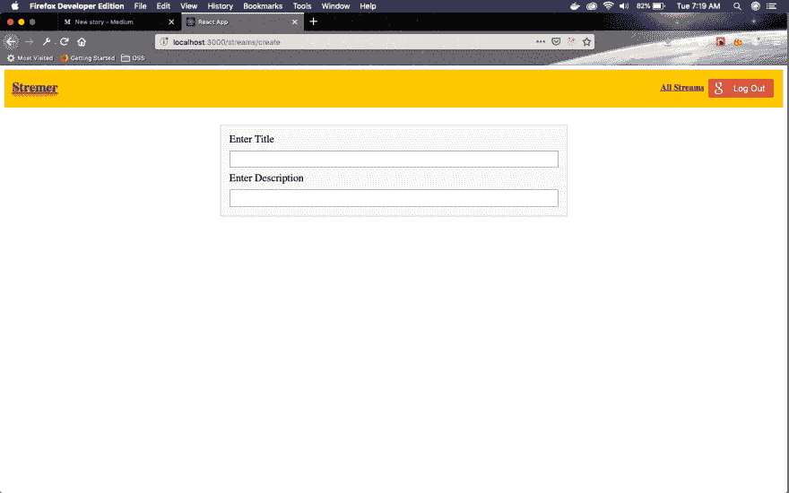
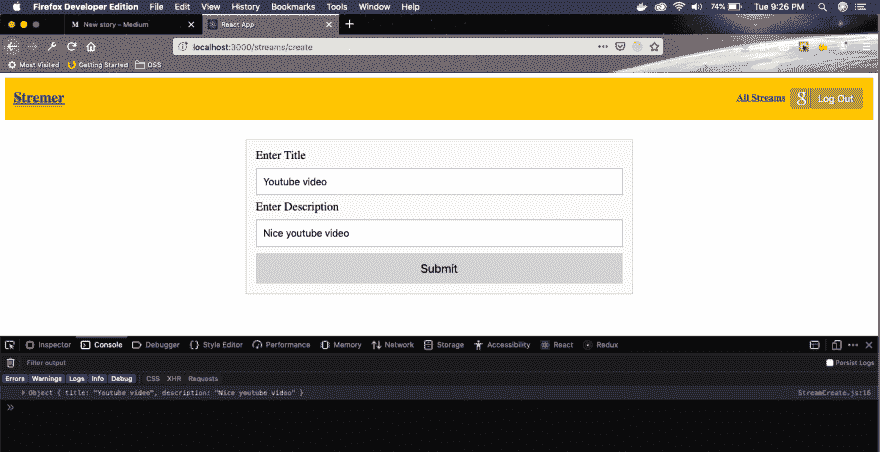
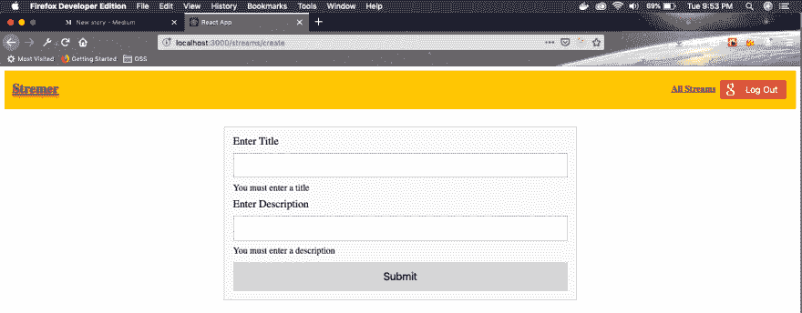
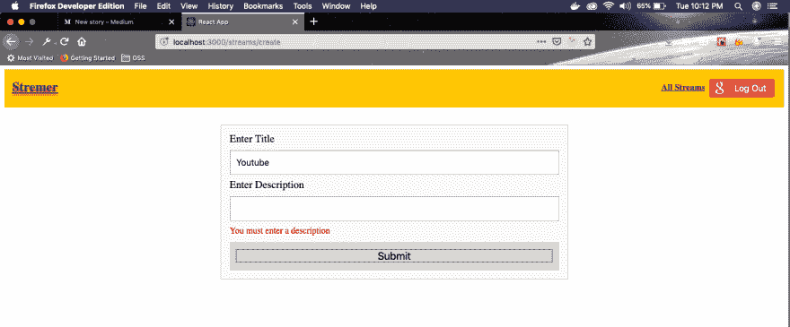

# 使用 React -3 创建抽搐克隆

> 原文：<https://dev.to/nabendu82/create-a-twitch-clone-using-react-3-2o1>

欢迎来到本系列的第 3 部分。我们将开始在项目中实现表单。我们将使用 Redux-forms，但是首先让我们在项目中连接 redux-devtools。

Redux Devtools 是 chrome/firefox 的扩展，对于调试基于 Redux 的项目非常有用。

点击这里进入 Redux Devtools 扩展页面[。你可以在那里找到火狐和 chrome 网上商店的链接。继续安装它。](https://github.com/zalmoxisus/redux-devtools-extension)

接下来，您必须在根 index.js 文件中进行一些更改，以使用这个扩展。更改用粗体标出。

```
import React from 'react';
import ReactDOM from 'react-dom';
import App from './components/App';
import { Provider } from 'react-redux';
import { createStore, applyMiddleware, compose } from 'redux';
import reducers from './reducers';

const composeEnhancers = window.__REDUX_DEVTOOLS_EXTENSION_COMPOSE__ || compose;
const store = createStore(reducers, composeEnhancers(applyMiddleware()));

ReactDOM.render(
<Provider store={store}><App /></Provider>, document.querySelector('#root')); 
```

现在，前往 localhost 并打开开发人员面板。在那里点击**还原**标签。如果设置正确，您将看到如下内容。

[](https://res.cloudinary.com/practicaldev/image/fetch/s--cplc5AkW--/c_limit%2Cf_auto%2Cfl_progressive%2Cq_auto%2Cw_880/https://cdn-images-1.medium.com/max/2880/1%2AheAoGctp-Vmxq2G69GoiQw.png)*Redux Devtools*

接下来，我们将开始在项目中添加 Redux-form。它是一个第三方库，帮助我们在项目中高效地使用表单。

打开您的终端，停止运行服务器实例并安装

[](https://res.cloudinary.com/practicaldev/image/fetch/s--oM2qVgZk--/c_limit%2Cf_auto%2Cfl_progressive%2Cq_auto%2Cw_880/https://cdn-images-1.medium.com/max/2000/1%2AHYcVa9cPOVjqchHWmw-nRg.png)*[redux-form @ 8 . 1 . 0](mailto:redux-form@8.1.0)*

不要忘记通过 **npm start** 重启你的服务器。现在让我们在项目中连接*和*。打开 **reducers** 文件夹中的 **index.js** 文件，更新以下代码。

```
import { combineReducers } from 'redux';
import authReducer from './authReducer';
import { reducer as formReducer } from 'redux-form';

export default combineReducers({
    auth: authReducer,
    form: formReducer
}); 
```

接下来，我们将更新我们的 **StreamCreate.js** 文件以使用 *redux-form*

```
import React, {Fragment} from 'react';
import { Field, reduxForm } from 'redux-form';
import './formStyles.css';

class StreamCreate extends React.Component {
  renderInputBox({input, label}) {
    return (
      <Fragment>
        <label>{label}</label>
        <input {...input} />
      </Fragment>
    )
  }

  render() {
    return (
      <form className="ui__form">
        <Field name="title" label="Enter Title" component={this.renderInputBox} />
        <Field name="description" label="Enter Description" component={this.renderInputBox} />
      </form>
    )
  }
}

export default reduxForm({form: 'streamCreate'})(StreamCreate); 
```

在这里，它主要是样板代码。我们从 redux-form 导入**字段，reduxForm** 。在 Redux 项目中， **reduxForm** 的用法类似于 **connect** 。

字段组件用于不同的表单元素。这里，我们使用创建两个输入框。然后我们有一个函数 **renderInputBox()** ，它有标签和输入。

接下来，我们将在表单中挂接一些样式。因此，在同一个文件夹中创建一个 **formStyles.css** 文件，并添加以下代码。

```
.ui__form {
    display: grid;
    grid-gap: 10px;
    background: #f9f9f9;
    border: 1px solid #c1c1c1;
    margin: 2rem auto 0 auto;
    max-width: 600px;
    padding: 1em;
  }

  .ui__form input {
    background: #fff;
    border: 1px solid #9c9c9c;
    padding: 0.7em;
  }
  .ui__form input:focus {
    outline: 3px solid gold;
  }
  .ui__form label {
      font-size:1.2rem;
  } 
```

现在，转到[http://localhost:3000/streams/create](http://localhost:3000/streams/create)来查看我们的表单。

[ ](https://res.cloudinary.com/practicaldev/image/fetch/s--oo4OnKi9--/c_limit%2Cf_auto%2Cfl_progressive%2Cq_auto%2Cw_880/https://cdn-images-1.medium.com/max/2880/1%2A-wlpMzLp-wEAMLYn5cBMfQ.png) *我们的形式*

接下来，让我们为表单添加提交功能。我们将在 **StreamCreate.js** 中更新以下内容。
在表单的 **onSubmit** 中，我们使用 **this.props.handleSubmit** ()来获取用户提交的值。

```
...
...
onSubmitForm(formValues) {
    console.log(formValues);
  }

  render() {
    return (
      <form onSubmit={this.props.handleSubmit(this.onSubmitForm)} className="ui__form">
        <Field name="title" label="Enter Title" component={this.renderInputBox} />
        <Field name="description" label="Enter Description" component={this.renderInputBox} />
        <button>Submit</button>
      </form>
    )
  }
...
... 
```

让我们在 **formStyles.css** 中添加一些 CSS 来使我们的默认按钮更漂亮

```
.ui__form button {
    background: lightgrey;
    font-size:1.2rem;
    padding: 0.7em;
    width: 100%;
    border: 0;
  }
  .ui__form button:hover {
    background: gold;
  } 
```

现在，转到[http://localhost:3000/streams/create](http://localhost:3000/streams/create)并在表单中输入一些值。然后点击按钮提交表格。您可以在控制台中看到，表单值在一个漂亮的对象中传递。

[ ](https://res.cloudinary.com/practicaldev/image/fetch/s--PTaz8izn--/c_limit%2Cf_auto%2Cfl_progressive%2Cq_auto%2Cw_880/https://cdn-images-1.medium.com/max/2880/1%2AZ6YxYwNQdtEb5CVRq6DT7Q.png) *易重叠形式*

接下来，我们将在表单中添加表单验证。Redux-form 有不同的方式来验证表单。我们将首先有一个名为 **validate** 的函数，然后我们将在其中有一个空的 error 对象。如果标题和描述没有任何值，则添加带有值的错误对象。

接下来，在 renderInputBox()中，我们添加 meta 并显示 **meta**

```
import React, {Fragment} from 'react';
import { Field, reduxForm } from 'redux-form';
import './formStyles.css';

class StreamCreate extends React.Component {
  renderInputBox({input, label, meta}) {
    return (
      <Fragment>
        <label>{label}</label>
        <input {...input} />
        <div>{meta.error}</div>
      </Fragment>
    )
  }

  onSubmitForm(formValues) {
    console.log(formValues);
  }

  render() {
    return (
      <form onSubmit={this.props.handleSubmit(this.onSubmitForm)} className="ui__form">
        <Field name="title" label="Enter Title" component={this.renderInputBox} />
        <Field name="description" label="Enter Description" component={this.renderInputBox} />
        <button>Submit</button>
      </form>
    )
  }
}

const validate = (formValues) => {
  const errors = {};
  if(!formValues.title) {
    errors.title = "You must enter a title";
  }
  if(!formValues.description) {
    errors.description = "You must enter a description";
  }

  return errors;
}

export default reduxForm({form: 'streamCreate', validate})(StreamCreate); 
```

现在，打开[http://localhost:3000/streams/create](http://localhost:3000/streams/create)，你会看到我们的错误信息如下截图。在字段中输入一些值，让它们消失。

[ ](https://res.cloudinary.com/practicaldev/image/fetch/s--eVaTHNhn--/c_limit%2Cf_auto%2Cfl_progressive%2Cq_auto%2Cw_880/https://cdn-images-1.medium.com/max/2880/1%2AG1r-CF5OqLh0Pc5oxxflJQ.png) *错误*

您可能已经注意到了，我们在表单加载时直接显示错误消息。我们通常应该给用户一个填充字段的机会。我们将更新我们的代码来做到这一点。我们获取 meta 属性并调用函数 **renderError** ()。在里面检查用户是否触摸了输入字段，然后只显示错误。

```
...
...
renderError(meta) {
    if(meta.touched && meta.error) {
      return (
        <div className="err__msg">{meta.error}</div>
      );
    }
  }

  renderInputBox = ({input, label, meta}) => {
    return (
      <Fragment>
        <label>{label}</label>
        <input {...input} />
        {this.renderError(meta)}
      </Fragment>
    )
  }
...
... 
```

另外，在 **formStyles.css** 中添加一点 CSS，用红色显示这个错误消息。

```
.err__msg{
      font-size: 1rem;
      color:red;
  } 
```

现在，打开[http://localhost:3000/streams/create](http://localhost:3000/streams/create)，默认情况下不会看到错误消息。在一个字段中为另一个字段输入一些值，然后按 tab 键进入和退出。您将看到错误消息。

[ ](https://res.cloudinary.com/practicaldev/image/fetch/s--4Uy7zDss--/c_limit%2Cf_auto%2Cfl_progressive%2Cq_auto%2Cw_880/https://cdn-images-1.medium.com/max/2880/1%2ArSghl12FAeD5-hb0JrUsRw.png) *错误信息*

这就完成了我们的 Redux-form，并结束了本系列的第 3 部分。